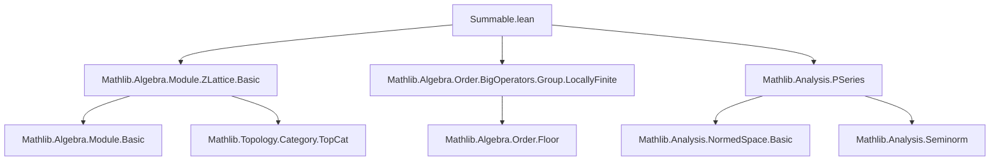

### Technical Brief: `Summable.lean` — Convergence of $p$-series on lattices

---

#### **1. Key Definitions & Theorems**

| Name | Type / Signature | Purpose |
|------|------------------|---------|
| `exists_forall_abs_repr_le_norm` | `∃ ε > 0, ∀ x : L, i, ε * |b.repr x i| ≤ ‖x‖` | Guarantees a uniform lower bound of the norm in terms of coordinate magnitudes w.r.t. a $\mathbb{Z}$-basis. |
| `normBound` | `Basis ι ℤ L → ℝ` | A canonical choice of such $\varepsilon$ from the above lemma. |
| `normBound_pos` | `0 < normBound b` | Positivity of the norm bound constant. |
| `normBound_spec` | `normBound b * |b.repr x i| ≤ ‖x‖` | The defining inequality for `normBound`. |
| `abs_repr_le` | `|b.repr x i| ≤ (normBound b)⁻¹ * ‖x‖` | Upper bound on coordinates in terms of norm. |
| `abs_repr_lt_of_norm_lt` | `‖x‖ < normBound b * n ⇒ |b.repr x i| < n` | Converse direction: small norm ⇒ small coordinates. |
| `le_norm_of_le_abs_repr` | `n ≤ |b.repr x i| ⇒ normBound b * n ≤ ‖x‖` | Used to relate coordinate size to norm. |
| `sum_piFinset_Icc_rpow_le` | `∑_{p ∈ s(n)} ‖∑_i p i • b i‖^r ≤ C * ∑'_k k^{d-1+r}` | Core combinatorial estimate bounding sums over lattice points by $p$-series. |
| `exists_finsetSum_norm_rpow_le_tsum` | `∃ A > 0, ∀ r < -d, s : Finset L, ∑_{z ∈ s} ‖z‖^r ≤ A^r * ∑'_k k^{d-1+r}` | Uniform bound on finite partial sums by a convergent $p$-series. |
| `tsumNormRPowBound` | `ℝ` | A canonical choice of $A > 0$ from the previous lemma. |
| `tsumNormRPowBound_pos` | `0 < tsumNormRPowBound L` | Positivity of the bound constant. |
| `tsumNormRPowBound_spec` | `∑_{z ∈ s} ‖z‖^r ≤ tsumNormRPowBound L^r * ∑'_k k^{d-1+r}` | Explicit inequality for finite sums. |
| `summable_norm_rpow` | `r < -d ⇒ Summable (λ z, ‖z‖^r)` | Main convergence result for centered $p$-series. |
| `tsum_norm_rpow_le` | `∑' z, ‖z‖^r ≤ A^r * ∑'_k k^{d-1+r}` | Quantitative bound on the total sum. |
| `summable_norm_sub_rpow` | `r < -d ⇒ Summable (λ z, ‖z - x‖^r)` | Convergence of shifted $p$-series (for any $x \in E$). |
| `summable_norm_sub_zpow`, `summable_norm_zpow` | Integer exponents version of above. | Specialization to integer powers. |
| `summable_norm_sub_inv_pow`, `summable_norm_pow_inv` | `n > d ⇒ Summable (λ z, ‖z - x‖^{-n})` | Convergence of inverse-power series (e.g., Coulomb-type). |

---

#### **2. Naming Conventions**

- **Prefixes**:
  - `normBound*`: constants and lemmas about the uniform norm-coordinate comparison.
  - `tsumNormRPowBound*`: constants and lemmas about the bounding constant for total sums.
  - `summable_*`: convergence results.
  - `abs_repr_*`: coordinate bounds.
  - `le_norm_*`, `norm_*`: norm-coordinate comparisons.

- **Suffixes**:
  - `_spec`: specification of the chosen witness from an existential.
  - `_pos`: positivity of a constant.
  - `_rpow`: real exponent $r$.
  - `_zpow`: integer exponent $n$.
  - `_inv_pow`: negative integer exponent (i.e., $n > 0$ in $‖·‖^{-n}$).

- **Pattern**:
  - `normBound b` is a *definitional* choice of $\varepsilon$.
  - `tsumNormRPowBound L` is a *definitional* choice of $A$.
  - `summable_*` lemmas are corollaries of `tsumNormRPowBound_spec`.

---

#### **3. Tactic Stack**

| Tactic | Frequency | Role |
|--------|-----------|------|
| `wlog` | 1 | Symmetry reduction in `exists_forall_abs_repr_le_norm`. |
| `simp` / `simp_rw` | Very high | Simplification of sums, norms, and basis representations. |
| `gcongr` | High | Monotonicity arguments for sums and powers (especially with $r < 0$). |
| `linarith` / `omega` | Medium | Linear arithmetic over inequalities involving $r$, $d$, etc. |
| `rw` / `push_cast` | High | Rewriting of casted naturals, norms, and exponent laws. |
| `convert` | Medium | Matching goals up to definitional equality (e.g., in `sum_piFinset_Icc_rpow_le`). |
| `zify` | Low | Lifting integer inequalities to reals. |
| ` positivity` | Very high | Automatic positivity proofs (e.g., for $r < -d$, $d > 0$). |
| `exact` / `refine` | High | Goal-directed proof construction. |
| `cases subsingleton_or_nontrivial` | Medium | Handling degenerate (zero-rank) lattices. |
| `set` / `have` / `obtain` | Very high | Intermediate definitions and lemmas. |

---

#### **4. Proof Logic**

The logical flow follows a standard *comparison test* strategy for series over countable sets:

1. **Coordinate–Norm Comparison**  
   Prove existence of $\varepsilon > 0$ such that $\varepsilon |b.\text{repr}(x)_i| \le \|x\|$. This gives control of coordinates by norm (and vice versa), enabling discretization.

2. **Decomposition by Annuli / Cubes**  
   Partition $L$ into layers:
   $$
   s(n) = \{x \in L : \forall i, |b.\text{repr}(x)_i| \le n\}
   $$
   Then $s(n+1) \setminus s(n)$ corresponds to points with at least one coordinate of size $\approx n$.

3. **Cardinality Estimate**  
   Bound $|s(n+1) \setminus s(n)| \le 2d(2n+3)^{d-1}$ using volume estimates (difference of $d$-dimensional cubes).

4. **Norm Lower Bound on Layer**  
   For $x \in s(n+1) \setminus s(n)$, use $\|x\| \ge \varepsilon (n+1)$ to get $\|x\|^r \le (\varepsilon (n+1))^r$ (note $r < 0$ reverses inequality).

5. **Summation over Layers**  
   Combine cardinality and norm bounds:
   $$
   \sum_{x \in s(n)} \|x\|^r \le C \cdot \varepsilon^r \cdot \sum_{k=1}^n k^{d-1+r}
   $$
   where $C = 2d \cdot 3^{d-1}$.

6. **Comparison with $p$-Series**  
   Since $r < -d$, we have $d-1+r < -1$, so $\sum_k k^{d-1+r}$ converges (by `PSeries` theory in Mathlib).

7. **Uniform Bound on Finite Sums**  
   Derive `exists_finsetSum_norm_rpow_le_tsum`, then define `tsumNormRPowBound` as a canonical bound.

8. **Convergence via Comparison Test**  
   Apply `summable_of_sum_le` to get `summable_norm_rpow`. Shifted version uses triangle inequality and closedness of $L$.

9. **Integer & Inverse Powers**  
   Immediate corollaries via specialization and sign manipulation.

---

#### **5. Imports & Dependencies**

| Module | Role |
|--------|------|
| `Mathlib.Algebra.Module.ZLattice.Basic` | Core definitions: $\mathbb{Z}$-lattices, `ZLattice`, `norm`, `repr`, `basis`. |
| `Mathlib.Algebra.Order.BigOperators.Group.LocallyFinite` | Tools for sums over countable groups, `tsum`, `summable`. |
| `Mathlib.Analysis.PSeries` | Convergence of $\sum k^r$ for $r < -1$. |

**Key auxiliary theories used implicitly**:
- `Mathlib.Topology.MetricSpace.Basic` (for `dist`, `closedBall`, `isBounded`, `finite_isBounded_inter_isClosed`)
- `Mathlib.Analysis.NormedSpace.Basic` (for `normed_space`, `finite_dimensional`, `continuous_linear_equiv`)
- `Mathlib.Algebra.Group.Basic`, `Mathlib.Algebra.Module.Basic`, `Mathlib.Algebra.Order.Floor` (for `floor`, `Int.cast`, etc.)

---

#### **6. Mermaid Diagrams**

##### **Dependency Graph (Module-Level)**



##### **Theoretical Overview (Conceptual Flow)**

```mermaid
flowchart LR
  A[Finite-dim normed ℝ-space E] --> B[Discrete ℤ-submodule L ⊆ E]
  B --> C[Basis b : ι → L]
  C --> D[Coordinate–norm comparison: ε > 0]
  D --> E[Decomposition of L into layers s(n)]
  E --> F[Cardinality bound on layers]
  F --> G[Layer-wise norm bound: ‖x‖ ≥ ε(n+1)]
  G --> H[Sum over layers ≤ const · ∑ k^{d-1+r}]
  H --> I[r < -d ⇒ ∑ k^{d-1+r} converges]
  I --> J[summable_norm_rpow]
  J --> K[summable_norm_sub_rpow (via triangle + closedness)]
  K --> L[Integer & inverse-power corollaries]
```

---

#### **7. Summary**

This file formalizes a classical result in geometric analysis and number theory: **the summability of $r$-power norms over a lattice $L$ of rank $d$ holds exactly when $r < -d$**. It provides:
- Explicit quantitative bounds via `tsumNormRPowBound`.
- Uniform control over shifted sums (for any $x \in E$).
- A robust framework for handling lattice sums in higher analysis (e.g., zeta functions, Epstein zeta, lattice point counting).

The proof is constructive in the sense that all constants are definable (`normBound`, `tsumNormRPowBound`), and the argument is elementary (no measure theory or Fourier analysis required), relying instead on combinatorial geometry and basic analysis.

--- 

Let me know if you'd like a formalized dependency graph (e.g., `.lean`-level imports), or a visualization of the `sum_piFinset_Icc_rpow_le` proof structure.
