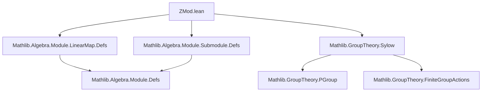
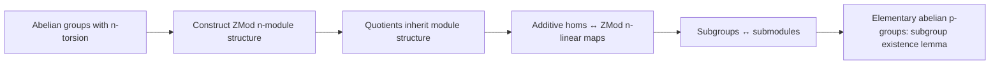

**Technical Brief: `ZMod.lean` Module Structure on Torsion Abelian Groups**

---

### 1. KEY DEFINITIONS & THEOREMS

| Name | Type / Signature | Purpose |
|------|------------------|---------|
| `AddCommMonoid.zmodModule` | `[NeZero n] → AddCommMonoid M → (∀ x, n • x = 0) → Module (ZMod n) M` | Constructs a `ZMod n`-module structure on a commutative monoid where every element is annihilated by `n`. |
| `AddCommGroup.zmodModule` | `AddCommGroup G → (∀ x, n • x = 0) → Module (ZMod n) G` | Extends the above to abelian groups (handles `n = 0` via `toIntModule`). |
| `QuotientAddGroup.zmodModule` | `[AddCommGroup G] → H : AddSubgroup G → (∀ x, n • x ∈ H) → Module (ZMod n) (G ⧸ H)` | Induces a `ZMod n`-module structure on the quotient when `n • x ∈ H` for all `x`. |
| `ZMod.map_smul` | `f : M →ₗ[ZMod n] M₁ → c : ZMod n → x : M → f (c • x) = c • f x` | Shows additive homomorphisms are `ZMod n`-linear (used in `toZModLinearMap`). |
| `ZMod.smul_mem` | `x ∈ K → c : ZMod n → c • x ∈ K` | Proves subgroups closed under scalar multiplication by `ZMod n`. |
| `AddMonoidHom.toZModLinearMap` | `M →+ M₁ → M →ₗ[ZMod n] M₁` | Reinterprets additive homomorphisms as `ZMod n`-linear maps. |
| `AddMonoidHom.toZModLinearMapEquiv` | `(M →+ M₁) ≃+ (M →ₗ[ZMod n] M₁)` | Equivalence between additive homs and `ZMod n`-linear maps. |
| `AddSubgroup.toZModSubmodule` | `AddSubgroup M ≃o Submodule (ZMod n) M` | Equivalence between additive subgroups and `ZMod n`-submodules (order-preserving). |
| `ZModModule.exists_submodule_subset_card_le` | `[Module (ZMod p) G] → H ≤ G → k ≤ |H|, k ≠ 0 ⇒ ∃ H' ≤ H, |H'| ≤ k < p·|H'|` | Submodule version of Sylow-style subgroup existence in elementary abelian `p`-groups. |

---

### 2. NAMING CONVENTIONS

- **Prefixes**:
  - `zmodModule`: indicates construction of a `ZMod n`-module structure.
  - `toZMod*`: conversion *to* a `ZMod n`-structured object (`toZModLinearMap`, `toZModSubmodule`).
  - `map_*`, `smul_*`: properties about interaction of maps/scalars with structure.

- **Suffixes**:
  - `Equiv`: bijective equivalence (e.g., `toZModLinearMapEquiv`).
  - `Equivo`: order-preserving equivalence (e.g., `toZModSubmodule` is `≃o`).
  - `mem_*`, `coe_*`: lemmas about membership or coercion.

- **Case patterns**:
  - `n + 1` vs `0`: case analysis on `n` for base cases (especially for `n = 0` vs `n > 0`).

---

### 3. TACTIC STACK

- `rw`: rewriting using modular arithmetic identities (`Nat.mod_add_div'`, `add_nsmul`, `mul_nsmul`, etc.)
- `simp`: simplification with `h`, `cast`, `zsmul_mem`, etc.
- `exact`: direct proof steps after simplification.
- `ext`: extensionality for functions/morphisms.
- `congr`: congruence for function extensionality.
- `obtain ⟨...⟩ := ...`: destructuring existential or product types (e.g., from `Sylow.exists_subgroup_le_card_le`).
- `simpa [QuotientAddGroup.forall_mk, ← QuotientAddGroup.mk_nsmul]`: targeted simplification with rewrite rules.

---

### 4. PROOF LOGIC

- **Inductive/Case-based structure**: Definitions like `zmodModule` split on `n = 0` vs `n > 0`.
- **Reduction via modular arithmetic**: Key lemmas like `h_mod` reduce scalar multiplication modulo `n`.
- **Transport along equivalences**: Subgroups ↔ submodules via `toZModSubmodule`, additive maps ↔ linear maps via `toZModLinearMap`.
- **Leveraging existing structures**: Uses `toIntModule` for `n = 0`, and `Sylow.exists_subgroup_le_card_le` for the final lemma.
- **Verification of module axioms**: For `zmodModule`, each module law is proven by reducing to `nsmul` properties and using `h : n • x = 0`.

---

### 5. IMPORTS

| Import | Purpose |
|--------|---------|
| `Mathlib.Algebra.Module.LinearMap.Defs` | Defines linear maps (`→ₗ[R]`) and related structure. |
| `Mathlib.Algebra.Module.Submodule.Defs` | Defines submodules and their operations. |
| `Mathlib.GroupTheory.Sylow` | Provides Sylow theorems and subgroup existence lemmas (used in `exists_submodule_subset_card_le`). |

---

### 6. DEPENDENCY & THEORY OVERVIEW

#### Mermaid Diagram: Module Dependencies

#### Mermaid Diagram: Theory Flow

---

### 7. DOMAIN-SPECIFIC INSIGHTS

- **Reversibility of structure**: The equivalence `AddSubgroup M ≃o Submodule (ZMod n) M` shows that for `n`-torsion modules, the additive subgroup lattice *is* the submodule lattice.
- **Reducible non-instances**: The `note [reducible non-instances]` comments indicate that these are *reducible* abbreviations (not typeclass instances) to avoid inference loops and allow explicit control.
- **Modular arithmetic as core**: The entire theory hinges on the identity `(c % n) • x = c • x` under the assumption `n • x = 0`.
- **Bridge between additive and module theory**: This file formalizes the bridge between torsion abelian groups and modules over the ring `ℤ/nℤ`, a foundational step for structure theorems (e.g., classification of finite abelian groups).

--- 

Let me know if you'd like a formalized summary in Lean syntax or a theory roadmap for extending this to PID/module classification.
