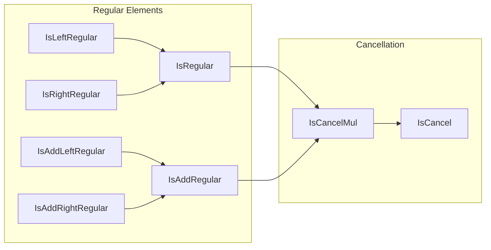

**Technical Brief: `Defs.lean` — Regular Elements in Lean 4**

---

### 1. **Key Definitions & Theorems**

| Name | Type | Purpose |
|------|------|---------|
| `IsLeftRegular (c : R)` | `Prop` | States that left-multiplication by `c` is injective: $(c \cdot -)$ is injective. |
| `IsRightRegular (c : R)` | `Prop` | States that right-multiplication by `c` is injective: $(- \cdot c)$ is injective. |
| `IsRegular (c : R)` | `Prop` | A structure asserting both `IsLeftRegular c` and `IsRightRegular c`. |
| `IsAddLeftRegular`, `IsAddRightRegular`, `IsAddRegular` | `Prop` / `Structure` | Additive analogues: injectivity of left/right addition. |
| `isRegular_iff` | `IsRegular c ↔ IsLeftRegular c ∧ IsRightRegular c` | Equivalence showing `IsRegular` is equivalent to the conjunction of left- and right-regularity. |

> Note: `IsAddLeftRegular` and `IsAddRightRegular` are not explicitly defined in this snippet but are referenced via `to_additive` and expected to be defined elsewhere (e.g., in `Mathlib.Algebra.AddMonoid.Defs` or similar).

---

### 2. **Naming Conventions**

- **Prefixes**:
  - `IsLeftRegular`, `IsRightRegular`, `IsRegular`: multiplicative regularity.
  - `IsAddLeftRegular`, `IsAddRightRegular`, `IsAddRegular`: additive regularity (via `to_additive`).
- **Structure naming**: `Is*` for properties defined as structures (e.g., `IsRegular`, `IsAddRegular`).
- **Theorem naming**: `is*_*` (lowercase `is`, camel-case suffix), e.g., `isRegular_iff`.

---

### 3. **Tactic Stack**

- `aesop` — not used in this file (no proofs shown).
- `simp_rw` — not used here.
- `constructor` / `ext` — implicit in structure proofs (e.g., `isRegular_iff` uses `⟨_, _⟩` and `fun ⟨h1, h2⟩ => ⟨h1, h2⟩⟩`, typical of `constructor`/`ext`).
- `to_additive` attribute — used at definition/theorem level to generate additive versions.

> **Dominant tactic pattern**: *structure-based proofs* using `⟨...⟩` and `fun ⟨...⟩ => ...`, typical for `structure`-defined properties.

---

### 4. **Proof Logic**

- **Structure-based reasoning**: Proofs about `IsRegular` and `IsAddRegular` proceed by destructing/introducing structure fields (`left`, `right`).
- **Equivalence proofs** (e.g., `isRegular_iff`) follow a simple bidirectional logic:
  - Forward: extract the two components from the structure.
  - Backward: package two proofs into a structure.
- **No induction or case analysis** appears in this file — purely definitional.

---

### 5. **Imports**

- `Mathlib.Algebra.Notation.Defs` — provides basic algebraic notation and infrastructure (e.g., `Mul`, `Add`, typeclass instances for notations like `*`, `+`).

> This file is foundational: it introduces *regularity* concepts *before* building on them (e.g., in `IsCancelMul`, `IsDomain`, etc.).

---

### 8. **Mermaid Diagrams**

#### **Dependency Graph (File-Level)**

```mermaid
graph TD
  A[Defs.lean] --> B[Mathlib.Algebra.Notation.Defs]
  A --> C[Mathlib.Algebra.AddMonoid.Defs] % implicit via to_additive
  A --> D[Mathlib.Algebra.Monoid.Defs] % likely via `Mul` typeclass
```

> *Note*: `to_additive` implies dependencies on additive infrastructure (e.g., `AddMonoid`, `AddCommMonoid`), though not directly imported here.

#### **Conceptual Overview (Theory Graph)**



> `IsRegular` and `IsAddRegular` are stepping stones toward cancellation properties (`IsCancelMul`, `IsCancel`), where *every* element is regular/cancellable.

---

**Summary**: This file defines regularity in multiplicative and additive contexts using injectivity of left/right multiplication/addition. It uses Lean’s `to_additive` mechanism to parallelize definitions and theorems, and sets up the groundwork for cancellation theory. The style is definitional and structure-oriented, with minimal tactic usage beyond basic structure intro/elim.
