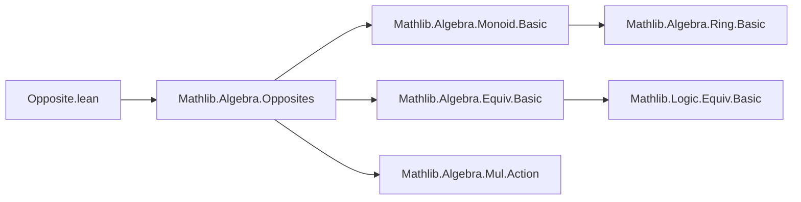
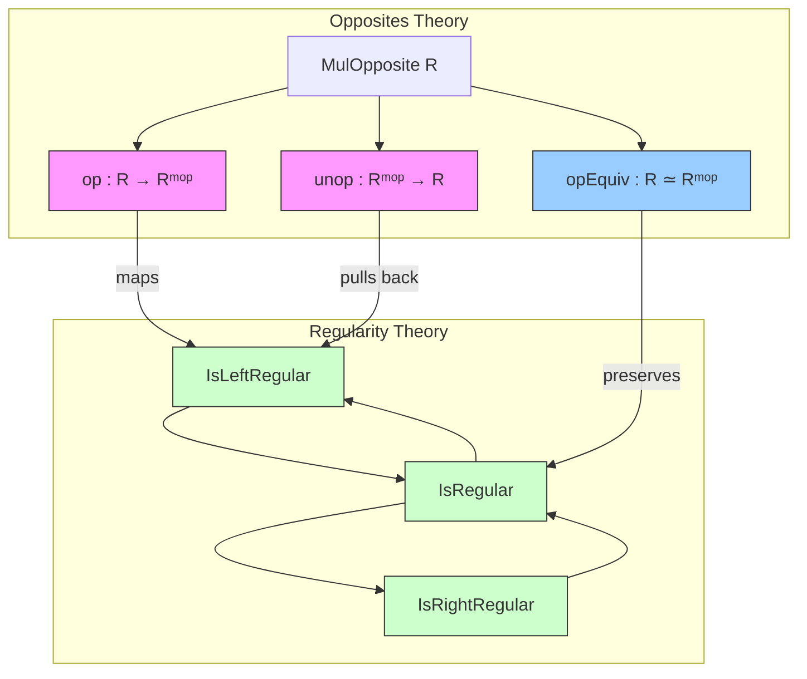

**Technical Brief: `Opposite.lean` Module**

---

### 1. **Key Definitions & Theorems**

| Name | Type | Purpose |
|------|------|---------|
| `isLeftRegular_op` | `IsLeftRegular (op a) ↔ IsRightRegular a` | Relates left-regularity of the opposite element to right-regularity of the original. |
| `isRightRegular_op` | `IsRightRegular (op a) ↔ IsLeftRegular a` | Relates right-regularity of the opposite element to left-regularity of the original. |
| `isRegular_op` | `IsRegular (op a) ↔ IsRegular a` | Shows regularity is preserved under opposition (since regular = left ∧ right). |
| `isLeftRegular_unop` | `IsLeftRegular a.unop ↔ IsRightRegular a` | Dual of `isLeftRegular_op`, for elements in `Rᵐᵒᵖ`. |
| `isRightRegular_unop` | `IsRightRegular a.unop ↔ IsLeftRegular a` | Dual of `isRightRegular_op`. |
| `isRegular_unop` | `IsRegular a.unop ↔ IsRegular a` | Dual of `isRegular_op`. |
| `IsLeftRegular.op`, `IsRightRegular.op`, `IsRegular.op` | Proof aliases | Provide forward directions of the equivalences as lemmas (via `protected alias`). |
| `IsLeftRegular.unop`, `IsRightRegular.unop`, `IsRegular.unop` | Proof aliases | Provide forward directions for unop. |

> **Note**: `IsRegular x` is defined as `IsLeftRegular x ∧ IsRightRegular x`.  
> `op : R → Rᵐᵒᵖ` and `unop : Rᵐᵒᵖ → R` are the canonical maps from the `MulOpposite` construction.

---

### 2. **Naming Conventions**

- **Prefixes**:
  - `isLeftRegular_`, `isRightRegular_`, `isRegular_`: predicate-based naming for regularity properties.
  - `op`, `unop`: standard for opposite/unop maps.
- **Suffixes**:
  - `_op`: statements about `op a`.
  - `_unop`: statements about `a.unop`.
- **Aliases**:
  - `protected alias ⟨_, IsRegular.op⟩ := ...` — extracts the forward implication as a reusable lemma.

---

### 3. **Tactic Stack**

- `simp`: heavily used, especially with `isRegular_iff`, `and_comm`, and symmetry.
- `symm`: to flip equivalences.
- `trans`: chaining equivalences via `comp_injective` and `injective_comp`.
- `by` + `simp [...]`: for short proofs (e.g., `isRegular_op`).
- No heavy automation (e.g., `aesop`, `linarith`, `ring`) — proofs are mostly algebraic rewrites.

---

### 4. **Proof Logic**

- **Core idea**: Use properties of `opEquiv : R ≃ Rᵐᵒᵖ` (the multiplicative opposite equivalence).
- For `isLeftRegular_op` and `isRightRegular_op`, the proof leverages:
  - `opEquiv.comp_injective _` (injectivity of composition with `op`)
  - `opEquiv.injective_comp _` (equivalence of left/right composition under `op`)
  - Then `trans` + `symm` to get the desired biconditional.
- For `isRegular_op`, since regularity is a conjunction, `simp` suffices using `isRegular_iff` and `and_comm`.
- All `unop` versions follow by symmetry (`symm`) of the corresponding `op` versions.

---

### 5. **Imports**

- `Mathlib.Algebra.Opposites`: provides `MulOpposite`, `op`, `unop`, `opEquiv`, and basic regularity theory.

---

### 8. **Mermaid Diagrams**

#### **Dependency Graph (Module-Level)**



#### **Overview of Theory Flow**



#### **Proof Structure (High-Level)**

```mermaid
flowchart LR
  A[IsLeftRegular (op a)] 
    <-->|opEquiv.comp_injective| B[IsRightRegular a]
  A <-->|symm + trans| B
  C[IsRegular (op a)] 
    <-->|simp [isRegular_iff, and_comm]| D[IsRegular a]
```

---

**Summary**: This module formalizes how regularity properties behave under the multiplicative opposite construction. It uses the equivalence `opEquiv` to translate left/right regularity across `op`/`unop`, with concise proofs relying on `simp` and equivalence reasoning. The naming and aliasing follow Lean/Mathlib conventions for symmetry and reusability.
