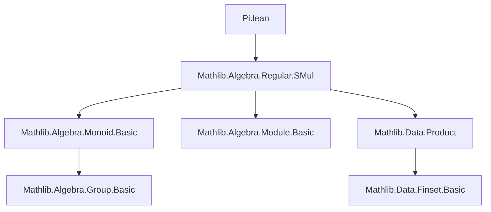
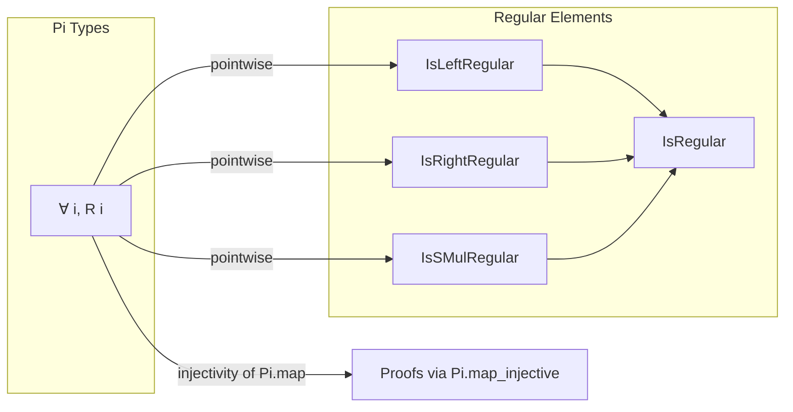

**Technical Brief: `Pi.lean` — Regularity in Pi Types**

---

### 1. **Key Definitions & Theorems**

| Name | Type | Purpose |
|------|------|---------|
| `IsLeftRegular` | `∀ {α} [Mul α], α → Prop` | $a$ is left regular iff $∀ x y,\ a * x = a * y → x = y$ |
| `IsRightRegular` | `∀ {α} [Mul α], α → Prop` | $a$ is right regular iff $∀ x y,\ x * a = y * a → x = y$ |
| `IsRegular` | `∀ {α} [Mul α], α → Prop` | $a$ is regular iff it is both left and right regular |
| `IsSMulRegular` | `∀ {α β} [SMul α β], α → Prop` | $r$ is left $*$-regular w.r.t. scalar multiplication: $∀ x y,\ r • x = r • y → x = y$ |
| `isLeftRegular_iff` | `IsLeftRegular a ↔ ∀ i, IsLeftRegular (a i)` | Characterizes left regularity of a function $a : \prod_i R i$ pointwise |
| `isRightRegular_iff` | `IsRightRegular a ↔ ∀ i, IsRightRegular (a i)` | Same for right regularity |
| `isRegular_iff` | `IsRegular a ↔ ∀ i, IsRegular (a i)` | Pointwise characterization of regularity |
| `isSMulRegular_iff` | `IsSMulRegular (∀ i, R i) r ↔ ∀ i, IsSMulRegular (R i) r` | Pointwise characterization of scalar multiplication regularity |

All theorems are equipped with `[to_additive (attr := simp)]`, indicating they have additive analogues and are `simp`-friendly.

---

### 2. **Naming Conventions**

- **Prefixes**:
  - `is_`: Predicate-style naming for properties (`isLeftRegular`, `isRightRegular`, `isRegular`, `isSMulRegular`)
- **Suffixes**:
  - `_iff`: Indicates an equivalence (↔) statement
- **Structure**:
  - `theorem name {args} [instances] : Prop ↔ Prop := proof`
  - Use of `Pi.map_injective` as a key proof ingredient (injectivity of `Pi.map`)

---

### 3. **Tactic Stack**

| Tactic | Usage |
|--------|-------|
| `simp` | Used explicitly in `isRegular_iff`, and implicitly via `to_additive (attr := simp)` |
| `have ... := ...; ...` | To construct a witness for nonemptiness (`have (i : _) : Nonempty (R i) := ⟨a i⟩`) |
| `.symm` | To reverse an equivalence/injective map (e.g., `.symm <| Pi.map_injective.symm`) |
| `simp_rw` (implicit) | Via `simp` with `to_additive` and definitional rewritings |
| `constructor` (implicit) | For `↔` proofs — not shown but standard for such equivalences |

---

### 4. **Proof Logic**

- **General Strategy**:
  - Leverage injectivity of the canonical map `Pi.map : (∀ i, R i) → ∏ i, R i` (here, identity on dependent functions).
  - For `isLeftRegular_iff` and `isRightRegular_iff`, use:
    - `have (i : _) : Nonempty (R i) := ⟨a i⟩` to ensure nonempty fibers (needed for injectivity).
    - Apply `Pi.map_injective`, which states that if `Pi.map f = Pi.map g` then `f = g`.
  - For `isRegular_iff`, reduce via `isRegular_iff := isLeftRegular ∧ isRightRegular` and use `forall_and`.
  - For `isSMulRegular_iff`, directly apply `Pi.map_injective` (since scalar multiplication is preserved under `Pi.map`).

- **Pattern**:
  > *Show equivalence by reducing to pointwise behavior via injectivity of the product embedding.*

---

### 5. **Imports & Dependencies**

| Import | Role |
|--------|------|
| `Mathlib.Algebra.Regular.SMul` | Defines `IsSMulRegular`, `IsLeftRegular`, `IsRightRegular`, `IsRegular`, and their basic properties |
| `Pi` (built-in) | Dependent product type and `Pi.map` |
| `Nonempty` (core) | Used to ensure type fibers are inhabited (needed for injectivity lemmas) |

No other imports are present — this is a minimal, self-contained module.

---

### 6. **Mermaid Diagrams**

#### **Dependency Graph**

#### **Overview of Theoretical Scope**

---

### 7. **Summary**

This module establishes that regularity (left, right, or full) and scalar multiplication regularity are **pointwise properties** in dependent product types (`Π i, R i`). The proofs rely on the injectivity of the canonical embedding of product functions into the product type — a standard but powerful technique in algebraic formalization. The use of `to_additive` ensures compatibility with additive notation (e.g., for modules or abelian groups), making the results broadly applicable across algebraic structures.
