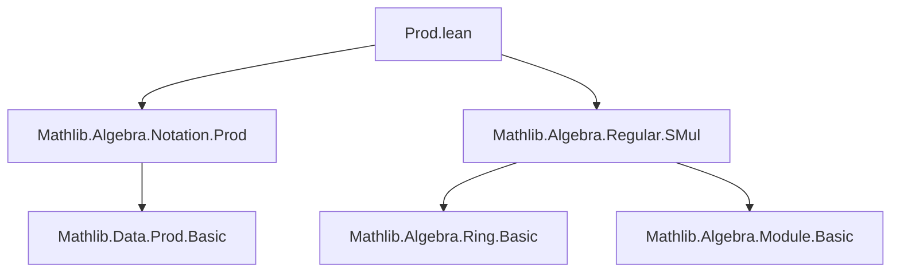

**Technical Brief: `Prod.lean` — Regularity in Product Types**

---

### 1. **Key Definitions & Theorems**

| Name | Type | Purpose |
|------|------|---------|
| `Prod.isLeftRegular_mk` | `IsLeftRegular (a, b) ↔ IsLeftRegular a ∧ IsLeftRegular b` | Characterizes left-regular elements in a product ring/semigroup as pairs of left-regular elements. |
| `Prod.isRightRegular_mk` | `IsRightRegular (a, b) ↔ IsRightRegular a ∧ IsRightRegular b` | Same as above, for right-regular elements. |
| `Prod.isRegular_mk` | `IsRegular (a, b) ↔ IsRegular a ∧ IsRegular b` | Characterizes regular elements (both left and right) in products. |
| `IsLeftRegular.prodMk` | `IsLeftRegular a → IsLeftRegular b → IsLeftRegular (a, b)` | Constructive direction: if components are left-regular, so is the pair. |
| `IsRightRegular.prodMk` | `IsRightRegular a → IsRightRegular b → IsRightRegular (a, b)` | Constructive direction for right-regular. |
| `IsRegular.prodMk` | `IsRegular a → IsRegular b → IsRegular (a, b)` | Constructive direction for regular elements. |
| `Prod.isSMulRegular_iff` | `IsSMulRegular (R × S) r ↔ IsSMulRegular R r ∧ IsSMulRegular S r` | Generalizes regularity to scalar multiplication across product modules. |

> **Note**: `isRegular a` means `IsLeftRegular a ∧ IsRightRegular a`.  
> `IsSMulRegular R r` means left-multiplication by `r` is injective on `R`.

---

### 2. **Naming Conventions**

- **Prefixes**:
  - `is*Regular` — predicates for regularity (left, right, two-sided).
  - `prodMk` — constructive introduction rule for product elements.
- **Suffixes**:
  - `_mk` — used for equivalence/implication involving pair introduction (`(a, b)`).
  - `_iff` — used for biconditional characterizations (e.g., `isSMulRegular_iff`).
- **Pattern**: `Prod.[property]_[constructor/iff]` — standard for product-type properties.

---

### 3. **Tactic Stack**

| Tactic | Usage |
|--------|-------|
| `simp` | Simplification using `isRegular_iff`, `and_and_and_comm`, and `Prod.map_injective`. |
| `exact` / `assumption` | Implicit in `Prod.map_injective` usage (via `have` + `intro`/`intro?`). |
| `Iff.symm` | To flip equivalences when needed (e.g., in `Prod.isRightRegular_mk`). |
| `have : Nonempty _ := ⟨_⟩` | To supply nonemptiness needed by `Prod.map_injective`. |

> The proofs are mostly *equational reasoning* with `simp` and `Prod.map_injective`, leveraging injectivity of `Prod.map id id`.

---

### 4. **Proof Logic**

- **Structure**:
  1. Introduce nonemptiness of components (via `⟨a⟩`, `⟨b⟩`) to satisfy `Prod.map_injective`’s preconditions.
  2. Apply `Prod.map_injective`, which states:
     $$
     \text{Prod.map } f\,g\,x = \text{Prod.map } f\,g\,y \iff x = y
     $$
     Here, `f = g = id`, so injectivity reduces to component-wise equality.
  3. For `isRegular_mk`, use `isRegular_iff` (i.e., `IsLeftRegular a ∧ IsRightRegular a`) and simplify with `and_and_and_comm`.
- **Pattern**:
  - Equivalence proofs: reduce to injectivity of product map.
  - Constructive lemmas (`prodMk`): apply `⟨ha, hb⟩` and use `_iff.2`.

---

### 5. **Imports**

| Import | Role |
|--------|------|
| `Mathlib.Algebra.Notation.Prod` | Provides `×` notation and basic product algebraic structure (`Mul`, `SMul`, etc.). |
| `Mathlib.Algebra.Regular.SMul` | Defines `IsLeftRegular`, `IsRightRegular`, `IsRegular`, and `IsSMulRegular`. |

> These imports define the algebraic context (semigroups, modules) and regularity notions.

---

### 6. **Mermaid Diagrams**

#### **Dependency Graph (Module-Level)**



#### **Theoretical Overview (Conceptual Flow)**

```mermaid
flowchart LR
  subgraph "Algebraic Structure"
    R[Semigroup R] -->|Mul| PR[Prod R S]
    S[Semigroup S] -->|Mul| PR
  end

  subgraph "Regularity"
    L[IsLeftRegular a] -->|def| Reg[IsRegular a]
    Rg[IsRightRegular b] -->|def| Reg
  end

  subgraph "Product Characterization"
    Reg -->|Prod.isRegular_mk| RegPair[IsRegular (a,b)]
    L -->|Prod.isLeftRegular_mk| LPair[IsLeftRegular (a,b)]
    Rg -->|Prod.isRightRegular_mk| RPair[IsRightRegular (a,b)]
  end

  subgraph "Scalar Action"
    SM[SMul α R] -->|SMul| PR
    SM' [SMul α S] -->|SMul| PR
    SM -->|Prod.isSMulRegular_iff| SMPair[IsSMulRegular (R×S) r]
  end

  RegPair <-->|↔| LPair & RPair
```

---

### Summary

This module formalizes the elementary but foundational fact that regularity (left, right, or two-sided) and scalar regularity behave *componentwise* in product types. The proofs rely on the injectivity of the identity product map (`Prod.map id id`), a core property of products in type theory. The `to_additive` attributes indicate that analogous results hold for additive structures (e.g., abelian groups), supporting Lean’s additive/multiplicative duality infrastructure.
