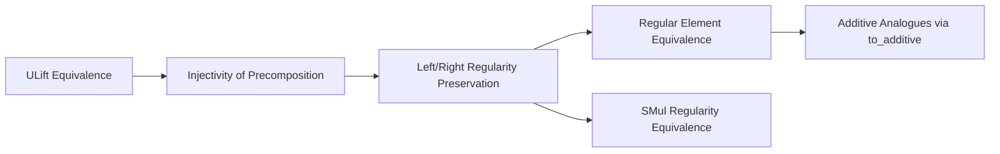

**Technical Brief: `ULift.lean` (Mathlib Module)**  
*Domain: Formalized Mathematics — Algebra, Type Theory, Category-Theoretic Lifting*

---

### 1. **Key Definitions & Theorems**

| Name | Type | Purpose |
|------|------|---------|
| `ULift.up.{u} a` | `R → ULift.{u} R` | Canonical embedding of a type `R` into its lifted version `ULift R` (to increase universe level) |
| `ULift.down` | `ULift R → R` | Inverse of `up`, projecting down from the lifted type |
| `IsLeftRegular a` | `Prop` | $a$ is left-regular: $a \cdot x = a \cdot y \implies x = y$ |
| `IsRightRegular a` | `Prop` | $a$ is right-regular: $x \cdot a = y \cdot a \implies x = y$ |
| `IsRegular a` | `Prop` | $a$ is both left- and right-regular |
| `IsSMulRegular α R r` | `Prop` | $r \in \alpha$ acts regularly on $R$ via scalar multiplication: $r \cdot x = r \cdot y \implies x = y$ |

| Theorem | Type | Purpose |
|---------|------|---------|
| `isLeftRegular_up` | `IsLeftRegular (ULift.up a) ↔ IsLeftRegular a` | Lift preserves left-regularity |
| `isRightRegular_up` | `IsRightRegular (ULift.up a) ↔ IsRightRegular a` | Lift preserves right-regularity |
| `isRegular_up` | `IsRegular (ULift.up a) ↔ IsRegular a` | Lift preserves regularity (uses `isRegular_iff`) |
| `isLeftRegular_down` | `IsLeftRegular a.down ↔ IsLeftRegular a` | Projection preserves left-regularity (by symmetry) |
| `isRightRegular_down` | `IsRightRegular a.down ↔ IsRightRegular a` | Projection preserves right-regularity |
| `isRegular_down` | `IsRegular a.down ↔ IsRegular a` | Projection preserves regularity |
| `isSMulRegular_iff` | `IsSMulRegular (ULift R) r ↔ IsSMulRegular R r` | Scalar regularity is preserved under `ULift` |

---

### 2. **Naming Conventions**

- **Prefixes**:
  - `is*Regular`: Predicate naming for regularity properties (`isLeftRegular`, `isRightRegular`, `isRegular`, `isSMulRegular`)
  - `*_up` / `*_down`: Indicate direction of lifting/projection
- **Suffixes**:
  - `_up`: Statement about `ULift.up`
  - `_down`: Statement about `ULift.down`
- **Attributes**:
  - `@[to_additive (attr := simp)]`: Enables automatic additive version generation and marks as `simp`-normalizing

---

### 3. **Tactic Stack**

- `simp`: Used via `@[simp]` attribute on theorems; heavily leveraged in `isRegular_up` and `isRegular_down`
- `rw` / `trans`: Implicit in proofs via `|>.trans` chaining equivalences
- `equiv.ulift.symm.comp_injective` / `equiv.ulift.symm.injective_comp`: Core reasoning about injectivity of precomposition under `ULift` equivalence
- No explicit `aesop`, `ring`, or `linarith` — proofs are purely logical/equational, relying on properties of equivalences and injectivity

---

### 4. **Proof Logic**

- **Core Strategy**: Exploit the fact that `ULift.up` and `ULift.down` form an equivalence (`Equiv.ulift`), and that injectivity of multiplication maps is preserved under equivalence.
- **Pattern**:
  1. Use `Equiv.ulift.symm.comp_injective _` to relate injectivity of left-multiplication on `ULift R` to that on `R`.
  2. Combine with `Equiv.ulift.symm.injective_comp _` to get equivalence of regularity conditions.
  3. For `isRegular_up`, simplify using `isRegular_iff` (which rewrites `IsRegular a ↔ IsLeftRegular a ∧ IsRightRegular a`).
  4. For `*_down`, apply symmetry (`*.symm`) of the corresponding `*_up` theorem.

- **Induction/Case Analysis**: Not used — all proofs are direct equivalences via equivalence properties.

---

### 5. **Imports**

| Import | Role |
|--------|------|
| `Mathlib.Algebra.Group.ULift` | Defines `ULift` group/monoid/semigroup instances and basic structure |
| `Mathlib.Algebra.Regular.SMul` | Defines `IsSMulRegular`, `IsLeftRegular`, `IsRightRegular`, and `IsRegular` |

> **Scope**: This module bridges `ULift` (a universe-lifting construction) with regularity properties in multiplicative and scalar multiplication contexts — foundational for reasoning about algebraic structures across universe levels.

---

### 8. **Mermaid Diagrams**

#### **Dependency Graph (Module-Level)**

```mermaid
graph TD
  ULift_lean --> Mathlib_Algebra_Group_ULift
  ULift_lean --> Mathlib_Algebra_Regular_SMul
  Mathlib_Algebra_Group_ULift --> Mathlib_Data ULift
  Mathlib_Algebra_Regular_SMul --> Mathlib_Algebra_Group_Definitions
  Mathlib_Algebra_Regular_SMul --> Mathlib_Algebra_Monoid_Definitions
```

#### **Overview of Theoretical Flow**



#### **Proof Structure (Per Theorem)**

```mermaid
flowchart LR
  Start[Start: Goal: IsRegular(up a) ↔ IsRegular a] --> Equiv[Use Equiv.ulift]
  Equiv --> CompInj[Apply comp_injective]
  CompInj --> InjComp[Apply injective_comp]
  InjComp --> Trans[Chain equivalence]
  Trans --> Simp[If needed: simp using isRegular_iff]
  Simp --> End[QED]
```

---

**Summary**: This module formalizes that `ULift` — a universe-level shifting equivalence — preserves and reflects regularity of elements under multiplication and scalar multiplication. It is a small but critical bridge for ensuring algebraic properties are universe-independent in Mathlib.
