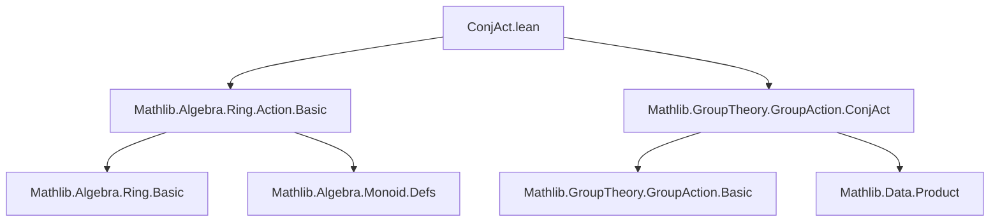
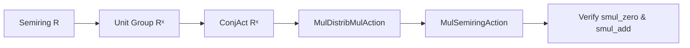

**Technical Brief: `ConjAct.lean`**

---

### 1. **Key Definitions & Theorems**

| Name | Type / Signature | Purpose |
|------|------------------|---------|
| `unitsMulSemiringAction` | `MulSemiringAction (ConjAct Rˣ) R` | Constructs a multiplicative semiring action of the *conjugation action* of the unit group $R^×$ on the semiring $R$. Specifically, it extends the existing `ConjAct.unitsMulDistribMulAction` (a multiplicative distributive action) to a full `MulSemiringAction`, verifying compatibility with `0` and `+`. |

- **`ConjAct Rˣ`**: The conjugation action of the group of units $R^×$ on the underlying type of $R$, defined as $u \cdot r = u \cdot r \cdot u^{-1}$.
- **`units_smul_def`**: Definition of scalar multiplication in this action: $u • r = u * r * u⁻¹$.

---

### 2. **Naming Conventions**

- **Prefixes**:
  - `units_`: Pertains to actions involving the unit group $R^×$.
  - `ConjAct.`: Namespace for conjugation action–related constructions.
- **Suffixes**:
  - `_MulAction`, `_MulSemiringAction`: Denote the algebraic structure of the action (multiplicative group action vs. semiring compatibility).
- **Pattern**: `X_Y_Z` often encodes “action of X with property Y on structure Z”.

---

### 3. **Tactic Stack**

- `simp`: Used twice, with custom lemmas (`units_smul_def`, `mul_add`, `add_mul`).
- No heavy automation (e.g., `aesop`, `ring`, `linarith`) — proofs are straightforward simplifications.
- Tactics used: `simp`, `by` (tactic block), `exact` (implicit via `by`).

---

### 4. **Proof Logic**

- **Strategy**: *Direct verification* of `MulSemiringAction` axioms using definitional equality and basic ring identities.
  - `smul_zero`: Simplifies using `units_smul_def` and `zero_mul`, `mul_zero`.
  - `smul_add`: Expands `smul` as conjugation, then applies distributivity of multiplication over addition (`mul_add`, `add_mul`).
- **No induction** or case analysis — relies on algebraic properties of semirings and unit inverses.

---

### 5. **Imports**

| Import | Role |
|--------|------|
| `Mathlib.Algebra.Ring.Action.Basic` | Provides foundational definitions: `MulAction`, `MulSemiringAction`, `smul`, etc. |
| `Mathlib.GroupTheory.GroupAction.ConjAct` | Defines the conjugation action `ConjAct G` for a group $G$, including `ConjAct.unitsMulDistribMulAction`. |

> **Note**: The module *exposes* `Field` is *not* used (explicitly `assert_not_exists Field` ensures no dependency on `Field`).

---

### 6. **Dependency & Theory Overview**

#### Mermaid Diagram: Module Dependencies

#### Mermaid Diagram: Theoretical Flow

- **Core Theory**: The conjugation action of the unit group $R^×$ on $R$ preserves addition and multiplication (hence is a *ring* automorphism), and extends naturally to a `MulSemiringAction`.
- **Scope**: This file formalizes the *compatibility* of conjugation with the semiring structure — foundational for later results on group rings, crossed modules, or Galois theory in noncommutative settings.

--- 

Let me know if you'd like the corresponding `MulDistribMulAction` definition or a proof sketch of `smul_add`.
