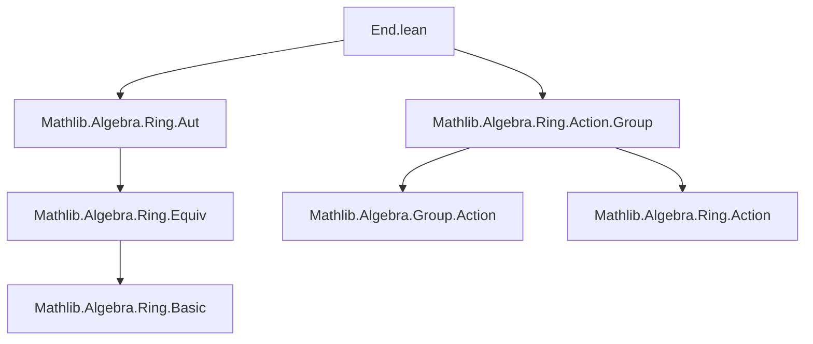

**Technical Brief: `End.lean` — Ring Automorphism Group and Its Action**

---

### 1. **Key Definitions & Theorems**

| Name | Type / Signature | Purpose |
|------|------------------|---------|
| `RingAut R` | `RingEquiv R R` | The type of ring automorphisms of `R`, i.e., bijective ring homomorphisms `R → R`. |
| `applyMulSemiringAction` | `MulSemiringAction (RingAut R) R` | The *tautological* action of `RingAut R` on `R` via evaluation: `f • r = f r`. |
| `smul_def` | `∀ f r, f • r = f r` | Justifies that the `smul` action is literally application. |
| `apply_faithfulSMul` | `FaithfulSMul (RingAut R) R` | Ensures the action is faithful: if `f • r = g • r` for all `r`, then `f = g`. |
| `MulSemiringAction.toRingAut` | `[MulSemiringAction G R] ⇒ G →* RingAut R` | Converts any multiplicative semiring action of `G` on `R` into a group homomorphism `G → RingAut R`. |

---

### 2. **Naming Conventions**

- **Prefixes**:
  - `apply_`: indicates an action defined by application (e.g., `applyMulSemiringAction`, `apply_faithfulSMul`).
  - `to_`: conversion or universal construction (e.g., `toRingAut`, `toFun`).
- **Suffixes**:
  - `_smul`: relates to scalar multiplication (`smul_def`, `one_smul`, `mul_smul`).
  - `_def`: definition lemmas (e.g., `smul_def`).
- **Structure names**:
  - `RingAut`: module and namespace name; `RingEquiv R R` underlying type.

---

### 3. **Tactic Stack**

- `rfl`: used for definitional equalities (`smul_def`, `one_smul`, `mul_smul`).
- `RingEquiv.ext`: used to prove equality of ring automorphisms by extensionality (applied to underlying functions).
- `aesop` is *not* used here — proofs are mostly definitional or rely on `simp`-friendly lemmas.
- `simp_rw` not needed; `simp` suffices due to `@[simp]` annotations.

---

### 4. **Proof Logic**

- **Structure**: The proofs are *definitional* and *extensional*:
  - `applyMulSemiringAction`: verifies the `MulSemiringAction` axioms by appealing to the fact that `RingAut` elements are ring homomorphisms (`map_zero`, `map_add`, etc.).
  - `smul_def`: immediate from definition of `smul` as application.
  - `apply_faithfulSMul`: uses `RingEquiv.ext`, i.e., extensionality of ring equivalences.
  - `MulSemiringAction.toRingAut`:
    - `toFun` uses `MulSemiringAction.toRingEquiv` (a prior construction).
    - `map_mul'` and `map_one'` reduce to `mul_smul` and `one_smul`, then apply `RingEquiv.ext`.

- **No induction or case analysis** — all arguments are algebraic and rely on homomorphism properties.

---

### 5. **Imports**

| Import | Role |
|--------|------|
| `Mathlib.Algebra.Ring.Action.Group` | Provides `MulSemiringAction`, `DistribMulAction`, etc. |
| `Mathlib.Algebra.Ring.Aut` | Defines `RingAut` and related structures (likely imports `Ring.Equiv`). |

> Note: The file is intentionally kept separate from `Ring.Equiv` to avoid dependency cycles (e.g., `Fintype.Perm` needs `RingEquiv` before group structure on automorphisms).

---

### 6. **Mermaid Diagrams**

#### **Dependency Graph (Module-Level)**



#### **Overview of Theory Flow**

```mermaid
flowchart LR
  A[Semiring R] --> B[RingEquiv R R]
  B --> C[RingAut R]
  C --> D[MulSemiringAction (RingAut R) R]
  D --> E[ FaithfulSMul ]
  F[MulSemiringAction G R] --> G[toRingAut G R]
  G --> C
```

- **Key insight**: `RingAut R` is the *universal* object for ring automorphism actions on `R`, and any action of `G` on `R` factors uniquely through it.

---

### 7. **Additional Notes**

- **Multiplication convention**: `RingAut` multiplication = function composition = `Equiv.Perm` multiplication = `CategoryTheory.End`, but *not* `CategoryTheory.comp` (which is opposite order).
- **Design principle**: Separation of `RingEquiv` (as a type with equivalence structure) from `RingAut` (as a group) avoids premature dependencies.
- **`@[simps]`**: Used on `toRingAut` to generate projection lemmas (e.g., `toRingAut_apply`, `toRingAut_apply_one`, etc.).

--- 

Let me know if you'd like the corresponding `RingAut` theory in `Ring.Equiv` or a formalization checklist for extending this to `RingAut` as a `Group` instance.
