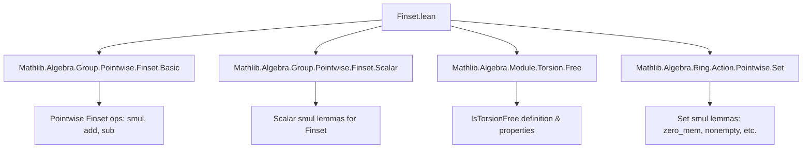
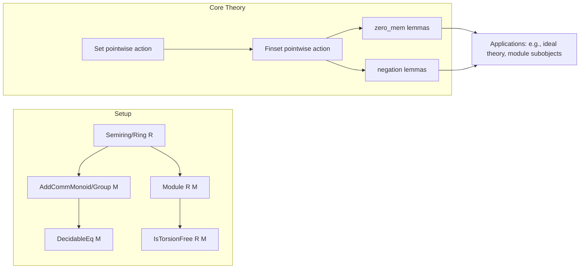

**Technical Brief: `Finset.lean` — Pointwise Actions on Finite Sets in a Ring**

---

### 1. **Key Definitions & Theorems**

| Name | Type / Statement | Purpose |
|------|------------------|---------|
| `zero_mem_smul_finset_iff` | `r ≠ 0 → (0 ∈ r • t ↔ 0 ∈ t)` | Characterizes when zero belongs to a *scalar* smul of a finite set, under nonzero scalar. |
| `zero_mem_smul_iff` | `(0 ∈ s • t ↔ 0 ∈ s ∧ t.Nonempty ∨ 0 ∈ t ∧ s.Nonempty)` | Full characterization of zero in *set* smul (i.e., `s • t`), handling both zero in scalar set and/or target set. |
| `neg_smul_finset` | `-a • t = -(a • t)` | Commutativity of negation and scalar smul on finite sets (for single scalar `a`). |
| `neg_smul` | `-s • t = -(s • t)` | Commutativity of negation and *set* smul (for finite set of scalars `s`). |

> **Notation**: `•` denotes the pointwise action of `R` on `M`, defined as `s • t = { r • m | r ∈ s, m ∈ t }`.

---

### 2. **Naming Conventions**

- **Prefixes**:
  - `zero_mem_…`: Properties about membership of `0`.
  - `neg_…`: Properties about interaction with additive inverse (`-`).
- **Suffixes**:
  - `_finset`: Applies to finite sets (`Finset`), often distinguishing from set-theoretic versions (`Set`).
  - `_iff`: Biconditional characterizations.

> Example: `zero_mem_smul_finset_iff` → `zero_mem_` + `smul` + `_finset` + `_iff`.

---

### 3. **Tactic Stack**

- `simp only [...]`: Used for targeted simplification with specific lemmas.
- `rw [...]`: Rewriting using definitions or lemmas (e.g., `← mem_coe`, `coe_smul_finset`).
- `simp_rw [...]`: Combines simplification and rewriting, especially for `image_` lemmas.
- `exact ...`: Direct proof step (e.g., `exact image₂_image_left_comm neg_smul`).
- `rfl`: Reflexivity for definitional equalities.

> No heavy automation (e.g., `aesop`, `linarith`) — proofs are mostly algebraic rewrites and structural reasoning.

---

### 4. **Proof Logic**

- **Structure**:
  1. **Rewrite definitions** using `← mem_coe` to reduce `Finset` membership to `Set` membership.
  2. **Apply known `Set` lemmas** (e.g., `Set.zero_mem_smul_set_iff`, `Set.zero_mem_smul_iff`).
  3. **Simplify using `simp`/`simp_rw`** with image lemmas (`image_smul`, `image_neg_eq_neg`).
  4. **Use functional commutativity** (e.g., `image₂_image_left_comm`) to swap operations.

- **Typical flow**:
  > `rw [def] → apply known Set lemma → rfl / simp / exact`

- **No induction** observed — relies on pre-established `Set` theory and `Finset` coercion lemmas.

---

### 5. **Imports**

| Import | Role |
|--------|------|
| `Mathlib.Algebra.Group.Pointwise.Finset.Basic` | Basic `Finset` pointwise operations (`smul`, `add`, etc.). |
| `Mathlib.Algebra.Group.Pointwise.Finset.Scalar` | Scalar-specific lemmas for `Finset` actions. |
| `Mathlib.Algebra.Module.Torsion.Free` | Ensures torsion-freeness for `R`-module `M`, used implicitly via `[IsTorsionFree R M]`. |
| `Mathlib.Algebra.Ring.Action.Pointwise.Set` | Set-theoretic pointwise action lemmas (e.g., `Set.zero_mem_smul_iff`). |

> **Scope**: This file bridges `Set` and `Finset` pointwise actions, focusing on *ring* and *module* contexts.

---

### 6. **Mermaid Diagrams**

#### **Dependency Graph (Module-Level)**

#### **Overview of Theoretical Flow**

---

### 7. **Domain-Specific AI Agent Notes**

- **Key reasoning patterns**:
  - Convert `Finset` statements to `Set` via coercion (`↑s`).
  - Use `image_` lemmas to push operations through finite sets.
  - Leverage `IsTorsionFree` only when needed (e.g., `zero_mem_smul_finset_iff` requires `r ≠ 0`).
- **Common pitfalls**:
  - Forgetting `DecidableEq` assumptions (needed for `Finset` equality/operations).
  - Confusing `r • t` (scalar smul) vs `s • t` (set smul).
- **Extensibility**:
  - This file is a building block for `Ideal`, `Submodule`, and `Module` theory (e.g., finite generation, annihilators).

--- 

Let me know if you'd like the corresponding `Set.lean` theory summary or a formalization roadmap for extending this file.
