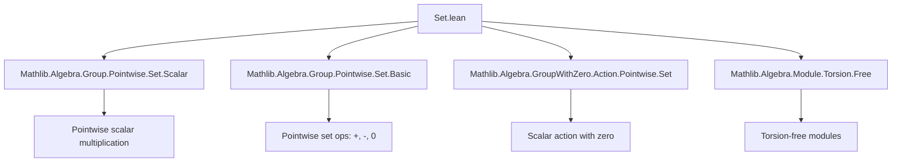

**Technical Brief: `Set.lean` — Pointwise Operations of Sets in a Ring**

---

### 1. **Key Definitions & Theorems**

| Name | Type / Statement | Purpose |
|------|------------------|---------|
| `smul_set_neg` | `a • -t = -(a • t)` | Shows scalar multiplication distributes over negation of a set. |
| `smul_neg` | `s • -t = -(s • t)` | Extends `smul_set_neg` to pointwise scalar multiplication by a set. |
| `add_smul_subset` | `(a + b) • s ⊆ a • s + b • s` | Relates scalar addition to set addition under scalar multiplication; inclusion may be strict without torsion-freeness or domain assumptions. |
| `zero_mem_smul_set_iff` | `0 ∈ a • t ↔ 0 ∈ t` (for `a ≠ 0`) | Characterizes when zero lies in a scalar multiple of a set, assuming scalar is nonzero and module is torsion-free. |
| `zero_mem_smul_iff` | `0 ∈ s • t ↔ (0 ∈ s ∧ t.Nonempty) ∨ (0 ∈ t ∧ s.Nonempty)` | Full characterization of zero membership in product of sets under scalar multiplication. |
| `neg_smul_set` | `-a • t = -(a • t)` | Analog of `smul_set_neg` for ring negation. |
| `neg_smul` | `-s • t = -(s • t)` | Set-level version of `neg_smul_set`. |

All lemmas are `@[simp]`, indicating they are intended for automatic simplification.

---

### 2. **Naming Conventions**

- **Prefixes**:
  - `smul_`, `neg_`, `add_`: indicate operation being studied (scalar mult, negation, addition).
  - `zero_mem_`: indicates membership of zero is being analyzed.
- **Suffixes**:
  - `_set`: indicates the operation is on sets (e.g., `smul_set_neg`).
  - `_iff`: indicates an equivalence (↔) statement.
  - `_subset`: indicates an inclusion (⊆) statement.

---

### 3. **Tactic Stack**

- `simp_rw`: used repeatedly to rewrite using `image_` lemmas and definitions.
- `simp only [...]`: fine-grained simplification with explicit lemmas.
- `exact ...`: for direct proof steps.
- `rintro`, `obtain`, `rwa`: for destructuring and rewriting hypotheses.
- `image_image`, `image_image2_right_comm`, `image2_image_left_comm`: used to commute images of binary/unary operations.
- `smul_eq_zero.1`, `resolve_left`: for reasoning about when a scalar multiple is zero.

---

### 4. **Proof Logic**

- **Structure**: Proofs are largely *computational* and *element-wise*, leveraging:
  - Definitions of pointwise operations (`image`, `image2`).
  - Algebraic identities (`add_smul`, `neg_smul`, `smul_eq_zero`).
  - Properties of modules and rings (e.g., torsion-freeness, domain).
- **Typical Flow**:
  1. Introduce an arbitrary element (`rintro _ ⟨x, hx, rfl⟩`).
  2. Apply algebraic identity (e.g., `add_smul`).
  3. Use membership lemmas (`smul_mem_smul_set`, `zero_smul`, `smul_zero`).
  4. Conclude via `simpa` or `exact`.

- **Key Techniques**:
  - Reduction to element-wise reasoning via `image`/`image2`.
  - Use of `smul_eq_zero` to split cases on zero scalars.
  - Exploitation of torsion-freeness to cancel nonzero scalars.

---

### 5. **Imports**

| Import | Role |
|--------|------|
| `Mathlib.Algebra.Group.Pointwise.Set.Scalar` | Defines scalar multiplication of sets (`•`) and basic properties. |
| `Mathlib.Algebra.Group.Pointwise.Set.Basic` | Defines pointwise addition, negation, and basic set operations. |
| `Mathlib.Algebra.GroupWithZero.Action.Pointwise.Set` | Extends scalar actions to zero-inclusive settings. |
| `Mathlib.Algebra.Module.Torsion.Free` | Provides torsion-free module assumptions (used in `zero_mem_smul_set_iff`). |

These imports define the foundational pointwise algebraic operations on sets and provide key lemmas used in this file.

---

### 6. **Mermaid Diagrams**

#### **Dependency Graph (Module-Level)**



#### **Overview of File Structure**

```mermaid
flowchart LR
  subgraph "Imports"
    B["Scalar Set"]
    C["Basic Set"]
    D["Action Set"]
    E["Torsion Free"]
  end

  subgraph "Section: Monoid"
    S1[smul_set_neg]
    S2[smul_neg]
  end

  subgraph "Section: Semiring"]
    S3[add_smul_subset]
    S4[zero_mem_smul_set_iff]
    S5[zero_mem_smul_iff]
  end

  subgraph "Section: Ring"]
    S6[neg_smul_set]
    S7[neg_smul]
  end

  B --> S1
  C --> S1 & S2
  D --> S3 & S4 & S5
  E --> S4
  B --> S6 & S7
  C --> S6 & S7
```

---

### 7. **Domain & Theory Scope**

- **Domain**: Abstract algebra — specifically, *set-theoretic operations* in the context of *rings*, *modules*, and *monoids*.
- **Theory Scope**:
  - Extends `Mathlib.Algebra.Group.Pointwise.Set.*` to rings and modules.
  - Bridges pointwise algebra with module-theoretic properties (e.g., torsion-freeness).
  - Supports formalization of constructions like *ideals*, *submodules*, and *convex sets* where scalar multiplication of sets is used.

---

### 8. **Notes**

- The `assert_not_exists IsOrderedMonoid Field` line prevents accidental use of ordered monoid/field assumptions, keeping the theory general.
- The file is part of the `Mathlib` library’s effort to formalize *pointwise algebra* on sets, crucial for analysis, geometry, and algebraic structures defined via sets (e.g., topological groups, convex geometry).
