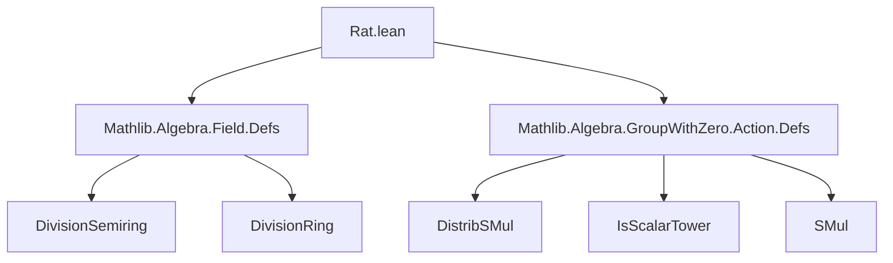
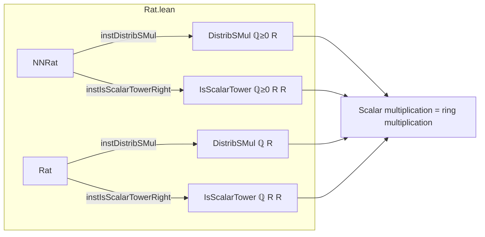

**Technical Brief: `Rat.lean` — Actions by Rational Numbers**

---

### 1. **Key Definitions & Theorems**

| Name | Type / Declaration | Purpose |
|------|--------------------|---------|
| `smul_def` | `smul = mul` (implicit via `smul_eq_mul`) | Defines scalar multiplication as ring multiplication in a `DivisionSemiring`/`DivisionRing`. |
| `instDistribSMul` (for `ℚ≥0`) | `DistribSMul ℚ≥0 R` | Establishes that nonnegative rationals act distributively on `R`. |
| `instDistribSMul` (for `ℚ`) | `DistribSMul ℚ R` | Same as above, but for full rationals. |
| `instIsScalarTowerRight` (for `ℚ≥0`) | `IsScalarTower ℚ≥0 R R` | Ensures associativity of scalar multiplication: $(a \cdot x) \cdot y = a \cdot (x \cdot y)$. |
| `instIsScalarTowerRight` (for `ℚ`) | `IsScalarTower ℚ R R` | Same as above for full rationals. |

*Note:* The proofs rely on `smul_def`, which identifies scalar multiplication with ring multiplication, and `smul_eq_mul`, which is likely a definitional equality or lemma derived from it.

---

### 2. **Naming Conventions**

- **Prefixes:**
  - `inst_`: Standard Lean convention for typeclass instances.
  - `smul_`: Pertaining to scalar multiplication (`smul_zero`, `smul_add`, `smul_assoc`).
- **Suffixes:**
  - `_right`: Indicates right-action associativity in `IsScalarTower`.
- **Namespace usage:**
  - `NNRat`: For nonnegative rationals (`ℚ≥0`).
  - `Rat`: For full rationals (`ℚ`).

---

### 3. **Tactic Stack**

- `rw`: Rewriting definitions (`smul_def`, `mul_zero`, `mul_add`, `mul_assoc`).
- `simp only [...]`: Simplification using specific lemmas (`smul_eq_mul`, `mul_assoc`).
- `by`: Intro tactic for simple proofs (no automation like `aesop` or `linarith` used here).

---

### 4. **Proof Logic**

- **Structure:** Direct verification of typeclass axioms.
- **Pattern:**
  1. Unfold `smul_def` to reduce scalar multiplication to ring multiplication.
  2. Apply known ring identities (`mul_zero`, `mul_add`, `mul_assoc`).
  3. Use `simp only` when associativity or definitional equalities suffice.

No induction or case analysis is needed—proofs are purely equational reasoning.

---

### 5. **Imports**

| Module | Role |
|--------|------|
| `Mathlib.Algebra.Field.Defs` | Provides `DivisionSemiring`, `DivisionRing`, and related definitions. |
| `Mathlib.Algebra.GroupWithZero.Action.Defs` | Supplies `DistribSMul`, `IsScalarTower`, and scalar multiplication infrastructure. |

These imports define the algebraic structures and action-theoretic concepts used.

---

### 8. **Mermaid Diagrams**

#### **Dependency Graph**

#### **Overview of File Structure**

#### **Theoretical Context**

- This file sits in the hierarchy of *module-like actions* over ordered/graded structures.
- It bridges:
  - **Ordered algebra** (`ℚ≥0` as a subsemiring of `ℚ`)
  - **Module theory** (`DistribSMul`, `IsScalarTower`)
  - **Field/ring theory** (`DivisionSemiring`, `DivisionRing`)
- It enables reasoning about rational scaling in contexts like normed spaces, measure theory, or real/complex analysis where rational scalars arise naturally.

--- 

✅ *No `IsOrderedMonoid` instance is defined here (per `assert_not_exists`), indicating this file intentionally avoids imposing order-theoretic assumptions on `R`.*
