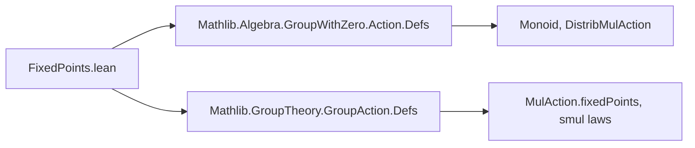
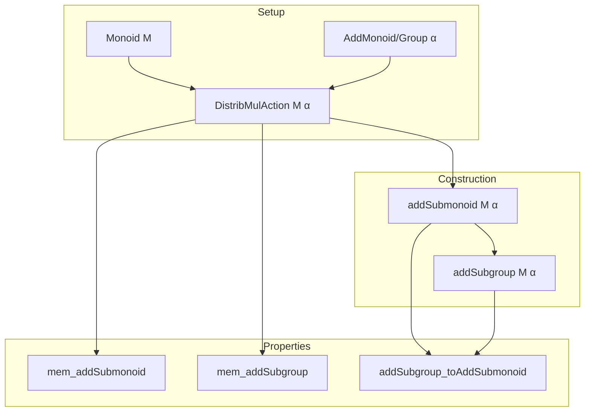
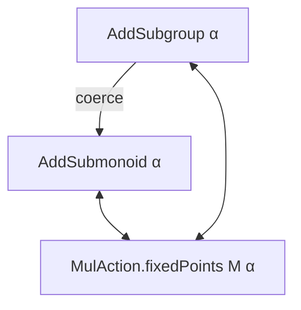

**Technical Brief: `FixedPoints.lean` (Submonoid.lean)**  
*Domain: Formalized mathematics — group actions and fixed points in additive structures*

---

### 1. **Key Definitions & Theorems**

| Name | Type / Signature | Purpose |
|------|------------------|---------|
| `FixedPoints.addSubmonoid` | `def FixedPoints.addSubmonoid : AddSubmonoid α` | Constructs the additive submonoid of elements fixed under all `M`-actions. |
| `FixedPoints.mem_addSubmonoid` | `lemma FixedPoints.mem_addSubmonoid (a : α) : a ∈ addSubmonoid M α ↔ ∀ m : M, m • a = a` | Characterizes membership in the fixed-point submonoid. |
| `FixedPoints.addSubgroup` | `def FixedPoints.addSubgroup : AddSubgroup α` | Extends `addSubmonoid` to an additive subgroup when `α` is an additive group. |
| `FixedPoints.mem_addSubgroup` | `lemma FixedPoints.mem_addSubgroup (a : α) : a ∈ α^+M ↔ ∀ m : M, m • a = a` | Membership criterion for the fixed-point subgroup. |
| `FixedPoints.addSubgroup_toAddSubmonoid` | `lemma FixedPoints.addSubgroup_toAddSubmonoid : (α^+M).toAddSubmonoid = addSubmonoid M α` | Shows compatibility between the subgroup and underlying submonoid. |
| `notation α "^+" M:51` | `α^+M` | Notation for `FixedPoints.addSubgroup M α`, mimicking `αᴹ` for multiplicative fixed points. |

---

### 2. **Naming Conventions**

- **Prefixes**:  
  - `FixedPoints.` — namespace for fixed-point constructions.  
  - `addSubmonoid`, `addSubgroup` — indicate additive monoid/subgroup structure.

- **Suffixes**:  
  - `_mem_` — for membership lemmas (`mem_addSubmonoid`, `mem_addSubgroup`).  
  - `_to_` — for coercion/forgetful functor lemmas (`addSubgroup_toAddSubmonoid`).

- **Notation**:  
  - `α^+M` — infix binary operator, precedence 51, right-associative (like `+`), emphasizing additive fixed points.

---

### 3. **Tactic Stack**

- `rw` — used repeatedly to rewrite using hypotheses (`ha`, `hb`) and definitions (`smul_zero`, `smul_add`, `smul_neg`).  
- `simp` — implicit via `@[simp]` attributes; lemmas are marked for simplification.  
- ` rfl` — used in `Iff.rfl` for definitional equality of ↔ statements.  
- No heavy automation (e.g., `aesop`, `linarith`) — proofs are elementary and structural.

---

### 4. **Proof Logic**

- **Structure**:  
  - *Case 1 (AddMonoid)*: Define carrier as `MulAction.fixedPoints M α`, verify closure under `0` and `+` using `smul_zero` and `smul_add`.  
  - *Case 2 (AddGroup)*: Extend to additive subgroup by adding `neg_mem'`, using `smul_neg`.  
- **Proof style**: Direct verification of substructure axioms via action properties; no induction or case analysis beyond basic algebraic rewriting.

---

### 5. **Imports**

| Import | Role |
|--------|------|
| `Mathlib.Algebra.GroupWithZero.Action.Defs` | Provides `DistribMulAction`, `smul`, and basic action definitions. |
| `Mathlib.GroupTheory.GroupAction.Defs` | Supplies `MulAction.fixedPoints`, `smul_zero`, `smul_add`, `smul_neg`, etc. |

> *Note*: The module assumes `M` is a monoid acting distributively on an additive structure `α`.

---

### 8. **Mermaid Diagrams**

#### **Dependency Graph (Module-Level)**

#### **Overview of Theory Flow**

#### **Conceptual Hierarchy**

---

**Summary**: This module formalizes the fixed-point submonoid and subgroup of a monoid action on an additive monoid/group. It uses minimal machinery, relying on basic action properties (`smul_zero`, `smul_add`, `smul_neg`) and standard `AddSubmonoid`/`AddSubgroup` constructors. The notation `α^+M` aligns with multiplicative analogues (e.g., `αᴹ`), supporting a uniform treatment of fixed points across additive and multiplicative contexts.
