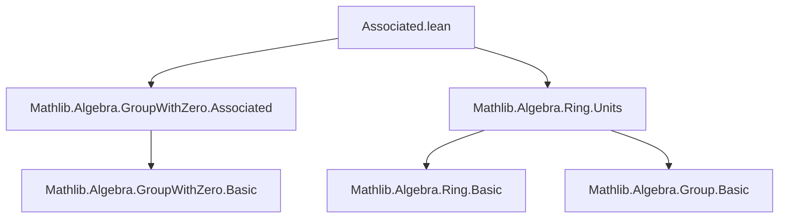
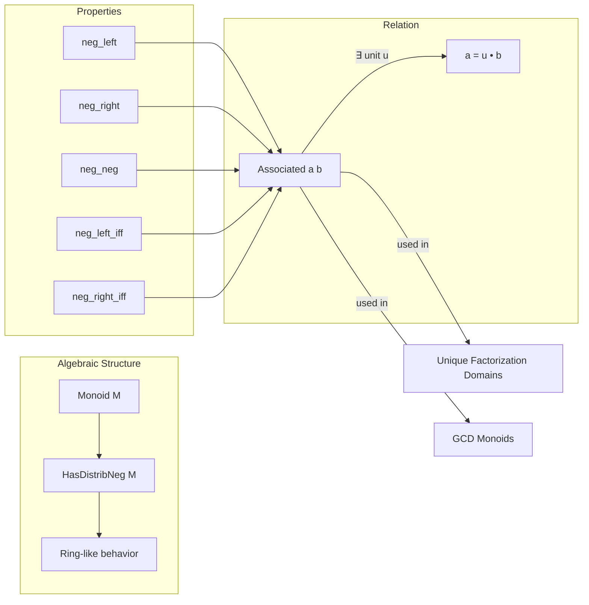

**Technical Brief: `Associated.lean` (Mathlib Module)**

---

### 1. **Key Definitions & Theorems**

| Name | Type / Signature | Purpose |
|------|------------------|---------|
| `Associated` | `class Associated (a b : M) [Monoid M] : Prop` (imported from `Mathlib.Algebra.GroupWithZero.Associated`) | Defines that $a$ and $b$ are *associated* if there exists a unit $u$ such that $a = u • b$. |
| `neg_left` | `Associated a b → Associated (-a) b` | Shows that negating the left argument preserves association. |
| `neg_right` | `Associated a b → Associated a (-b)` | Shows that negating the right argument preserves association. |
| `neg_neg` | `Associated a b → Associated (-a) (-b)` | Shows that simultaneous negation of both arguments preserves association. |
| `neg_left_iff` | `Associated (-a) b ↔ Associated a b` | Equivalence stating that $-a$ is associated to $b$ iff $a$ is associated to $b$. |
| `neg_right_iff` | `Associated a (-b) ↔ Associated a b` | Equivalence stating that $a$ is associated to $-b$ iff $a$ is associated to $b$. |

> **Note**: The `Associated` relation is defined in `Mathlib.Algebra.GroupWithZero.Associated`, and this file extends it with properties specific to structures with `HasDistribNeg` (i.e., where negation distributes over multiplication, such as rings).

---

### 2. **Naming Conventions**

- **Prefixes**:
  - `neg_`: Indicates behavior under negation (`neg_left`, `neg_right`, `neg_neg`).
- **Suffixes**:
  - `_iff`: Used for biconditional lemmas (`neg_left_iff`, `neg_right_iff`).
- **Structure**:
  - `⟨u, hu⟩ := h`: Standard pattern for destructing an existential proof (here, `h : Associated a b` gives a unit $u$ and proof $hu : a = u • b$).

---

### 3. **Tactic Stack**

- `simp [hu]`: Simplifies using the hypothesis `hu` (e.g., to show $-a = (-u) • b$).
- `symm`: Used to flip equivalences or equalities (e.g., to reuse `neg_left` for `neg_right`).
- `_root_.neg_neg`: Refers to the global lemma `neg_neg : -(-a) = a`, used for rewriting.
- Implicit use of `let ⟨u, hu⟩ := h` (i.e., `rcases`/`cases` under the hood).

No heavy automation (e.g., `aesop`, `ring`, `linarith`) is used—proofs are mostly direct and structural.

---

### 4. **Proof Logic**

- **Strategy**: Direct constructive reasoning using the definition of `Associated`:
  1. Unpack the hypothesis `h : Associated a b` into a unit $u$ and equality $a = u • b$.
  2. Construct a new unit (e.g., $-u$) and verify the required equality using `simp` and ring identities.
  3. For `iff` lemmas, prove both directions using symmetry and previous lemmas.

- **Pattern**:
  ```lean
  let ⟨u, hu⟩ := h
  ⟨-u, by simp [hu]⟩
  ```
  This reflects the typical proof style for properties of `Associated` in rings with negation.

---

### 5. **Imports**

| Import | Role |
|--------|------|
| `Mathlib.Algebra.GroupWithZero.Associated` | Defines the core `Associated` relation for `GroupWithZero` (i.e., monoids with zero and invertible nonzero elements). |
| `Mathlib.Algebra.Ring.Units` | Provides facts about units in rings (e.g., closure under negation: if $u$ is a unit, so is $-u$). |

> **Note**: The module also asserts non-existence of certain typeclass instances (`IsOrderedMonoid`, `Multiset`, `Field`)—likely to avoid ambiguity or misuse in this context.

---

### 8. **Dependency & Theory Overview**

#### **Mermaid Diagrams**

##### **Dependency Graph**


##### **Theoretical Overview**


#### **Summary**
This module extends the general theory of *associated elements* (from `GroupWithZero`) to settings with additive negation compatible with multiplication (e.g., rings). It establishes that negation is *invertibly compatible* with the associated relation—i.e., sign changes do not affect association, as units are closed under negation in rings.

This is foundational for factorization theory (e.g., in UFDs), where elements are often considered up to units (including sign).
