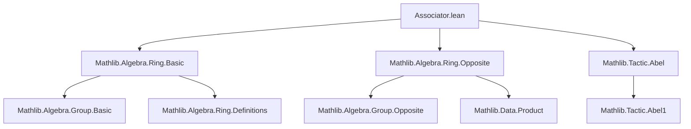

### Technical Brief: `Associator.lean`

---

#### **1. Key Definitions & Theorems**

| Name | Type / Signature | Purpose |
|------|------------------|---------|
| `associator` (unbundled) | `R → R → R → R` | Maps $(x, y, z) \mapsto (x * y) * z - x * (y * z)$ in a `NonUnitalNonAssocRing`. |
| `associator_apply` | `associator x y z = (x * y) * z - x * (y * z)` | Definitional equality (refl). |
| `associator_eq_zero_iff_associative` | `associator = 0 ↔ Std.Associative (· * ·)` | Characterizes associativity via vanishing of the associator. |
| `associator_cocycle` | `a * associator b c d - associator (a * b) c d + associator a (b * c) d - associator a b (c * d) + (associator a b c) * d = 0` | A 3-cocycle-like identity satisfied by the associator. |
| `associator_op` | `associator x y z = -op (associator (unop z) (unop y) (unop x))` | Behavior of associator under opposite ring; involves negation and opposite element conversion. |
| `mulLeft₃` | `R →+ R →+ R →+ R` | Bundled additive monoid homomorphism version of $(x, y, z) \mapsto (x * y) * z$. |
| `mulLeft₃_apply` | `mulLeft₃ x y z = (x * y) * z` | Definitional equality for `mulLeft₃`. |
| `mulRight₃` | `R →+ R →+ R →+ R` | Bundled additive monoid homomorphism version of $(x, y, z) \mapsto x * (y * z)$. |
| `mulRight₃_apply` | `mulRight₃ x y z = x * (y * z)` | Definitional equality for `mulRight₃`. |
| `mulLeft₃_eq_mulRight₃_iff_associative` | `mulLeft₃ = mulRight₃ ↔ Std.Associative (· * ·)` | Bundled version of associativity characterization. |
| `associator` (bundled) | `R →+ R →+ R →+ R` | Defined as `mulLeft₃ - mulRight₃`, i.e., the difference of the two 3-ary multiplications. |
| `associator_eq_zero_iff_associative` (bundled) | `associator = 0 ↔ Std.Associative (· * ·)` | Same as unbundled, but via bundled homs. |

---

#### **2. Naming Conventions**

- **Prefixes**:
  - `associator_`: for properties of the associator (both unbundled and bundled).
  - `mulLeft₃_`, `mulRight₃_`: for properties of the 3-ary left/right multiplications.
- **Suffixes**:
  - `_apply`: definitional equalities for function application.
  - `_iff_associative`: characterizations of associativity.
  - `_op`: behavior under opposite ring.
- **No `is_` or `dist_` prefixes** — no explicit “is associative” predicates used; instead, `Std.Associative` is used directly.

---

#### **3. Tactic Stack**

- **Core tactics**:
  - `simp` (especially `simp only [...]`, `simp [assoc]`)
  - `abel` / `abel1` (for abelian group/ring identities)
  - `ext` (extensionality for functions/homomorphisms)
  - `rw`, `apply`, `exact`
- **Specialized**:
  - `congr_fun₃`: for 3-ary function extensionality.
  - `inferInstance`: to derive `Std.Associative` from `NonUnitalRing`/`NonUnitalSemiring` instances.

---

#### **4. Proof Logic**

- **Structure**:
  - Most proofs are *equational reasoning* or *extensionality + simplification*.
  - For equivalences (`↔`), proofs split into `mp` and `mpr` directions:
    - `mp`: assume equality of functions, then evaluate at arbitrary arguments to get associativity.
    - `mpr`: assume associativity, then show equality of functions via `ext` and `simp`.
- **Cocycle identity** (`associator_cocycle`):
  - Proven by expanding definitions, applying distributivity (`mul_sub`, `sub_mul`), and using `abel1` to simplify in the abelian group.
- **Opposite ring lemma** (`associator_op`):
  - Uses `unop_mul`, `unop_sub`, `op_unop`, and `neg_sub` to rewrite in terms of opposite ring operations.

---

#### **5. Imports**

- `Mathlib.Algebra.Ring.Basic`: foundational ring theory.
- `Mathlib.Algebra.Ring.Opposite`: opposite ring constructions (`MulOpposite`, `op`, `unop`).
- `Mathlib.Tactic.Abel`: tactic for abelian group/ring identities (`abel`, `abel1`).

---

#### **8. Mermaid Diagrams**

##### **Dependency Graph (Module-Level)**



##### **Conceptual Overview (Theory Flow)**

```mermaid
flowchart LR
  A[NonUnitalNonAssocRing R] --> B[Define associator: (x*y)*z - x*(y*z)]
  A --> C[Define mulLeft₃, mulRight₃ as AddMonoidHoms]
  
  B --> D[associator = 0 ↔ associative]
  C --> E[mulLeft₃ = mulRight₃ ↔ associative]
  
  D --> F[NonUnitalRing ⇒ associator = 0]
  E --> G[NonUnitalSemiring ⇒ mulLeft₃ = mulRight₃]
  
  A --> H[Opposite ring: associator_op]
  B --> I[associator_cocycle identity]
```

##### **Bundled vs Unbundled Hierarchy**

```mermaid
graph LR
  Unbundled[Unbundled associator: R → R → R → R] -->|def| Bundled[Bundled associator: R →+ R →+ R →+ R]
  Bundled -->|def| Diff[mulLeft₃ - mulRight₃]
  
  Unbundled -->|↔| Assoc[Std.Associative (· * ·)]
  Bundled -->|↔| Assoc
```

---

This module formalizes the *associator* as a central measure of non-associativity in (semi)rings, and shows how its vanishing (or equality of the two 3-ary multiplications) characterizes associativity — both at the element level and in the bundled homomorphic setting.
