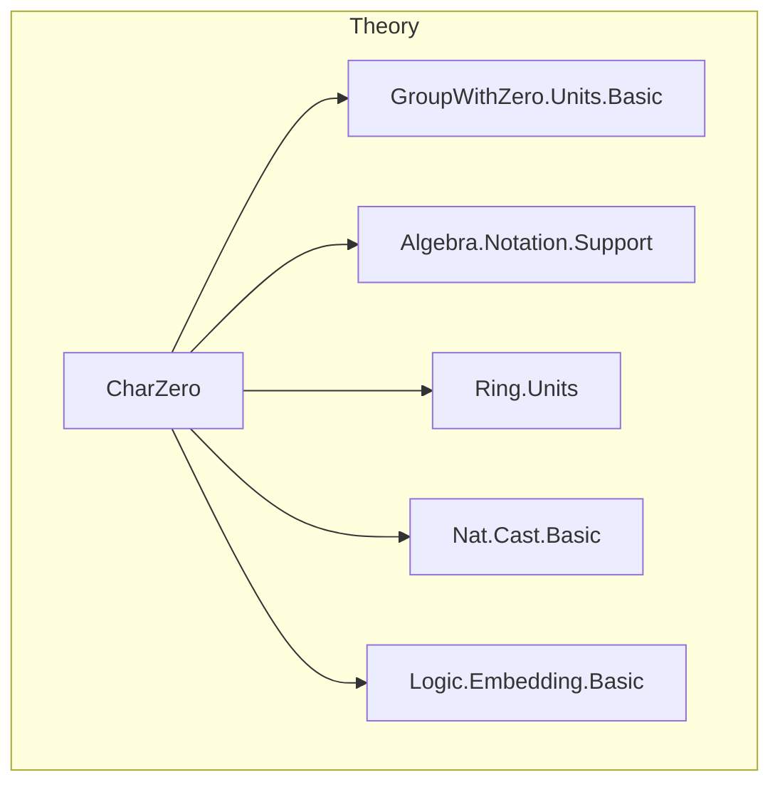
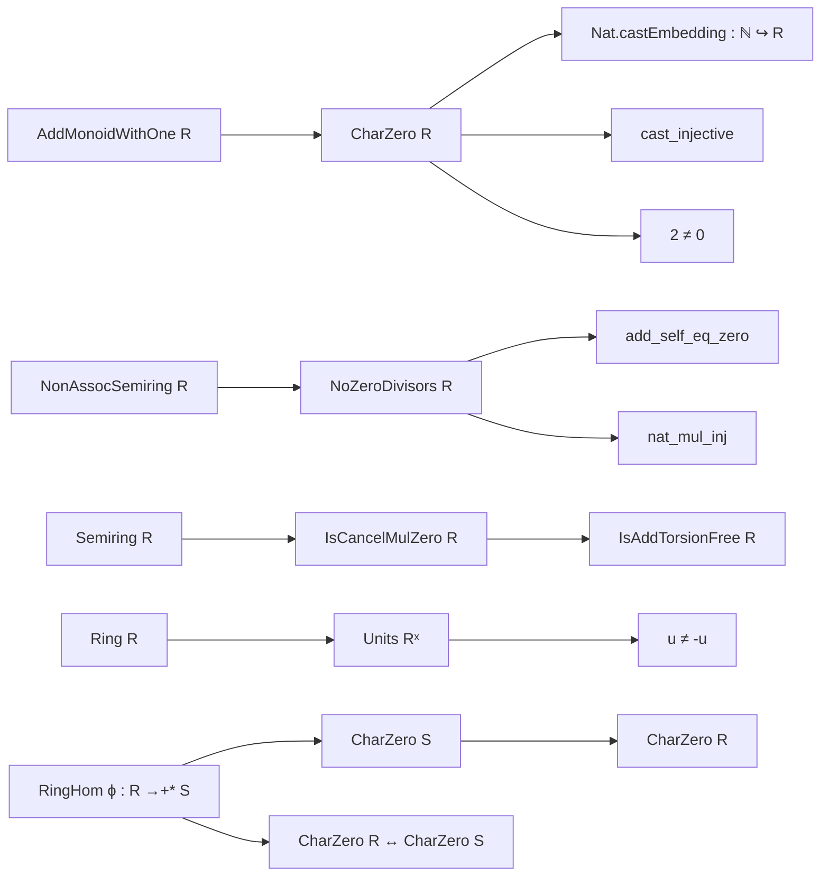

### Technical Brief: `CharZero.lean`

---

#### **1. Key Definitions & Theorems**

| Name | Type / Signature | Purpose |
|------|------------------|---------|
| `CharZero` | `class CharZero (R : Type*) [AddMonoidWithOne R] : Prop` | States that the canonical map `ℕ → R` is injective (i.e., characteristic is zero). |
| `Nat.castEmbedding` | `ℕ ↪ R` | Embedding of `ℕ` into `R` as a monoid under addition/multiplication, using `cast_injective`. |
| `CharZero.cast_injective` | `a b : ℕ → a ≠ b → (a : R) ≠ (b : R)` | Core property: distinct naturals map to distinct elements in `R`. |
| `RingHom.charZero` | `(ϕ : R →+* S) → [CharZero S] → CharZero R` | Pullback of characteristic zero along injective ring homomorphism. |
| `RingHom.charZero_iff` | `[Injective ϕ] → CharZero R ↔ CharZero S` | Equivalence of characteristic zero under injective ring homomorphisms. |
| `RingHom.injective_nat` | `(f : ℕ →+* R) → [CharZero R] → Injective f` | Any ring homomorphism from `ℕ` to a char-zero ring is injective. |
| `add_self_eq_zero` | `a + a = 0 ↔ a = 0` | In a char-zero semiring with no zero divisors, doubling is injective. |
| `nat_mul_inj` | `(n : R) * a = (n : R) * b → n = 0 ∨ a = b` | Cancellation law for multiplication by natural numbers in char-zero domains. |
| `nat_mul_inj'` | `(n : R) * a = (n : R) * b → n ≠ 0 → a = b` | Cancellation when the scalar is nonzero. |
| `CharZero.neg_eq_self_iff` | `-a = a ↔ a = 0` | In char-zero rings with no zero divisors, only 0 is self-negative. |
| `CharZero.eq_neg_self_iff` | `a = -a ↔ a = 0` | Equivalent form of above. |
| `units_ne_neg_self` | `u : Rˣ → u ≠ -u` | Units cannot be equal to their own negatives in char-zero rings. |
| `IsAddTorsionFree.of_isCancelMulZero_charZero` | `IsAddTorsionFree R` | Char-zero + `IsCancelMulZero` ⇒ additive torsion-freeness. |

---

#### **2. Naming Conventions**

- **Prefixes**:
  - `cast_`: Relating to `Nat.cast`, e.g., `cast_injective`, `cast_eq_one`, `cast_pow_eq_one`.
  - `charZero_`: Properties specific to characteristic zero, e.g., `charZero`, `charZero_iff`.
  - `neg_`, `eq_neg_`, `neg_eq_`: Symmetry/antisymmetry of negation.
  - `mulSupport_`, `support_`: Support of constant functions.
  - `nat_`, `natCast_`: Natural number scalars or embeddings.

- **Suffixes**:
  - `_iff`: Logical equivalence (biconditional).
  - `_inj`, `_inj'`: Injectivity or cancellation lemmas.
  - `_ne_zero`, `_ne_one`: Non-vanishing of natural numbers in `R`.

---

#### **3. Tactic Stack**

Frequently used tactics in proofs:

- `simp` / `simp_rw`: Simplification using `@[simp]` lemmas (e.g., `cast_eq_one`, `two_ne_zero`).
- `rw`: Rewriting using equalities like `map_natCast`, `two_mul`, `sub_eq_zero`.
- `exact`, `intro`, `apply`: Basic proof construction.
- `mod_cast`: Modular arithmetic casting (e.g., lifting `n = 0` from `R` to `ℕ`).
- `cases`, `contradiction`, `decide`: For case analysis and decidability.
- `simpa`: Simplify and apply target.
- `subst`, `convert`: Substitution and conversion of goals.

---

#### **4. Proof Logic**

- **Induction**: Not explicitly used here (no inductive types beyond `ℕ`).
- **Case analysis**: On whether `n = 0` or `n ≠ 0`, especially in `nat_mul_inj`.
- **Equational reasoning**: Heavy use of `rw` and `simp` to reduce to known facts like `cast_injective`, `two_ne_zero`, `mul_eq_zero`.
- **Logical equivalences**: Many lemmas are biconditionals (`↔`), proven via `iff.intro` or `simp`.
- **Cancellation arguments**: In domains with `NoZeroDivisors`, zero-divisor-free multiplication yields cancellation laws.

---

#### **5. Imports**

| Module | Purpose |
|--------|---------|
| `Mathlib.Algebra.GroupWithZero.Units.Basic` | Units in rings with zero, e.g., `Rˣ`. |
| `Mathlib.Algebra.Notation.Support` | Support of functions, used in `support_natCast`. |
| `Mathlib.Algebra.Ring.Units` | Basic unit theory. |
| `Mathlib.Data.Nat.Cast.Basic` | `Nat.cast`, its properties, injectivity, etc. |
| `Mathlib.Logic.Embedding.Basic` | Embeddings (`↪`) and `support`/`mulSupport`. |

---

#### **8. Mermaid Diagrams**

##### **Dependency Graph (Module-Level)**

##### **Conceptual Overview**

---

#### **Domain Summary**

This file formalizes foundational properties of **rings of characteristic zero**, emphasizing:

- Injectivity of `ℕ → R`,
- Cancellation laws for multiplication by natural numbers,
- Torsion-freeness in domains,
- Behavior of units and negation.

It serves as a **core module** for later developments in analysis, algebra, and number theory where characteristic zero is essential (e.g., ℚ, ℝ, ℂ).
