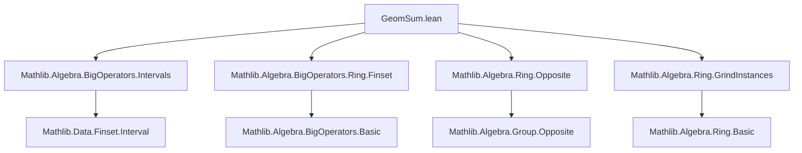
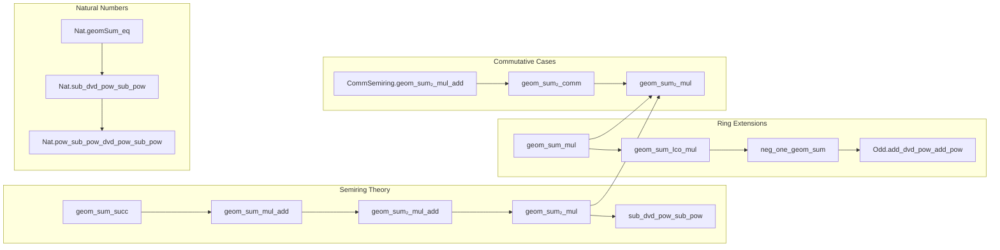
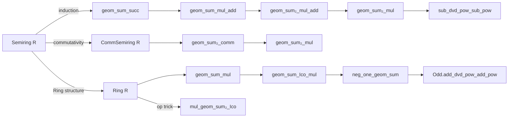

### Technical Brief: `GeomSum.lean`

---

#### **1. Key Definitions & Theorems**

| Name | Type / Signature | Purpose |
|------|------------------|---------|
| `geom_sum_succ` | `∑ i ∈ range (n + 1), x ^ i = x * ∑ i ∈ range n, x ^ i + 1` | Recursive formula for geometric sum (left-multiplication form) |
| `geom_sum_succ'` | `∑ i ∈ range (n + 1), x ^ i = x ^ n + ∑ i ∈ range n, x ^ i` | Recursive formula (right-additive form) |
| `geom_sum_zero` | `∑ i ∈ range 0, x ^ i = 0` | Base case (empty sum) |
| `geom_sum_one` | `∑ i ∈ range 1, x ^ i = 1` | Single-term sum |
| `zero_geom_sum` | `∑ i ∈ range n, 0 ^ i = if n = 0 then 0 else 1` | Sum of powers of zero |
| `one_geom_sum` | `∑ i ∈ range n, 1 ^ i = n` | Sum of ones |
| `geom_sum₂_self` | `∑ i ∈ range n, x ^ i * x ^ (n - 1 - i) = n • x ^ (n - 1)` | Special case where both factors are same base |
| `geom_sum_mul_add` | `(∑ i ∈ range n, (x + 1) ^ i) * x + 1 = (x + 1) ^ n` | Reformulation of $x^n - y^n = (x - y)\sum x^k y^{n-1-k}$ without subtraction |
| `Commute.geom_sum₂_mul_add` | Same as above but for commuting `x, y` with `x + y` instead of `x + 1` | Generalized version for noncommutative rings |
| `geom_sum₂_mul` | `(∑ i ∈ range n, x ^ i * y ^ (n - 1 - i)) * (x - y) = x ^ n - y ^ n` | Core identity: factorization of difference of powers |
| `sub_dvd_pow_sub_pow` | `x - y ∣ x ^ n - y ^ n` | Divisibility consequence of above identity |
| `geom_sum_mul` | `(∑ i ∈ range n, x ^ i) * (x - 1) = x ^ n - 1` | Standard geometric series identity in rings |
| `geom_sum_Ico_mul` | `(∑ i ∈ Ico m n, x ^ i) * (x - 1) = x ^ n - x ^ m` | Geometric sum over interval `Ico m n` |
| `neg_one_geom_sum` | `∑ i ∈ range n, (-1) ^ i = if Even n then 0 else 1` | Alternating sum of powers of -1 |
| `Odd.add_dvd_pow_add_pow` | `Odd n → x + y ∣ x ^ n + y ^ n` | Divisibility of sum of odd powers |
| `geomSum_eq` | `∑ k ∈ range n, m ^ k = (m ^ n - 1) / (m - 1)` (for `2 ≤ m`) | Closed-form evaluation over naturals using division |

---

#### **2. Naming Conventions**

- **Prefixes**:
  - `geom_sum`: basic geometric sum over `range n`
  - `geom_sum₂`: two-variable geometric sum $\sum x^i y^{n-1-i}$
  - `geom_sum_Ico`: geometric sum over interval `Ico m n`
  - `op_geom_sum`: behavior under `MulOpposite.op`
  - `neg_one_geom_sum`: special case for `-1`
  - `zero_geom_sum`, `one_geom_sum`: special constants

- **Suffixes**:
  - `_succ`, `_succ'`: recursive step variants
  - `_mul_add`, `_mul`: identities involving multiplication by `(x - y)` or `(x + 1)`
  - `_comm`: commutativity-based symmetry
  - `_dvd`: divisibility lemmas
  - `_Ico`: interval-specific versions

- **Namespace usage**:
  - `Commute.*`: lemmas requiring `Commute x y`
  - `RingHom.map_*`: behavior under ring homomorphisms
  - `Nat.*`: natural-number-specific versions (e.g., `Nat.sub_dvd_pow_sub_pow`)

---

#### **3. Tactic Stack**

Frequently used tactics in proofs:

| Tactic | Role |
|--------|------|
| `simp` / `simp_rw` | Simplification using definitions, lemmas, and congruences |
| `induction` | Structural induction on `n : ℕ`, often with `with | zero | succ` |
| `rw` | Rewriting using equalities, often chained with `at` or `using` |
| `congr` / `congr_arg` | Equality of expressions via congruence |
| `grind` | Custom tactic for automatic simplification of algebraic identities (likely from `Mathlib.Algebra.Ring.GrindInstances`) |
| `aesop` | Not explicitly used here, but `grind` likely subsumes its role |
| `ring` | Not used directly; `grind` and `simp` handle ring reasoning |
| `convert` / `exact` | Proof construction with unification |
| `split_ifs` | Case analysis on `if ... then ... else ...` |
| `lia` / `tauto` | Linear arithmetic and propositional logic automation |
| `op_injective` | Injectivity of `MulOpposite.op` used to reduce to opposite ring |

---

#### **4. Proof Logic**

- **Inductive structure**: Most proofs proceed by induction on `n : ℕ`, especially for recursive sum identities (`geom_sum_succ`, `geom_sum₂_mul_add`, etc.).
- **Case splitting**: On `n = 0`, `n = 1`, or `n ≥ 2`, especially for `zero_geom_sum`, `neg_one_geom_sum`.
- **Algebraic manipulation**:
  - Use of `pow_add`, `pow_succ'`, `mul_sum`, `sum_congr`, `sum_range_succ'`, `sum_Ico_eq_sub`.
  - Exploitation of `Commute x y` to reorder terms (e.g., `h.pow_right`, `h.pow_pow`).
- **Symmetry via `Finset.sum_flip` / `sum_range_reflect`**: To show symmetry in `x, y` for `geom_sum₂_comm`.
- **Opposite ring trick**: To prove left/right variants (e.g., `mul_geom_sum₂`, `mul_neg_geom_sum₂`) by applying `op_injective` and reducing to the right-multiplication case.
- **Reduction to known lemmas**: Many proofs reduce to previously established lemmas via `rw [h.geom_sum₂_mul_add]`, `simpa using ...`, or `conv_rhs => rw ...`.

---

#### **5. Imports**

| Import | Purpose |
|--------|---------|
| `Mathlib.Algebra.BigOperators.Intervals` | `range`, `Ico`, interval sum lemmas |
| `Mathlib.Algebra.BigOperators.Ring.Finset` | General big operator theory over finite sets |
| `Mathlib.Algebra.Ring.Opposite` | `MulOpposite`, `op`, and properties |
| `Mathlib.Algebra.Ring.GrindInstances` | `grind` tactic for ring identities |

---

#### **8. Mermaid Diagrams**

##### **Dependency Graph (Module-Level)**

##### **Theoretical Overview**

##### **Core Theory Flow**

---

This file provides a comprehensive toolkit for reasoning about geometric sums in algebraic structures, with careful attention to noncommutativity, semirings without subtraction, and natural-number specializations. The structure reflects Lean’s modular design: base lemmas in `Semiring`, extensions in `Ring`/`CommRing`, and number-theoretic corollaries in `Nat`.
