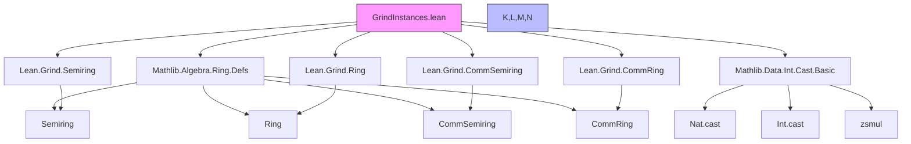

### Technical Brief: `GrindInstances.lean`

---

#### **1. Key Definitions & Theorems**

| Name | Type / Signature | Purpose |
|------|------------------|---------|
| `Semiring.toGrindSemiring` | `[Semiring α] → Grind.Semiring α` | Converts a `Semiring α` into a `Grind.Semiring α`, with low priority to avoid interference with built-in `Grind.Semiring Nat`. |
| `CommSemiring.toGrindCommSemiring` | `[CommSemiring α] → Grind.CommSemiring α` | Extends `Semiring.toGrindSemiring` to `CommSemiring`, adding `mul_comm`. |
| `Ring.toGrindRing` | `[Ring α] → Grind.Ring α` | Lifts a `Ring α` to `Grind.Ring α`, adding `zsmul`, `intCast`, and related properties. |
| `CommRing.toGrindCommRing` | `[CommRing α] → Grind.CommRing α` | Extends `Ring.toGrindRing` to `CommRing`, adding `mul_comm`. |
| `Semiring.toGrindSemiring_ofNat` | `(n : ℕ) → @OfNat.ofNat α n (Lean.Grind.Semiring.ofNat n) = n.cast` | Proves that `ofNat` in `Grind.Semiring` coincides with `Nat.cast`. |
| `example (s : Grind.CommRing α) : CommRing α` | Construction from `Grind.CommRing` to `CommRing` | Demonstrates reverse direction (not used in practice), verifying no definitional issues in `Grind` structure. |
| `inferInstance` examples | Equalities between `Grind.Semiring Nat` and `Grind.CommSemiring.toSemiring` | Confirms no definitional mismatches between derived instances. |

---

#### **2. Naming Conventions**

- **Prefixes**:
  - `toGrind*`: Conversion from standard algebraic structures (`Semiring`, `Ring`, etc.) to `Grind.*` variants.
  - `natCast`, `intCast`, `zsmul`, `nsmul`, `npow`: Standard Lean algebraic operation names.
- **Suffixes**:
  - `ofNat`, `natCast_succ`, `intCast_neg`: Property names for compatibility with `Grind`’s internal `OfNat`, `NatCast`, `IntCast` interfaces.
- **Pattern**:
  - `Grind.*.property` used for projections (e.g., `Grind.Semiring.natCast_zero`).
  - `nsmul_eq_natCast_mul`, `neg_zsmul`, `intCast_ofNat`: Explicit property names for `Grind`-specific axioms.

---

#### **3. Tactic Stack**

Frequently used tactics in proofs:
- `simp`: For simplifying definitions (`add_zero`, `mul_one`, `zero_mul`, etc.).
- `rfl`: For definitional equalities (especially in `ofNat_eq_natCast`, `ofNat_succ`).
- `rw [← AddMonoidWithOne.natCast_succ]`: Rewriting using known lemmas.
- `change ...`: For targeted rewriting of goals.
- `match n with | 0 | 1 | n + 2 => ...`: Structural induction on natural numbers.

No heavy automation (e.g., `linarith`, `ring`, `aesop`) is used—proofs are mostly definitional or case-based.

---

#### **4. Proof Logic**

- **Induction style**: Induction on `n : ℕ` with explicit cases for `0`, `1`, and `n + 2`.
- **Case analysis**: For `ofNat_eq_natCast`, `ofNat_succ`, and `intCast_ofNat`, proofs proceed by pattern matching on natural numbers.
- **Definitional reasoning**: Most proofs reduce to `rfl` or `simp` after unfolding definitions.
- **No higher-order reasoning**: All proofs are first-order and rely on basic algebraic properties and definitional equality.

---

#### **5. Imports**

- `Mathlib.Algebra.Ring.Defs`: Core ring-theoretic definitions (`Semiring`, `Ring`, etc.).
- `Mathlib.Data.Int.Cast.Basic`: Basic `Int.cast`, `Nat.cast`, and related lemmas.

These imports define the standard algebraic hierarchy and casting infrastructure that `Grind` instances must align with.

---

#### **6. Dependency Diagram**

#### **7. Overview of File & Theory Scope**

- **Purpose**: Bridge standard algebraic structures (`Semiring`, `Ring`, etc.) with Lean’s `Grind`-based typeclass hierarchy.
- **Design Motivation**:
  - `Grind` is a lightweight, definitional-friendly algebra hierarchy used in Lean’s typeclass resolution for simplification and normalization.
  - Standard `Mathlib` structures use non-definitional `ofNat`, `natCast`, etc., which cause issues in `Grind`’s normalization pipeline.
  - This file provides *low-priority* instances to ensure `Grind`’s own `Nat`-specific instances take precedence.
- **Key Insight**:
  - `Grind.*` structures are *not* meant to replace `Mathlib.*`, but to serve as a *normalized* backend for simplification and reflection.
  - Reverse construction (`Grind.CommRing → CommRing`) is provided only as a *consistency check*, not for use in practice.

---

#### **8. Theoretical Implications**

- **Definitional Equality Preservation**: All `Grind.*` instances are designed to ensure `ofNat`, `natCast`, `intCast`, etc., are definitionally equal to their `Mathlib` counterparts in concrete types like `ℕ`, `ℤ`, `UInt8`.
- **No Defeq Loops**: Instances are non-injective and non-surjective in the definitional sense—`Grind → Mathlib` constructions are not inverses up to definitional equality.
- **Reflection Safety**: The `Grind` hierarchy is intended for use in *reflection* (e.g., `grind` tactic), where definitional behavior is critical.

--- 

This file is a *foundational glue layer* ensuring compatibility between Lean’s standard algebraic hierarchy and its reflection-oriented `Grind` infrastructure.
