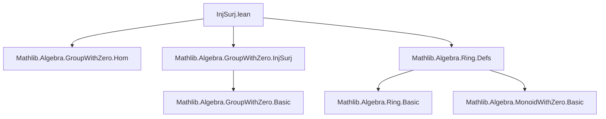
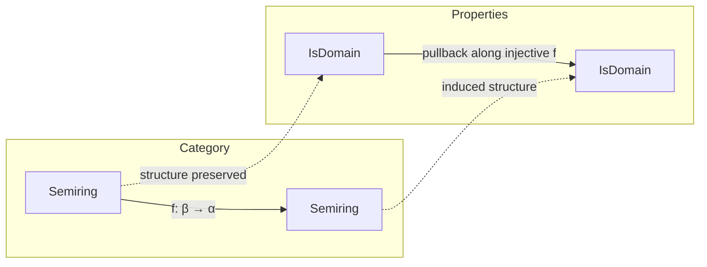

**Technical Brief: `InjSurj.lean` Module Metadata**

---

### 1. **Key Definitions & Theorems**

| Name | Type / Signature | Purpose |
|------|------------------|---------|
| `Function.Injective.isDomain` | `∀ {α β : Type*} [Semiring α] [IsDomain α] [Semiring β] {F} [FunLike F β α] [MonoidWithZeroHomClass F β α], (f : F) → Injective f → IsDomain β` | Pulls back the `IsDomain` property along an injective `MonoidWithZeroHom`-like map `f : β → α`. Constructs domain structure on `β` using injectivity and structure preservation. |

*Note:* The theorem uses two fields:
- `__ := domain_nontrivial f (map_zero _) (map_one _)`: ensures `β ≠ 0` via `f` preserving `0 ≠ 1`.
- `__ := hf.isCancelMulZero f (map_zero _) (map_mul _)`: ensures no zero divisors in `β` using injectivity and multiplicativity.

No other named definitions or theorems appear in the provided excerpt.

---

### 2. **Naming Conventions**

- **Prefixes**:
  - `is_`: used for properties/instances (e.g., `isDomain`).
  - `map_`: for structure-preserving behavior of homs (e.g., `map_zero`, `map_one`, `map_mul`).
- **Suffixes**:
  - `_class`: for typeclass interfaces (e.g., `MonoidWithZeroHomClass`).
  - `FunLike`: standard Lean convention for “function-like” objects.

---

### 3. **Tactic Stack**

- **`domain_nontrivial`**, **`isCancelMulZero`**: *not tactics*, but *lemmas* invoked in the proof term.
- The proof is written in **term mode**, not tactic mode — no explicit tactics (`aesop`, `ring`, `simp`, etc.) appear in this snippet.
- Relies on:
  - `domain_nontrivial` (from `Mathlib.Algebra.Ring.Defs` or `IsDomain` theory)
  - `isCancelMulZero` (from `Mathlib.Algebra.GroupWithZero.InjSurj`)

---

### 4. **Proof Logic**

- **Structure**: Direct term proof (no induction/cases).
- **Logic flow**:
  1. Use `domain_nontrivial` to prove `β` is nontrivial: requires `f` maps `0 ≠ 1` in `β` to `0 ≠ 1` in `α`, and `f` preserves `0` and `1`.
  2. Use `hf.isCancelMulZero` to prove cancellation of zero divisors: injectivity of `f` + `f` preserves multiplication and zero ensures if `x * y = 0` in `β`, then `f(x) * f(y) = 0` in `α`, so one factor vanishes in `α`, hence in `β` by injectivity.

---

### 5. **Imports**

| Import | Role |
|--------|------|
| `Mathlib.Algebra.GroupWithZero.Hom` | Provides homomorphism classes (e.g., `MonoidWithZeroHomClass`) and basic hom properties. |
| `Mathlib.Algebra.GroupWithZero.InjSurj` | Contains key lemmas like `isCancelMulZero`, `domain_nontrivial`, and injective/surjective transfer principles. |
| `Mathlib.Algebra.Ring.Defs` | Defines `Semiring`, `IsDomain`, and foundational ring-theoretic notions (e.g., `domain_nontrivial`). |

---

### 8. **Mermaid Diagrams**

#### **Dependency Graph (Module-Level)**



#### **Theoretical Overview (Data Flow)**

```mermaid
flowchart LR
  subgraph Input
    I1[Semiring α] 
    I2[IsDomain α]
    I3[Semiring β]
    I4[f : β → α (MonoidWithZeroHom)]
  end

  subgraph Hypothesis
    H[Injective f]
  end

  subgraph Tools
    T1[map_zero, map_one, map_mul]
    T2[domain_nontrivial]
    T3[isCancelMulZero]
  end

  subgraph Output
    O[IsDomain β]
  end

  I1 & I2 & I3 & I4 --> H
  H --> T3
  I4 --> T1
  T1 & T2 --> O
  T3 --> O
```

#### **Conceptual Theory Context**



---

**Summary**: This module implements *structure transport* for the `IsDomain` predicate along injective semiring maps, leveraging homomorphism preservation and injectivity to transfer domain properties. It exemplifies Lean’s “pullback along monomorphisms” paradigm in algebra.
