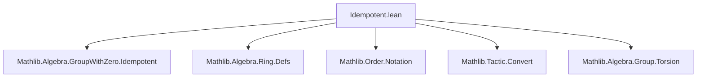

### Technical Brief: Idempotent Elements in Rings (Lean 4 Formalization)

---

#### **1. Key Definitions & Theorems**

| Name | Type / Signature | Purpose |
|------|------------------|---------|
| `IsIdempotentElem` | `class IsIdempotentElem (a : R) := (eq : a * a = a)` | Defines an element `a` satisfying $a^2 = a$. |
| `one_sub` | `IsIdempotentElem a → IsIdempotentElem (1 - a)` | Shows that if `a` is idempotent, so is `1 - a`. |
| `one_sub_iff` | `IsIdempotentElem (1 - a) ↔ IsIdempotentElem a` | Bidirectional equivalence: `a` is idempotent iff `1 - a` is. |
| `mul_one_sub_self` | `IsIdempotentElem a → a * (1 - a) = 0` | Product of `a` and `1 - a` is zero. |
| `one_sub_mul_self` | `IsIdempotentElem a → (1 - a) * a = 0` | Symmetric version of above. |
| `_root_.isIdempotentElem_iff_mul_one_sub_self` | `IsIdempotentElem a ↔ a * (1 - a) = 0` | Alternative characterization of idempotency. |
| `_root_.isIdempotentElem_iff_one_sub_mul_self` | `IsIdempotentElem a ↔ (1 - a) * a = 0` | Dual characterization. |
| `instance : Compl {a : R // IsIdempotentElem a}` | Complement operation on subtype of idempotents | Defines `aᶜ = 1 - a` as involution. |
| `coe_compl`, `compl_compl`, `zero_compl`, `one_compl` | Simplification lemmas for complement | Verifies properties of the complement involution. |
| `of_mul_add` | `a * b = 0 ∧ a + b = 1 ⇒ a, b idempotent` | Constructs two idempotents from orthogonal decomposition of unity. |
| `add_sub_mul` / `add_sub_mul_of_commute` | `a, b idempotent ⇒ a + b - a * b` idempotent (under commutativity or commuting assumption) | Generalized "join" operation on idempotents. |
| `add` | `a, b idempotent & a * b + b * a = 0 ⇒ a + b idempotent` | Idempotency of sum under anti-commutation. |
| `add_iff` | Under cancellation, `a + b` idempotent ⇔ anti-commutation | Characterizes when sum of idempotents is idempotent. |
| `sub` | `a, b idempotent & a * b = a = b * a ⇒ b - a idempotent` | Difference of idempotents under mutual absorption. |
| `mul_eq_zero_of_anticommute` | Anti-commuting idempotent `a` with `b` ⇒ `a * b = 0` | Anti-commutation with idempotent forces product to vanish. |
| `commute_of_anticommute` | Anti-commuting idempotent `a` with `b` ⇒ they commute | Anti-commutation + idempotent ⇒ commutation (in torsion-free additive monoids). |
| `sub_iff` | `q - p` idempotent ⇔ mutual absorption `p * q = p = q * p` | Full characterization of when difference of idempotents is idempotent. |

---

#### **2. Naming Conventions**

- **Prefixes**:
  - `one_sub_`: operations involving `1 - a`
  - `mul_one_sub_`, `one_sub_mul_`: products with `1 - a`
  - `add_sub_`: sums/differences involving `a + b - a * b`
  - `sub_`: difference-based lemmas (`b - a`)
  - `mul_eq_zero_of_anticommute`, `commute_of_anticommute`: anti-commutation consequences

- **Suffixes**:
  - `_iff`: bidirectional equivalence
  - `_self`: symmetric product with itself or complement
  - `_of_`: implication from auxiliary conditions (e.g., `of_mul_add`, `of_anticommute`)
  - `_commute`: assumes commutativity or anti-commutativity

- **Root-level lemmas** (e.g., `_root_.isIdempotentElem_iff_mul_one_sub_self`) indicate general equivalences not tied to a specific context.

---

#### **3. Tactic Stack**

Frequently used tactics in proofs:

| Tactic | Usage |
|--------|-------|
| `rw` | Rewriting definitions (`IsIdempotentElem`, `mul_sub`, `sub_mul`, etc.) |
| `simp` / `simp_rw` | Simplifying using `@[simp]` lemmas and definitions |
| `conv_rhs` | Focusing on right-hand side of equations for rewriting |
| `ext` | Extensionality for subtype equality |
| `convert` / `congr_arg` | Congruence-based proof steps, especially for algebraic identities |
| `rwa`, `rfl`, `exact`, `assumption` | Basic proof automation |
| `have`, `suffices` | Intermediate claims and goal restructuring |
| `nsmul_right_inj`, `zero_add`, `sub_self`, `sub_zero` | Ring-theoretic simplifications |
| `add_right_cancel_iff`, `add_left_cancel_iff` | Cancellation reasoning in additive structure |

---

#### **4. Proof Logic**

The logical flow across most proofs follows this pattern:

1. **Unfold definition**: `rw [IsIdempotentElem]` to reduce to $a^2 = a$.
2. **Expand algebraic expressions**: Use ring axioms (`mul_sub`, `sub_mul`, `add_mul`, etc.) to expand products.
3. **Apply hypotheses**: Substitute known equalities like $a^2 = a$, $a * b = 0$, or $a + b = 1$.
4. **Simplify**: Apply simplifiers (`simp`, `simp_rw`) to reduce to target expression.
5. **Use structural properties**:
   - In *Semiring* or *CommRing*, exploit distributivity and associativity.
   - In *NonUnitalRing*, rely on cancellation or torsion-freeness for stronger conclusions.
6. **Bidirectional reasoning**:
   - For `↔`, prove both directions separately.
   - Often one direction is trivial (`→`) and the other uses an involution or complement.

Examples:
- `one_sub_iff`: One direction uses `one_sub`, the other uses `sub_sub_cancel`.
- `add_iff`: Uses `add_right_cancel_iff` and expansion of $(a + b)^2$.
- `sub_iff`: Combines expansion of $(q - p)^2$, anti-commutation analysis, and absorption laws.

---

#### **5. Imports**

| Module | Purpose |
|--------|---------|
| `Mathlib.Algebra.GroupWithZero.Idempotent` | Base definition of idempotent elements in multiplicative monoids with zero |
| `Mathlib.Algebra.Ring.Defs` | Definitions of rings, semirings, non-unital rings, etc. |
| `Mathlib.Order.Notation` | Notation for order-theoretic constructs (used in `Compl` instance) |
| `Mathlib.Tactic.Convert` | Enables `convert` tactic for flexible proof construction |
| `Mathlib.Algebra.Group.Torsion` | Provides `IsAddTorsionFree` for cancellation arguments |

---

#### **6. Mermaid Diagrams**

##### **Dependency Graph (Module-Level)**



##### **Conceptual Overview (Theory Flow)**

```mermaid
flowchart LR
  ID[IsIdempotentElem a] --> C1[Complement: 1 - a]
  ID --> C2[Orthogonal decomposition: a * b = 0, a + b = 1]
  ID --> C3[Join: a + b - a * b]
  ID --> C4[Sum: a + b (anti-commuting)]
  ID --> C5[Difference: b - a (absorbing)]
  ID --> C6[Anti-commutation ⇒ product = 0]
  ID --> C7[Anti-commutation ⇒ commutation]
  
  C1 --> I1[Complement involution]
  C2 --> I2[Idempotent pairs]
  C3 --> I3[Join in CommRing]
  C4 --> I4[Additive structure]
  C5 --> I5[Subtraction logic]
  C6 --> I6[Multiplicative annihilation]
  C7 --> I7[Weak symmetry]
```

##### **Structure Hierarchy (Contextual Sections)**

```mermaid
graph LR
  NonAssocRing -->|defines| one_sub
  NonAssocRing -->|defines| one_sub_iff
  NonAssocRing -->|defines| mul_one_sub_self
  NonAssocRing -->|defines| one_sub_mul_self
  NonAssocRing -->|defines| instance Compl

  Semiring -->|defines| of_mul_add

  NonUnitalRing -->|defines| add_sub_mul_of_commute

  CommRing -->|defines| add_sub_mul

  NonUnitalNonAssocSemiring -->|defines| add
  NonUnitalNonAssocSemiring -->|defines| add_iff

  NonUnitalNonAssocRing -->|defines| sub

  NonUnitalSemiring & IsAddTorsionFree -->|defines| mul_eq_zero_of_anticommute
  NonUnitalSemiring & IsAddTorsionFree -->|defines| commute_of_anticommute

  NonUnitalRing & IsAddTorsionFree -->|defines| sub_iff
```

---

This formalization centers on the algebraic behavior of idempotent elements across increasingly structured rings, emphasizing duality (`a ↔ 1 - a`), orthogonality (`a * b = 0`), and symmetry (anti-/commutation). It demonstrates how simple identities like $a^2 = a$ generate rich structure, especially when combined with cancellation or torsion-free assumptions.
