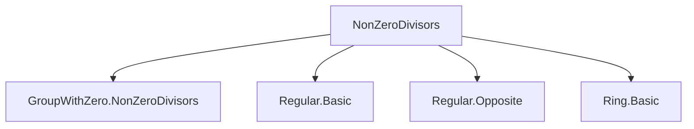
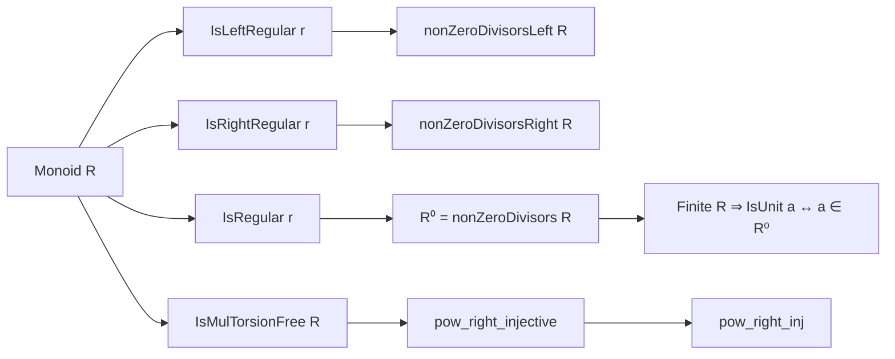
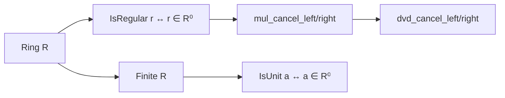

### Technical Brief: `NonZeroDivisors.lean`

---

#### **1. Key Definitions & Theorems**

| Name | Type / Signature | Purpose |
|------|------------------|---------|
| `IsLeftRegular r` | `r ∈ R` satisfies `∀ a b, r * a = r * b → a = b` | Left multiplication by `r` is injective. |
| `IsRightRegular r` | `∀ a b, a * r = b * r → a = b` | Right multiplication by `r` is injective. |
| `IsRegular r` | `IsLeftRegular r ∧ IsRightRegular r` | `r` is both left and right regular (i.e., not a left or right zero divisor). |
| `nonZeroDivisorsLeft R` | Submonoid of `R` | Elements of `R` that are left regular. |
| `nonZeroDivisorsRight R` | Submonoid of `R` | Elements of `R` that are right regular. |
| `R⁰` (notation for `nonZeroDivisors R`) | `nonZeroDivisorsLeft R ⊓ nonZeroDivisorsRight R` | Submonoid of *regular* elements (non-zero-divisors). |
| `IsMulTorsionFree R` | `∀ x ≠ 1, ∀ n > 0, x ^ n ≠ 1` | No nontrivial torsion under multiplication. |
| `pow_right_injective` | `x ≠ 1 → Function.Injective (n ↦ x ^ n)` | Powers of a non-1 torsion-free element are injective. |
| `isUnit_iff_mem_nonZeroDivisors_of_finite` | `[Finite R] → IsUnit a ↔ a ∈ R⁰` | In finite rings, units = non-zero-divisors. |

**Key Theorems (with purpose):**
- `isLeftRegular_iff_mem_nonZeroDivisorsLeft`: Connects left regularity to membership in `nonZeroDivisorsLeft`.
- `isRegular_iff_mem_nonZeroDivisors`: Connects regularity to membership in `R⁰`.
- `pow_right_injective`, `pow_right_inj`: Injectivity of exponentiation in torsion-free monoids/rings.
- `isUnit_iff_mem_nonZeroDivisors_of_finite`: Fundamental structural result for finite rings.

---

#### **2. Naming Conventions**

- **Prefixes:**
  - `isLeftRegular_`, `isRightRegular_`, `isRegular_`: Relate to regularity properties.
  - `pow_right_`: Pertains to injectivity/injectivity equivalence of exponentiation.
  - `mul_cancel_`: Left/right cancellation properties.
  - `dvd_cancel_`: Divisibility cancellation using regular elements.

- **Suffixes:**
  - `_left`, `_right`: Distinguish left/right variants.
  - `_of_finite`: Applies only under finiteness assumptions.
  - `_coe_`: Involves coercion from `R⁰` to `R`.
  - `_iff_`: Biconditional characterizations.

- **Notation:**
  - `R⁰`: Standard notation for the submonoid of non-zero-divisors.
  - `nonZeroDivisorsLeft`, `nonZeroDivisorsRight`: Explicit submonoids.

---

#### **3. Tactic Stack**

Frequently used tactics:
- `simp_rw`: Rewriting with simplification and definitional equalities.
- `rw`: Rewriting using equivalences and lemmas.
- `exact`, `intro`, `obtain`, `cases`: Basic proof structure.
- `rwa`: Rewrite + assumption.
- `mul_comm`, `pow_add`, `pow_eq_one_iff_right`: Algebraic rewrites.
- `isLeftRegular.mul_left_eq_self_iff`: Specialized algebraic reasoning.
- `Function.Injective`, `eq_iff`: Reasoning about injectivity and equality.

No heavy automation (e.g., `aesop`, `linarith`) — proofs are mostly algebraic and structural.

---

#### **4. Proof Logic**

- **Induction**: Not used directly in this file.
- **Case analysis**: On `n ≤ m` or `n ≥ m` (e.g., in `pow_injective` proofs).
- **Equivalence chaining**: Many proofs use `↔`-elimination via `eq_iff`, `dvd_iff`, etc.
- **Submonoid containment**: Proofs often reduce to checking element-wise regularity.
- **Cancellation ↔ Regularity**: Core logical flow: `r ∈ R⁰ ⇔ left/right cancellation holds`.
- **Finite → bijective ⇔ injective**: Used to upgrade regularity to unit-ness.

---

#### **5. Imports**

| Import | Purpose |
|--------|---------|
| `Mathlib.Algebra.GroupWithZero.NonZeroDivisors` | Core definitions of `nonZeroDivisorsLeft`, `nonZeroDivisorsRight`, `R⁰`. |
| `Mathlib.Algebra.Regular.Basic` | Definitions of `IsLeftRegular`, `IsRightRegular`, `IsRegular`. |
| `Mathlib.Algebra.Regular.Opposite` | Tools for transferring regularity via opposite monoids (used in `pow_injective` proofs). |
| `Mathlib.Algebra.Ring.Basic` | Basic ring theory infrastructure (used in `Ring` section). |

---

#### **6. Mermaid Diagrams**

##### **Dependency Graph (Module-Level)**

##### **Conceptual Overview (Theory Flow)**

##### **Ring Section Logic Flow**

---

#### **7. Domain-Specific AI Agent Notes**

- **Focus Areas**: Ring theory, especially zero-divisor structure, regular elements, and cancellation.
- **Common Patterns**:
  - Equating algebraic properties (regularity, unit-ness) with set-theoretic membership.
  - Leveraging monoid/cancellation/torsion assumptions to upgrade regularity.
  - Using finiteness to equate injectivity and surjectivity.
- **Key Abstractions**:
  - `R⁰` as a canonical submonoid of “good” elements.
  - `IsMulTorsionFree` as a proxy for “no periodic elements ≠ 1”.
- **Use Cases for AI Agent**:
  - Automating proofs of `r ∈ R⁰` via regularity checks.
  - Recognizing when `Finite R` allows unit/non-zero-divisor equivalence.
  - Suggesting `pow_right_injective` lemmas for exponent-based injectivity.

--- 

Let me know if you'd like a formalized summary in Lean or a theory graph for downstream reasoning.
