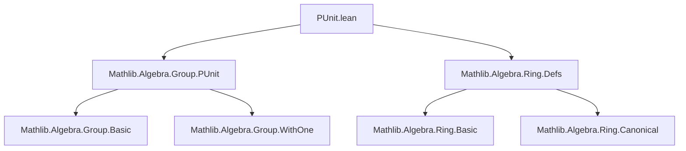
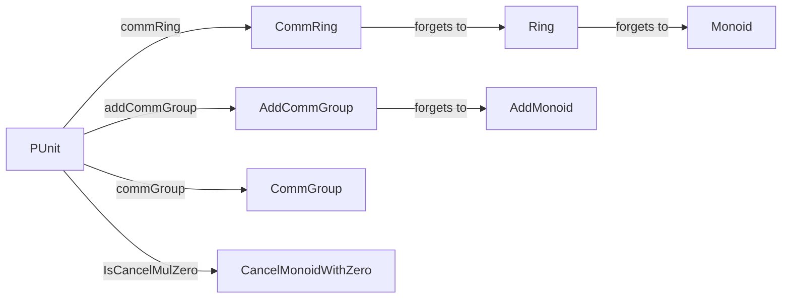
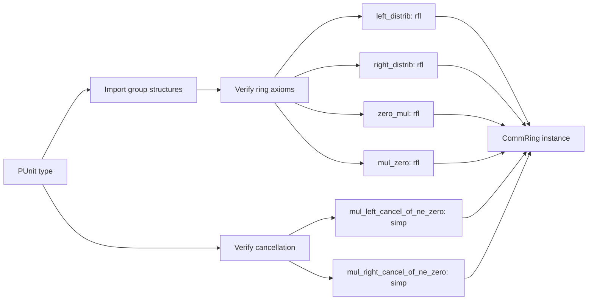

**Technical Brief: `PUnit.lean` (Lean 4)**  
*Domain: Algebraic Structures on the Singleton Type*

---

### 1. **Key Definitions & Theorems**

| Name | Type / Instance | Purpose |
|------|-----------------|---------|
| `PUnit.commRing` | `CommRing PUnit` | Equips the singleton type `PUnit` with a commutative ring structure. |
| `PUnit.commGroup` | `CommGroup PUnit` *(imported)* | Provides the multiplicative commutative group structure on `PUnit`. |
| `PUnit.addCommGroup` | `AddCommGroup PUnit` *(imported)* | Provides the additive commutative group structure on `PUnit`. |
| `IsCancelMulZero PUnit` | `IsCancelMulZero` instance | Proves left/right multiplication cancellation for nonzero elements (trivially true since only element is `unit`). |

**Notes**:
- `PUnit` is the type with exactly one element, usually denoted `unit`.
- All ring axioms are verified by `rfl` (definitional equality), as there is only one possible term of each type.
- `natCast _ := unit` defines the canonical embedding of natural numbers into `PUnit` as the unique element.

---

### 2. **Naming Conventions**

- **No custom naming prefixes/suffixes** in this file.
- Uses standard Lean/Mathlib naming:
  - `commRing`, `commGroup`, `addCommGroup`, `IsCancelMulZero` — standard instance names.
  - `left_distrib`, `right_distrib`, `zero_mul`, `mul_zero` — standard ring axiom names.

---

### 3. **Tactic Stack**

| Tactic | Frequency | Role |
|--------|-----------|------|
| `rfl` | High | Proves equalities by definitional equality (all ring axioms). |
| `simp` | Medium | Used in `IsCancelMulZero` proofs (simplifies using `PUnit`’s uniqueness). |
| `intros` | Medium | Intro step before `rfl`/`simp`. |

No advanced tactics (e.g., `ring`, `linarith`, `induction`) needed due to triviality.

---

### 4. **Proof Logic**

- **Structure**: *Definitional verification*.
- **Flow**:
  1. Use imported structures (`commGroup`, `addCommGroup`) to supply multiplicative/additive group parts.
  2. For remaining ring axioms (`left_distrib`, `right_distrib`, `zero_mul`, `mul_zero`), apply `intros` to introduce arbitrary elements (all equal to `unit`), then `rfl`.
  3. For `IsCancelMulZero`, use `simp` to reduce goals to trivial equalities (since `unit ≠ unit` is false, implications hold vacuously).
- **No induction or case analysis** needed — the type has only one element.

---

### 5. **Imports**

| Module | Role |
|--------|------|
| `Mathlib.Algebra.Group.PUnit` | Provides `PUnit.commGroup`, `PUnit.addCommGroup`, and related lemmas. |
| `Mathlib.Algebra.Ring.Defs` | Defines `CommRing`, `IsCancelMulZero`, and basic ring-theoretic notions. |

> **Scope**: This module sits at the *foundational layer* of algebraic hierarchy — verifying that the terminal object in the category of rings is well-behaved.

---

### 6. **Mermaid Diagrams**

#### Dependency Graph (File-Level)

#### Conceptual Overview (Theory Context)

#### Proof Structure (High-Level)

---

### 7. **Domain-Specific AI Agent Guidance**

- **Focus**: This file is a *triviality checker* — ideal for testing definitional equality reasoning.
- **Pattern to recognize**: When `PUnit` appears, expect:
  - `rfl`-based proofs,
  - `simp` for vacuous implications,
  - No induction or case splits.
- **Use case**: Template for verifying terminal objects in algebraic categories.

--- 

*End of Brief*
