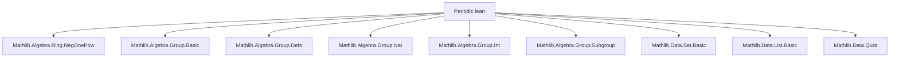
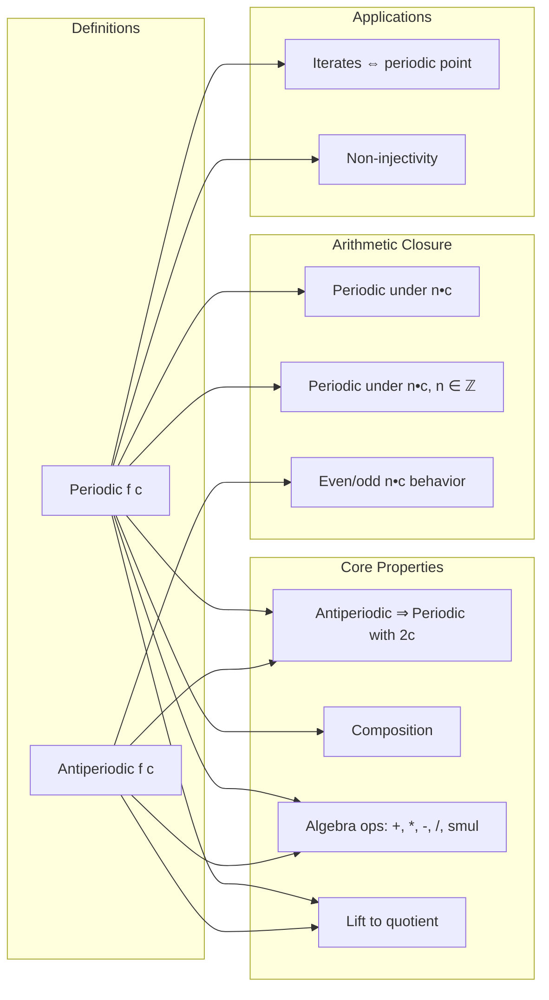

### Technical Brief: `Periodic.lean`

---

#### **1. Key Definitions & Theorems**

| Name | Type | Purpose |
|------|------|---------|
| `Periodic f c` | `∀ x, f (x + c) = f x` | Defines *c*-periodicity: function repeats every shift by `c`. |
| `Antiperiodic f c` | `∀ x, f (x + c) = -f x` | Defines *c*-antiperiodicity: function flips sign every shift by `c`. |
| `Periodic.funext` | `Periodic f c → (fun x ↦ f (x + c)) = f` | Converts periodicity condition to function equality via `funext`. |
| `Antiperiodic.periodic` | `Antiperiodic f c → Periodic f (2 • c)` | Shows antiperiodicity implies periodicity with doubled period. |
| `Periodic.comp` | `Periodic f c → Periodic (g ∘ f) c` | Composition with any `g` preserves periodicity. |
| `Periodic.mul`, `Periodic.div`, `Periodic.smul` | `Periodic f c → Periodic g c → Periodic (f * g) c`, etc. | Algebraic operations preserve periodicity. |
| `Periodic.nsmul`, `Periodic.zsmul` | `Periodic f c → Periodic f (n • c)` | Closure under natural/integer scalar multiplication of period. |
| `Periodic.lift` | `Periodic f c → α ⧸ ⟨c⟩ → β` | Lifts a periodic function to the quotient by the cyclic subgroup generated by `c`. |
| `Antiperiodic.add_zsmul_eq` | `f (x + n • c) = (n.negOnePow) • f x` | Exact formula for iterated antiperiodic shifts using `negOnePow`. |
| `Antiperiodic.even_nsmul_periodic`, `Antiperiodic.odd_nsmul_antiperiodic` | Classifies behavior of `(2n)•c` and `(2n+1)•c` shifts. |
| `Periodic.not_injective` | `Periodic f c ∧ c ≠ 0 → ¬ Injective f` | Non-injectivity of non-zero-periodic functions on additive monoids with zero. |
| `periodic_iterate_iff` | `Periodic (f^[·] a) n ↔ IsPeriodicPt f n a` | Connects function periodicity with pointwise periodicity of iterates. |

---

#### **2. Naming Conventions**

- **Prefixes**:
  - `Periodic.` / `Antiperiodic.` — namespace qualifiers for properties.
  - `const_`, `add_`, `sub_`, `smul_`, `mul_`, `div_`, `neg_`, `comp_`, `lift_` — describe structural transformations.
- **Suffixes**:
  - `_eq` — equality involving `f (…)` and `f 0` or `f x`.
  - `_periodic` / `_antiperiodic` — classification of derived periodic/antiperiodic behavior.
  - `even_` / `odd_` — parity-based classification (e.g., `even_nsmul_periodic`).
  - `zsmul` / `nsmul` / `int_mul` / `nat_mul` — indicate scalar type (`ℤ`, `ℕ`, or ring multiplication).
- **Special**:
  - `funext`, `funext'` — functional extensionality variants.
  - `lift`, `coe` — quotient-related operations.

---

#### **3. Tactic Stack**

Frequent tactics used in proofs:

| Tactic | Usage |
|--------|-------|
| `simp_all` | Simplify using `@[simp]` lemmas and local hypotheses. Dominant in short proofs. |
| `rw` / `rwa` | Rewrite using equalities, often with `sub_eq_add_neg`, `add_assoc`, etc. |
| `induction` | Structural induction on `n : ℕ`, `n : ℤ`, lists, multisets, finsets. |
| `rcases` / `obtain` | Case analysis on disjunctions (`even_or_odd'`) or existential quantifiers. |
| `simpa` | Simplify and apply target equality; used heavily for `… ▸ …` and `congr_arg f`. |
| `aesop` | Not present — Lean’s `Periodic.lean` avoids automation in favor of explicit rewriting. |
| `ring` / `abel` | Not used — arithmetic is handled via `nsmul_eq_mul`, `zsmul_eq_mul`, etc. |
| `exact`, `refine` | Used in `lift` definition and `periodic_iterate_iff`. |

---

#### **4. Proof Logic**

- **Inductive structure**: Proofs of `Periodic f (n • c)` and `Antiperiodic f ((2n+1)•c)` use induction on `n : ℕ`.
- **Parity case analysis**: Many results (e.g., `add_zsmul_eq`) split on `even n` / `odd n` via `Int.even_or_odd'`.
- **Algebraic manipulation**: Heavy use of group/ring identities (`sub_eq_add_neg`, `add_assoc`, `smul_add`, `inv_inv`).
- **Quotient lifting**: `lift` uses `Quotient.liftOn'` and subgroup properties (`AddSubgroup.zmultiples`).
- **Reduction to base cases**: Many theorems reduce to `h 0`, `h (x - c)`, or `h (a + x)` via `simpa`/`simp`.
- **Duality**: Antiperiodic results often mirror periodic ones, with sign changes and `2c` periods.

---

#### **5. Imports & Dependencies**

- **Core**:
  ```lean
  Mathlib.Algebra.Ring.NegOnePow
  ```
  Provides `negOnePow`, crucial for `Antiperiodic.add_zsmul_eq` and parity-based lemmas.

- **Implicit imports** (via `Add α`, `Mul β`, `AddGroup α`, etc.):
  - `Mathlib.Algebra.Group.Basic`
  - `Mathlib.Algebra.Group.Defs` (for `Add`, `Mul`, `Neg`, `SMul`, `DistribMulAction`)
  - `Mathlib.Algebra.Group.Nat`
  - `Mathlib.Algebra.Group.Int`
  - `Mathlib.Algebra.Group.Submonoid`
  - `Mathlib.Algebra.Group.Subgroup`
  - `Mathlib.Data.Set.Basic` (`open Set`)
  - `Mathlib.Data.List.Basic`, `Multiset`, `Finset`
  - `Mathlib.Data.Quot` (for `Quotient.liftOn'`, `QuotientAddGroup`)

---

#### **6. Mermaid Diagrams**

##### **Dependency Graph (Module-Level)**



##### **Conceptual Theory Overview**



---

#### **7. Summary**

This file formalizes the theory of *periodic* and *antiperiodic* functions in Lean 4, emphasizing algebraic closure properties, arithmetic behavior of periods (natural, integer, scalar multiples), and connections to group quotients. It leverages `negOnePow` to unify parity-sensitive behavior and provides a rich library of lemmas for manipulating shifts, compositions, and algebraic combinations. The proofs are constructive and rely on explicit rewriting rather than automation, aligning with Lean’s formalization philosophy for analysis and algebra.
