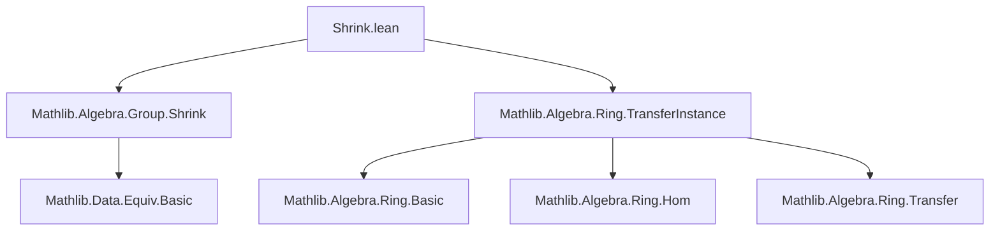
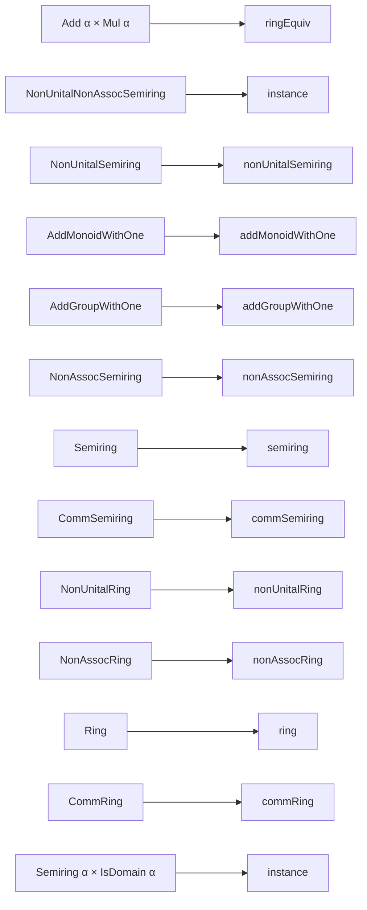

**Technical Brief: `Shrink.lean` — Transfer of Ring Structures via `Shrink α`**

---

### 1. **Key Definitions & Theorems**

| Name | Type / Declaration | Purpose |
|------|---------------------|---------|
| `ringEquiv` | `def ringEquiv [Add α] [Mul α] : Shrink.{v} α ≃+* α` | Constructs a ring isomorphism between `Shrink α` and `α`, using the equivalence `equivShrink α` and its symmetry. |
| `equivShrink α` | Implicitly from `Mathlib.Algebra.Group.Shrink` | Provides an equivalence `Shrink.{v} α ≃ α` when `α` is small. |
| `nonUnitalNonAssocSemiring`, `nonUnitalSemiring`, ..., `CommRing` | `instance` declarations | Transfer algebraic structures from `α` to `Shrink.{v} α` via transport along `equivShrink α`. |
| `isDomain` | `instance [Semiring α] [IsDomain α] : IsDomain (Shrink.{v} α)` | Proves that if `α` is an integral domain, then so is `Shrink α`, using `ringEquiv`. |

---

### 2. **Naming Conventions**

- **Prefixes**:
  - `is_`: Used in `IsDomain` (property, not structure).
  - `nonUnital`, `nonAssoc`: Prefixes for weakened algebraic structures (e.g., `NonUnitalRing`, `NonAssocSemiring`).
- **Suffixes**:
  - `_Equiv`: For equivalences (e.g., `ringEquiv`).
  - `_instance`: Implicitly used for `instance` declarations (not visible in name, but pattern is consistent).
- **Structure names**: Follow Lean’s algebra hierarchy (`Add`, `Mul`, `NonUnitalNonAssocSemiring`, `Semiring`, `Ring`, `CommRing`, etc.).

---

### 3. **Tactic Stack**

- **No explicit tactics** appear in the file (all definitions are *declarative*).
- **Implicit tactic usage** (via `ringEquiv`, `nonUnitalSemiring`, etc.) relies on:
  - `transfer_instance` infrastructure (from `Mathlib.Algebra.Ring.TransferInstance`), which internally uses:
    - `equiv.lift`, `equiv.map`, `equiv.transport`
    - Tactics like `aesop`, `simp`, ` rfl`, `congr`, `ext`, `apply`, `exact`, `refine`, `rw`, `change`, `apply_fun`, etc., in the underlying `TransferInstance` machinery.

---

### 4. **Proof Logic**

- **Uniform pattern** across all instances:
  1. Assume `α` has a structure `S` (e.g., `Semiring α`).
  2. Use `equivShrink α : Shrink α ≃ α`.
  3. Transport the structure along the equivalence: `(equivShrink α).symm.S` (e.g., `.symm.semiring`).
  4. For `IsDomain`, use `ringEquiv.isDomain`, which leverages that `IsDomain` is a *prop-valued* predicate preserved under isomorphism.

- **No induction or case analysis** is needed — the logic is *structural transport* via equivalence.

---

### 5. **Imports**

| Import | Role |
|--------|------|
| `Mathlib.Algebra.Group.Shrink` | Provides `Shrink`, `equivShrink`, and basic group-theoretic transport. |
| `Mathlib.Algebra.Ring.TransferInstance` | Provides infrastructure for transferring ring-like structures along equivalences (e.g., `equiv.ringEquiv`, `equiv.semiring`, `equiv.isDomain`). |

---

### 6. **Mermaid Diagrams**

#### **Dependency Graph (Module-Level)**



#### **Overview of Theory Flow**

```mermaid
flowchart LR
  subgraph Input
    α[α : Type*]([Small.{v} α])
    S[Structure on α<br/>e.g., Semiring α]
  end

  subgraph Transport
    E[equivShrink α<br/>Shrink α ≃ α]
    T[Transport along E.symm]
  end

  subgraph Output
    Sh[Shrink.{v} α]
    S′[Structure on Shrink α<br/>e.g., Semiring (Shrink α)]
  end

  α -->|smallness| E
  S -->|instance| T
  E -->|equiv.transport| T
  T --> S′
  Sh -->|via S′| S′
```

#### **Structure Hierarchy Transfer (Partial)**



---

### Summary

This file demonstrates *structure transport* along the equivalence `Shrink α ≃ α`, leveraging Lean’s `equiv` infrastructure and `TransferInstance`. All instances are *noncomputable* (as `Shrink` may involve choice), and the logic is uniform: transport along `equivShrink α.symm`. The file is a canonical example of *universe shrinking* while preserving algebraic structure — essential for constructing small types in dependent type theory.
