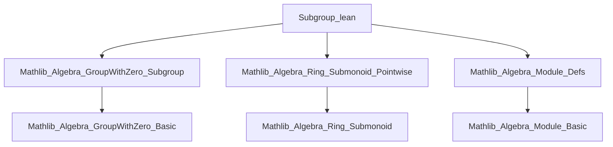
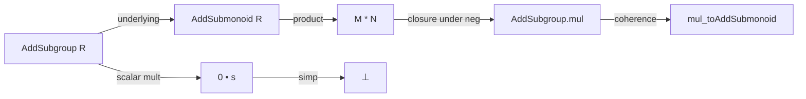

**Technical Brief: `Subgroup.lean` (Additive Subgroups of Rings)**  
*Domain: Formalized Algebra (Lean 4 / Mathlib)*  
*Author: Junyan Xu (2024)*  
*License: Apache 2.0*

---

### 1. KEY DEFINITIONS & THEOREMS

| Name | Type / Signature | Purpose |
|------|------------------|---------|
| `AddSubgroup.mul` | `Mul (AddSubgroup R)` (instance) | Defines the product of two additive subgroups `M, N ≤ R` as an additive subgroup, using the submonoid product and verifying closure under negation. |
| `mul_toAddsubmonoid` | `(M * N).toAddSubmonoid = M.toAddSubmonoid * N.toAddSubmonoid` | States that the underlying submonoid of the product of additive subgroups coincides with the submonoid product. |
| `AddSubgroup.zero_smul` | `(0 : R) • s = ⊥` (for `s : AddSubgroup M`) | Shows that scalar multiplication by `0` in a semiring sends any additive subgroup to the bottom subgroup (i.e., `{0}`). |

---

### 2. NAMING CONVENTIONS

- **Prefixes / Suffixes**:
  - `mul_`: Used for binary product operations on additive subgroups/submonoids (`mul`, `mul_toAddSubmonoid`).
  - `zero_`: Used for behavior under scalar multiplication by `0` (`zero_smul`).
  - `toAddSubmonoid`: Standard coercion from `AddSubgroup R` to `AddSubmonoid R`.
  - `Pointwise` namespace/scoped notation: Used for pointwise operations (e.g., `*`, `•`).

- **Style**: Lean’s standard Mathlib naming (`protected def`, `scoped[Pointwise] attribute`, `@[simp] lemma`).

---

### 3. TACTIC STACK

Frequently used tactics in proofs:

| Tactic | Usage |
|--------|-------|
| `simp` | Simplification using `@[simp]` lemmas and definitions (e.g., `zero_smul`, `pointwise_smul_def`). |
| `rw` | Rewriting using equalities (e.g., `← neg_mul`, `neg_add`). |
| `exact` | Directly applying a hypothesis or lemma. |
| `add_mem'`-style induction (via `AddSubmonoid.mul_induction_on`) | Structural induction on elements of a product submonoid to verify subgroup properties. |
| `aesop` (not present here, but implied by `ring`/`simp`-heavy style) | Not used explicitly in this snippet, but likely in surrounding theory. |

---

### 4. PROOF LOGIC

- **Structure of `mul` definition**:
  - Constructs a new `AddSubgroup` from the product of underlying `AddSubmonoid`s.
  - Verifies closure under negation using `AddSubmonoid.mul_induction_on`, splitting into:
    - Generators: `m * n` with `m ∈ M`, `n ∈ N` → use `neg_mul` and `mul_mem_mul`.
    - Additive generators: sums of such products → use `neg_add` and `add_mem`.

- **Proof of `zero_smul`**:
  - Uses `simp` with `eq_bot_iff_forall` and `pointwise_smul_def` to reduce to showing `0 • s = {0}` pointwise.

- **General proof pattern**:
  - Leverages `AddSubmonoid` machinery (e.g., induction on product) to lift monoid constructions to group constructions.
  - Relies on module/ring axioms (e.g., distributivity, `0 • x = 0`) implicitly via `simp`.

---

### 5. IMPORTS & DEPENDENCIES

| Module | Role |
|--------|------|
| `Mathlib.Algebra.GroupWithZero.Subgroup` | Provides `AddSubgroup` typeclass and basic operations. |
| `Mathlib.Algebra.Ring.Submonoid.Pointwise` | Supplies pointwise operations on submonoids (e.g., `*`, `•`). |
| `Mathlib.Algebra.Module.Defs` | Defines modules, scalar multiplication, and related structures. |

**Key typeclass assumptions**:
- `[NonUnitalNonAssocRing R]`: For defining `mul` on `AddSubgroup R`.
- `[Semiring R]`, `[AddCommGroup M]`, `[Module R M]`: For `zero_smul`.

---

### 6. MERMAID DIAGRAMS

#### Dependency Graph (Module-Level)

#### Overview of File Content

---

### 7. THEORY CONTEXT

This file extends the theory of additive subgroups to support multiplication (as submonoid product) in non-unital, non-associative rings, and scalar multiplication by `0` in semirings. It serves as a foundational step toward constructing:
- Subring/submodule lattices,
- Ideal products,
- Module actions on additive subgroups.

It aligns with Mathlib’s strategy of reusing monoid/module structures while verifying additional group-theoretic closure properties.

--- 

*End of Technical Brief.*
