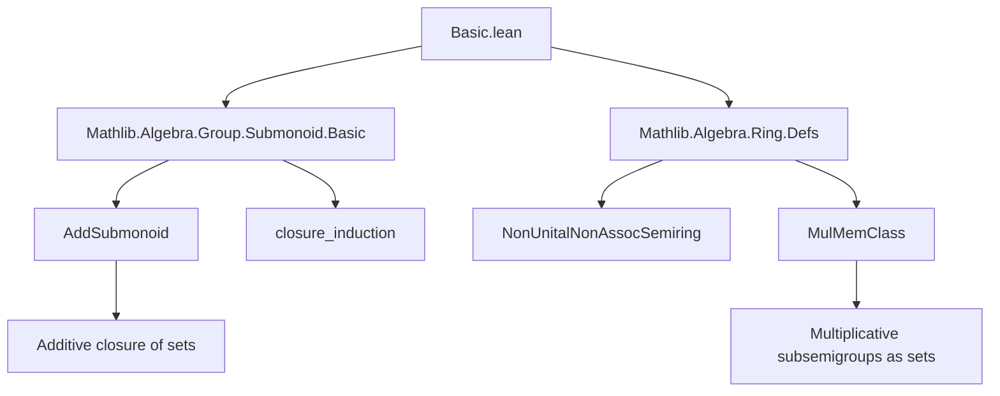
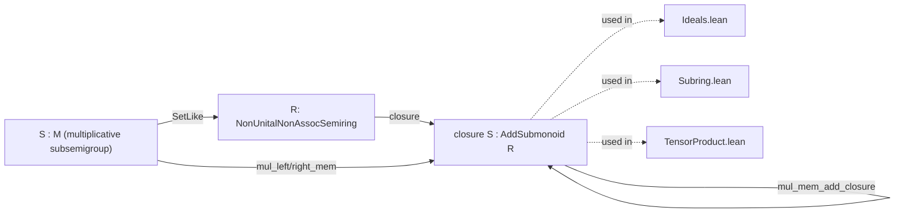

**Technical Brief: Basic.lean (Lean 4)**  
*Domain: Formalized Algebra — Additive Closures of Multiplicative Structures*

---

### 1. KEY DEFINITIONS & THEOREMS

| Name | Type / Signature | Purpose |
|------|------------------|---------|
| `MulMemClass` | `class` (implicit) | A typeclass encoding that elements of `M : Set R` are closed under multiplication with elements of `R` on either side (via `mul_mem`-like behavior). Used to reason about multiplicative subsemigroups/submonoids viewed as sets with a `SetLike` instance. |
| `mul_right_mem_add_closure` | `a ∈ closure (S : Set R) → b ∈ S → a * b ∈ closure S` | Shows that multiplying an element in the *additive closure* of `S` on the **right** by an element of `S` stays in the additive closure. |
| `mul_mem_add_closure` | `a ∈ closure S → b ∈ closure S → a * b ∈ closure S` | Shows that the additive closure of a multiplicative subsemigroup is closed under multiplication (i.e., is a *subring* without unit). |
| `mul_left_mem_add_closure` | `a ∈ S → b ∈ closure S → a * b ∈ closure S` | Symmetric version of `mul_right_mem_add_closure`, using `mul_mem_add_closure` as a helper. |

> Note: All lemmas operate under the assumption that `R` is a `NonUnitalNonAssocSemiring`, and `M` is a `SetLike` instance implementing `MulMemClass`, which ensures `S : M` (i.e., `S` is a multiplicative subsemigroup) satisfies `s ∈ S → r ∈ R → s * r ∈ S` and `r * s ∈ S` *modulo* the class’s interface.

---

### 2. NAMING CONVENTIONS

- **Prefixes**:
  - `mul_`: Indicates multiplication-related behavior.
  - `right` / `left`: Specifies side of multiplication (right vs. left action).
  - `mem_`: Indicates membership in a set (e.g., `mem_add_closure`).
- **Suffixes**:
  - `_add_closure`: Denotes the result pertains to the *additive closure* of a multiplicative structure.
- **Pattern**: `mul_[side]_mem_add_closure` — clearly encodes *which side* of multiplication and *which set* (additive closure) is involved.

---

### 3. TACTIC STACK

| Tactic | Usage Frequency | Role |
|--------|-----------------|------|
| `induction` | High | Core proof strategy: structural induction on `closure_induction` (i.e., on the proof that `a` or `b` lies in the additive closure). |
| `simp only [...]` | Medium | Simplifies goals using specific rewrites (e.g., `zero_mul`, `add_mul`, `mul_add`). |
| `exact` | Medium | Supplies immediate proofs (e.g., `mem_closure.mpr ...`). |
| `simpa only [...] using` | Medium | Combines simplification and `exact` in one step. |
| `mem_closure.mpr` | Medium | Converts membership in closure to a predicate-holding condition (via universal property of closure). |

No heavy automation (e.g., `aesop`, `linarith`) — proofs are constructive and structural.

---

### 4. PROOF LOGIC

The proofs follow a **standard induction-on-structure-of-closure** pattern:

1. **Base case (`mem`)**: For `a ∈ S` (or `b ∈ S`), use the `MulMemClass` assumption to show closure under multiplication.
2. **Zero case**: Use `zero_mul = 0` or `mul_zero = 0`, and `zero_mem` of additive submonoid.
3. **Add case**: Use distributivity (`add_mul`, `mul_add`) and closure under addition (`add_mem`).

This reflects the *free additive submonoid* construction: elements of `closure S` are finite sums of elements of `S`, so multiplication distributes over addition and respects the multiplicative structure of `S`.

---

### 5. IMPORTS & DEPENDENCIES

| Module | Role |
|--------|------|
| `Mathlib.Algebra.Group.Submonoid.Basic` | Provides `AddSubmonoid`, `closure`, and basic properties of additive closures. |
| `Mathlib.Algebra.Ring.Defs` | Defines `NonUnitalNonAssocSemiring`, `MulMemClass`, and related algebraic structures. |

> The file is foundational: it sets up closure properties needed for later results about *subrings*, *ideals*, and *semiring homomorphisms* preserving additive closures of multiplicative subsets.

---

### 6. MERMAID DIAGRAMS

#### Dependency Graph (File-Level)

#### Overview of Theoretical Flow

> **Interpretation**: This file is a *building block* for proving that additive closures of multiplicative structures inherit ring-like multiplication — essential for constructing subrings, ideals, localizations, and tensor products.

--- 

Let me know if you'd like the corresponding `MulMemClass` interface definition or a formalization of its usage in `Subring`.lean.
