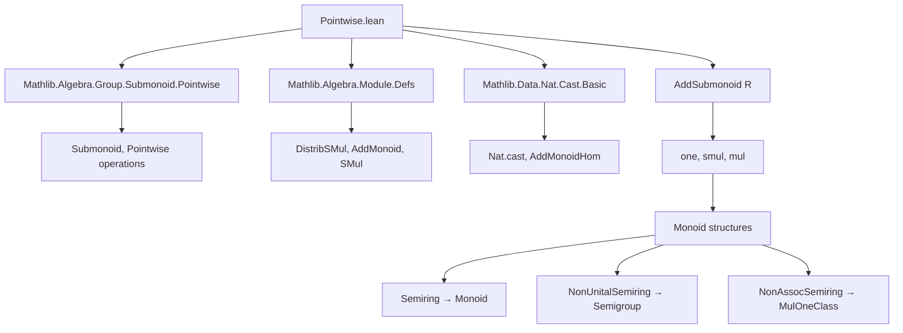

**Technical Brief: `Pointwise.lean` — Elementwise Monoid Structure on Additive Submonoids**

---

### 1. **Key Definitions & Theorems**

| Name | Type / Signature | Purpose |
|------|------------------|---------|
| `AddSubmonoid.one` | `One (AddSubmonoid R)` | Defines the unit additive submonoid as the range of `Nat.cast`, i.e., the submonoid generated by `1`. |
| `AddSubmonoid.smul` | `SMul (AddSubmonoid R) (AddSubmonoid A)` | For `M : AddSubmonoid R`, `N : AddSubmonoid A`, defines `M • N` as the additive submonoid generated by `{ m • n | m ∈ M, n ∈ N }` under `DistribSMul R A`. |
| `AddSubmonoid.mul` | `Mul (AddSubmonoid R)` | For `R` a `NonUnitalNonAssocSemiring`, defines `M * N` as the additive submonoid generated by `{ m * n | m ∈ M, n ∈ N }`. |
| `AddSubmonoid.mulOneClass` | `MulOneClass (AddSubmonoid R)` | For `R` a `NonAssocSemiring`, equips `AddSubmonoid R` with a `MulOneClass` structure (unit laws). |
| `AddSubmonoid.semigroup` | `Semigroup (AddSubmonoid R)` | For `R` a `NonUnitalSemiring`, equips `AddSubmonoid R` with associative multiplication. |
| `AddSubmonoid.monoid` | `Monoid (AddSubmonoid R)` | For `R` a `Semiring`, equips `AddSubmonoid R` with a full monoid structure. |
| `AddSubmonoid.hasDistribNeg` | `HasDistribNeg (AddSubmonoid R)` | For `R` a `NonUnitalNonAssocRing`, ensures `-(M * N) = (-M) * N = M * (-N)`. |
| `closure_mul_closure` | `closure S * closure T = closure (S * T)` | Relates multiplication of closures to closure of multiplication of sets. |
| `pow_eq_closure_pow_set` | `s ^ n = closure ((s : Set R) ^ n)` | Connects powers in the monoid of additive submonoids with set-theoretic powers. |

**Key Lemmas (used repeatedly):**
- `smul_mem_smul`, `mul_mem_mul`: membership in product/smuls.
- `smul_le`, `mul_le`: universal property of product/smuls (characterize inclusion).
- `smul_induction_on`, `mul_induction_on`: induction principles for elements of products.
- `smul_iSup`, `iSup_mul`, `mul_sup`, `sup_mul`: distributivity over suprema/suprema.
- `mul_comm_of_commute`: commutativity of multiplication when elements commute.

---

### 2. **Naming Conventions**

- **Prefixes:**
  - `smul_`: for scalar multiplication–induced constructions (`smul`, `smul_mem_smul`, `smul_le`, `smul_induction_on`, `smul_iSup`, etc.).
  - `mul_`: for multiplication of additive submonoids (`mul`, `mul_mem_mul`, `mul_le`, `mul_induction_on`, `mul_sup`, `mul_comm_of_commute`, etc.).
  - `one_`: for unit-related constructions (`one_eq_mrange`, `mem_one`, `one_eq_closure`, etc.).
  - `addSubmonoid_`: for lemmas about additive submonoid operations (`addSubmonoid_smul_bot`, `addSubmonoid_smul_sup`).
  - `pow_`: for powers (`pow_eq_closure_pow_set`, `closure_pow`).

- **Suffixes:**
  - `_on`: for induction principles (`smul_induction_on`, `mul_induction_on`).
  - `_le`: for universal properties (`smul_le`, `mul_le`).
  - `_mem_`: for membership lemmas (`smul_mem_smul`, `mul_mem_mul`, `natCast_mem_one`).
  - `_set`: for set-theoretic versions (`mul_eq_closure_mul_set`, `pow_eq_closure_pow_set`).

---

### 3. **Tactic Stack**

Frequent tactics used:
- `rw`, `simp`, `simp_rw`: for rewriting and simplification (especially with `mem_`, `zero_`, `one_`, `smul_`, `mul_` lemmas).
- `apply`, `exact`: for direct proof steps.
- `refine`: for constructing proofs with holes (e.g., `refine mul_le.2 fun ... => ?_`).
- `le_antisymm`: to prove equality of submonoids.
- `iSup_le`, `le_iSup`, `iSup_induction`: for reasoning about suprema.
- `closure_induction`, `closure_le`, `subset_closure`: for closure-based arguments.
- `ext`: for extensionality (e.g., proving sets equal).
- `aesop`: not used in this file (no `aesop` calls).
- `cases`/`obtain`: for destructuring existential or suprema membership.

---

### 4. **Proof Logic**

The logical flow is highly uniform:

1. **Define operations** via `iSup`/`closure` over generators (e.g., `M • N := ⨆ s : M, N.map (· • s.1)`).
2. **Prove basic properties**:
   - Membership lemmas (`smul_mem_smul`, `mul_mem_mul`) via `le_iSup`.
   - Universal properties (`smul_le`, `mul_le`) via `iSup_le`/`le_iSup`.
3. **Induction principles** (`smul_induction_on`, `mul_induction_on`) derived from universal property + closure under addition.
4. **Distributivity over suprema** (`smul_sup`, `sup_mul`, `smul_iSup`, `iSup_mul`) via `le_antisymm`, using:
   - `smul_le`/`mul_le` to reduce to generators.
   - `closure_induction` or direct verification for generators.
5. **Algebraic laws** (associativity, unit, commutativity under conditions) proven via:
   - `le_antisymm`.
   - Induction principles to reduce to generators.
   - Ring axioms (e.g., `mul_assoc`, `right_distrib`, `zero_mul`) applied to generators.

**Typical proof pattern:**
```lean
le_antisymm
  (smul_le.mpr fun m hm n hn => ?_)
  (smul_le.mpr fun m hm n hn => ?_)
```
or for associativity:
```lean
le_antisymm
  (mul_le.mpr fun _mn hmn p hp => mul_induction_on hmn ... )
  (mul_le.mpr fun m hm _np hnp => mul_induction_on hnp ... )
```

---

### 5. **Imports**

| Import | Role |
|--------|------|
| `Mathlib.Algebra.Group.Submonoid.Pointwise` | Provides `Pointwise` locale and infrastructure for pointwise operations on submonoids. |
| `Mathlib.Algebra.Module.Defs` | Provides `DistribSMul`, `AddMonoid`, `SMul`, etc., needed for scalar multiplication. |
| `Mathlib.Data.Nat.Cast.Basic` | Provides `Nat.castAddMonoidHom`, used in defining `one`. |

---

### 6. **Mermaid Diagrams**

#### **Dependency Graph (Top-Level)**



#### **Overview of File Structure**

```mermaid
flowchart LR
  subgraph Sections
    A[AddMonoidWithOne] -->|defines| one
    B[SMul] -->|defines| smul
    C[NonUnitalNonAssocSemiring] -->|defines| mul, hasDistribNeg
    D[NonAssocSemiring] -->|defines| mulOneClass
    E[NonUnitalSemiring] -->|defines| semigroup
    F[Semiring] -->|defines| monoid, pow_eq_closure_pow_set
  end

  subgraph Infrastructure
    one --> mem_one
    smul --> smul_mem_smul
    smul --> smul_le
    mul --> mul_mem_mul
    mul --> mul_le
    mul --> mul_induction_on
  end

  subgraph Algebraic Laws
    mulOneClass --> one_mul, mul_one
    semigroup --> mul_assoc
    monoid --> one_mul, mul_one, mul_assoc
  end

  style A fill:#f9f,stroke:#333
  style B fill:#9ff,stroke:#333
  style C fill:#ff9,stroke:#333
  style D fill:#f99,stroke:#333
  style E fill:#9f9,stroke:#333
  style F fill:#99f,stroke:#333
```

---

### 7. **Domain-Specific AI Agent Guidance**

- **Focus areas for automation:**
  - Recognize patterns like `smul_le.mpr`, `mul_le.mpr`, `le_antisymm`.
  - Apply `smul_induction_on`/`mul_induction_on` when goal involves `C a` with `a ∈ M • N` or `a ∈ M * N`.
  - Use `closure_mul_closure`, `pow_eq_closure_pow_set` to bridge set-theoretic and submonoid-level operations.
  - Detect `Commute` hypotheses to trigger `mul_comm_of_commute`.

- **Common proof obligations:**
  - Show `∀ m ∈ M, n ∈ N, P(m, n) ⇒ P extends to M • N or M * N`.
  - Prove distributivity over `⊔` or `⨆` using `smul_sup`, `sup_mul`, `smul_iSup`, `iSup_mul`.

- **Key lemmas to surface:**
  - `mem_one`, `smul_mem_smul`, `mul_mem_mul`
  - `smul_le`, `mul_le`
  - `one_eq_closure`, `pow_eq_closure_pow_set`
  - `mul_comm_of_commute`

--- 

Let me know if you'd like a formalized tactic automation sketch (e.g., `simp` set, `rewrite_search` rules) for this theory.
