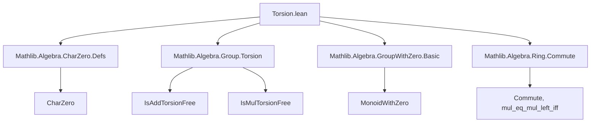

**Technical Brief: `Torsion.lean` Module**

---

### 1. **Key Definitions & Theorems**

| Name | Type / Signature | Purpose |
|------|------------------|---------|
| `IsAddTorsionFree R` | `IsAddTorsionFree R` (typeclass) | States that for all $n > 0$, $n \cdot a = n \cdot b \implies a = b$ (additive torsion-freeness). |
| `scoped instance IsDomain.isAddTorsionFree` | `[Semiring R] [IsDomain R] [CharZero R] → IsAddTorsionFree R` | Proves that any characteristic-zero integral domain is additively torsion-free. |
| `MonoidHom.map_neg_one` | `f (-1) = 1` | Shows that a monoid homomorphism from a ring to a *multiplicatively* torsion-free monoid sends $-1$ to the identity. |
| `MonoidHom.map_neg` | `f (-x) = f x` | Derives that $f(-x) = f(x)$ under the above assumptions (uses `map_neg_one`). |
| `MonoidHom.map_sub_swap` | `f(x - y) = f(y - x)` | Follows from `map_neg`, expressing that $f$ is symmetric under sign reversal of differences. |

---

### 2. **Naming Conventions**

- **Prefixes**:
  - `map_`: for lemmas about behavior of a monoid/homomorphism under operations (`map_neg`, `map_neg_one`, `map_sub_swap`).
  - `is_`: for typeclass instances (`IsAddTorsionFree`, `IsDomain`, `IsMulTorsionFree`).
- **Suffixes**:
  - `_left`: in `mul_eq_mul_left_iff`, indicating left-multiplication injectivity.
  - `_right`: in `nsmul_right_injective`, indicating right-action injectivity.
- **Operational terms**:
  - `nsmul`, `mul`, `cast`, `sub`, `neg`: standard arithmetic operations.
  - `sq`: used in `neg_one_sq` (i.e., $(-1)^2 = 1$).

---

### 3. **Tactic Stack**

| Tactic | Frequency | Role |
|--------|-----------|------|
| `simp only [...] at w` | High | Simplifies hypotheses using known rewrites (e.g., `nsmul_eq_mul`, `mul_eq_mul_left_iff`, `Nat.cast_eq_zero`). |
| `grind` | Medium | Used in the main instance proof to automate case analysis and simplification. |
| `rw [...]` | High | Rewrites using lemmas like `← neg_one_mul`, `map_pow`, `neg_sub`, `map_one`, `one_mul`. |
| `pow_eq_one_iff_left` | Medium | Applied to convert a power equation into an implication about the base. |
| `ring` / `linarith` | Not present | Not used in this file. |

---

### 4. **Proof Logic**

- **Instance proof (`isAddTorsionFree`)**:
  1. Assume $n > 0$, and $n \cdot a = n \cdot b$.
  2. In a domain with `CharZero`, $n \cdot a = n \cdot b$ rewrites to $n \cdot (a - b) = 0$.
  3. Since $n \ne 0$ and the ring is a domain (no zero divisors), $a - b = 0$, so $a = b$.
  4. The proof uses `simp only` to reduce to `n • (a - b) = 0`, then `grind` to finish (likely via `ne_zero_of_charZero` and `eq_zero_of_mul_eq_zero_left`).

- **`map_neg_one`**:
  1. Use $(-1)^2 = 1$.
  2. Apply `map_pow` to get $f(-1)^2 = 1$.
  3. Use `pow_eq_one_iff_left` (valid because `IsMulTorsionFree M` implies no nontrivial torsion in multiplication), to deduce $f(-1) = 1$.

- **`map_neg`**:
  1. Write $-x = (-1) \cdot x$.
  2. Apply `map_mul`, then use `map_neg_one` and `one_mul`.

- **`map_sub_swap`**:
  1. Use $x - y = -(y - x)$.
  2. Apply `map_neg`.

---

### 5. **Imports**

| Import | Purpose |
|--------|---------|
| `Mathlib.Algebra.CharZero.Defs` | Defines `CharZero R`: no positive natural maps to 0 under `Nat.cast`. |
| `Mathlib.Algebra.Group.Torsion` | Defines `IsAddTorsionFree`, `IsMulTorsionFree`, and related lemmas. |
| `Mathlib.Algebra.GroupWithZero.Basic` | Provides basic theory for `MonoidWithZero`, used for rings as multiplicative monoids with zero. |
| `Mathlib.Algebra.Ring.Commute` | Provides lemmas about commuting elements (used implicitly via `mul_eq_mul_left_iff`). |

---

### 6. **Mermaid Diagrams**

#### **Dependency Graph (Module-Level)**



#### **Overview of Theoretical Flow**

```mermaid
flowchart LR
  subgraph TheorySpace
    A[CharZero + IsDomain] -->|Instance| B[IsAddTorsionFree]
    C[Ring R →* M] -->|Assume| D[IsMulTorsionFree M]
    D -->|→| E[f(-1) = 1]
    E -->|→| F[f(-x) = f(x)]
    F -->|→| G[f(x - y) = f(y - x)]
  end

  B -->|Used in| H[General torsion-free reasoning]
  G -->|Used in| I[Symmetric difference behavior]
```

---

### 7. **Domain-Specific AI Agent Notes**

- **Key inference pattern**: *Lift algebraic properties from ring-level (e.g., domain + char 0) to monoid-level (e.g., torsion-freeness)*.
- **Critical assumptions**:
  - `IsDomain R`: ensures no zero divisors.
  - `CharZero R`: ensures $n \cdot 1 \ne 0$ for $n > 0$.
  - `IsMulTorsionFree M`: ensures $x^n = 1 \implies x = 1$ for $n > 0$.
- **Optimization note**: The `scoped` instance is marked expensive — avoid global use; prefer local instantiation.

--- 

Let me know if you'd like a formalization of the missing `pow_eq_one_iff_left` lemma or a proof sketch in natural deduction style.
