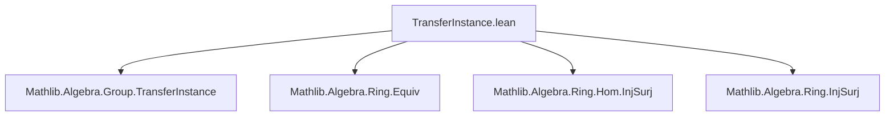
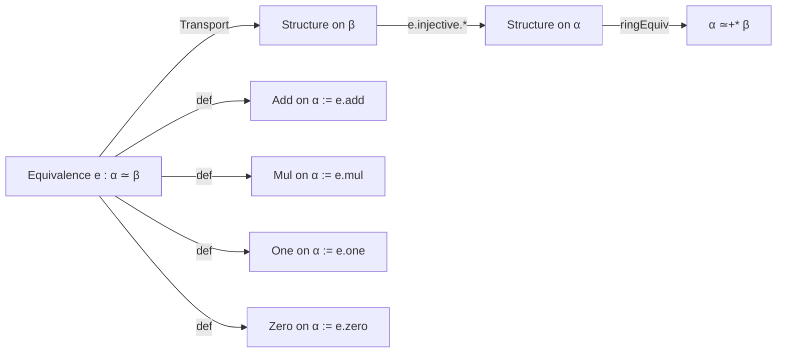

**Technical Brief: `TransferInstance.lean` (Mathlib Algebra Ring Transfer)**  
*Prepared for Domain-Specific AI Agent Training*

---

### 1. **Key Definitions & Theorems**

| Name | Type / Purpose |
|------|----------------|
| `ringEquiv (e : α ≃ β)` | `α ≃+* β` — constructs a ring equivalence from a bijection `e : α ≃ β`, transporting ring structure from `β` to `α`. |
| `ringEquiv_apply` | `ringEquiv e a = e a` — confirms the underlying function of the ring equivalence is `e`. |
| `ringEquiv_symm_apply` | `(ringEquiv e).symm b = e.symm b` — confirms the inverse of the ring equivalence is `e.symm`. |
| `Equiv.nonUnitalNonAssocSemiring` | Transports `NonUnitalNonAssocSemiring` across `e`. |
| `Equiv.nonUnitalSemiring` | Transports `NonUnitalSemiring`. |
| `Equiv.addMonoidWithOne` | Transports `AddMonoidWithOne`. |
| `Equiv.addGroupWithOne` | Transports `AddGroupWithOne`. |
| `Equiv.nonAssocSemiring` | Transports `NonAssocSemiring`. |
| `Equiv.semiring` | Transports `Semiring`. |
| `Equiv.nonUnitalCommSemiring` | Transports `NonUnitalCommSemiring`. |
| `Equiv.commSemiring` | Transports `CommSemiring`. |
| `Equiv.nonUnitalNonAssocRing` | Transports `NonUnitalNonAssocRing`. |
| `Equiv.nonUnitalRing` | Transports `NonUnitalRing`. |
| `Equiv.nonAssocRing` | Transports `NonAssocRing`. |
| `Equiv.ring` | Transports `Ring`. |
| `Equiv.nonUnitalCommRing` | Transports `NonUnitalCommRing`. |
| `Equiv.commRing` | Transports `CommRing`. |
| `Equiv.isDomain` | `IsDomain α` follows from `IsDomain β` via `e`, assuming `e.semiring` is in scope. |

All `abbrev` definitions construct algebraic structures on `α` by *transporting* along `e`, using `e.injective.*` lemmas to verify axioms via `e.apply_symm_apply _`.

---

### 2. **Naming Conventions**

- **Prefixes**:
  - `nonUnital`, `nonAssoc`, `Comm`, `Ring`, `Semiring`, `AddGroupWithOne`, etc. — mirror Lean’s algebra hierarchy.
  - `e.` — used for derived operations: `e.add`, `e.mul`, `e.one`, `e.zero`, `e.smul`, `e.pow`, `e.Neg`, `e.sub`.
- **Suffixes**:
  - `ringEquiv` — for the equivalence itself.
  - `apply` / `symm_apply` — for lemmas about the action of the equivalence or its inverse.
- **Pattern**: `Equiv.[structure]` — e.g., `Equiv.semiring`, `Equiv.commRing`.

---

### 3. **Tactic Stack**

- `intros` — repeated to introduce variables and hypotheses.
- `simp [add_def]`, `simp [mul_def]`, `simp [zero_def]`, `simp [one_def]`, `simp [add_def, one_def]` — simplification using definitions of transported operations.
- `congr_arg e.symm` — used in `intCast_negSucc` to push congruence through `e.symm`.
- `exact e.apply_symm_apply _` — core proof step: rewrites `e (e.symm x) = x` to discharge equality goals.
- `apply e.injective.*` — leverages injectivity of `e` to lift structure proofs from `β` to `α`.
- `letI := ...` — introduces local instances (e.g., `e.add`, `e.addMonoidWithOne`) for typeclass inference.

---

### 4. **Proof Logic**

- **Pattern**:  
  For each algebraic structure `S` on `β`, construct `S` on `α` by:
  1. Transporting operations via `e` (`e.add`, `e.mul`, etc.).
  2. Using `e.injective` to reduce verification of axioms to `β`.
  3. Applying `e.apply_symm_apply` (i.e., `e (e.symm x) = x`) to simplify equalities.
- **Induction / Cases**: Not used here — proofs are *algebraic*, relying on definitional simplification and injectivity.
- **Key Lemma**: `e.apply_symm_apply` is the workhorse: it ensures the transported structure satisfies axioms because `e` is bijective.

---

### 5. **Imports**

| Import | Role |
|--------|------|
| `Mathlib.Algebra.Group.TransferInstance` | Preceding pattern for groups; this file extends it to rings. |
| `Mathlib.Algebra.Ring.Equiv` | Ring equivalences (`≃+*`) and related lemmas. |
| `Mathlib.Algebra.Ring.Hom.InjSurj` | Injectivity/surjectivity lemmas for ring homs (used via `e.injective`). |
| `Mathlib.Algebra.Ring.InjSurj` | General injectivity/surjectivity tools for algebraic structures. |

---

### 6. **Mermaid Diagrams**

#### **Dependency Graph (Module-Level)**



#### **Structure Transport Overview**



#### **Proof Strategy Flow**

```mermaid
flowchart TD
  Start[Given e : α ≃ β, [β : S]] --> DefOps[Define ops on α via e]
  DefOps --> UseInjective[Apply e.injective.S]
  UseInjective --> Simplify[Use e.apply_symm_apply to simplify goals]
  Simplify --> Done[Structure S on α verified]
```

---

### 7. **Domain-Specific AI Insights**

- **Pattern Recognition**: This file exemplifies *structure transport* via equivalences — a recurring theme in Mathlib.
- **Automation Potential**: The uniform proof pattern (`letI`, `apply e.injective.*`, `simp`, `exact e.apply_symm_apply`) is highly automatable (e.g., via `aesop` or custom `transfer` tactic).
- **Extensibility**: New algebraic structures (e.g., `StarRing`, `DivisionRing`) can be added following the same template.
- **Critical Assumption**: `e` must be an `Equiv` (i.e., bijective); injectivity is essential for lifting axioms.

--- 

Let me know if you'd like the same analysis for a specific subclass (e.g., `CommRing` only) or a formal tactic sketch for automation.
