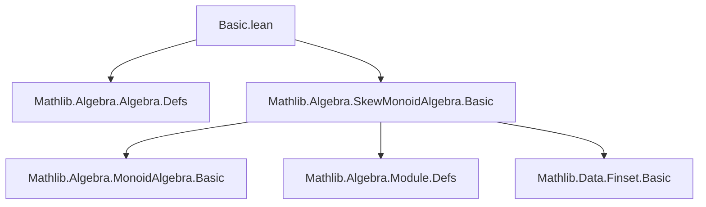

**Technical Brief: `Basic.lean` — Univariate Skew Polynomials in Lean 4**

---

### 1. **Key Definitions & Theorems**

| Name | Type / Signature | Purpose |
|------|------------------|---------|
| `SkewPolynomial R` | `Type u → [AddCommMonoid R] → Type u` | Type of univariate skew polynomials over `R`, defined as `SkewMonoidAlgebra R (Multiplicative ℕ)` |
| `φ` | `abbrev φ := MulSemiringAction.toRingHom (Multiplicative ℕ) R (ofAdd 1)` | Ring endomorphism induced by the action of `Multiplicative ℕ` on `R`; satisfies `X * a = φ(a) * X` |
| `support p` | `p : SkewPolynomial R ↦ Finset ℕ` | Finite set of exponents `n` where the coefficient of `Xⁿ` is nonzero |
| `monomial n` | `R →ₗ[R] SkewPolynomial R` | Linear embedding of coefficient `a` into the monomial `a * Xⁿ` |
| `φ_iterate_apply` | `(φ^[n] a) = (ofAdd n) • a` | Relates iteration of `φ` to the action of `Multiplicative ℕ` |
| `monomial_mul_monomial` | `monomial n r * monomial m s = monomial (n + m) (r * φ^[n] s)` | Core multiplication rule for monomials, encoding the twisted convolution |
| `instSemiring` | `[MulSemiringAction (Multiplicative ℕ) R] → Semiring (SkewPolynomial R)` | Provides ring structure on skew polynomials, contingent on `MulSemiringAction` instance |

---

### 2. **Naming Conventions**

- **Prefixes**:
  - `is_`: Not used here.
  - `inst_`: For typeclass instances (`instSemiring`, `instModule`, etc.).
  - `monomial_`, `support_`, `φ_`: For definitions/lemmas about structural components.
- **Suffixes**:
  - `_apply`: For lemmas about application of functions (e.g., `φ_iterate_apply`).
  - `_def`: For definitions (e.g., `φ_def`, `monomial_def`).
  - `_right`, `_left`: Not used here.
- **Notable pattern**: `ofAdd n` used to embed `n : ℕ` into `Multiplicative ℕ` (as `ofAdd : ℕ →ₙ* Multiplicative ℕ`).

---

### 3. **Tactic Stack**

Frequently used tactics in proofs:
- `simp` / `simp_all`: For simplifying using `@[simp]` lemmas (e.g., `support_zero`, `support_eq_empty`).
- `induction`: Used in `φ_iterate_apply` to prove iterate-action equivalence.
- `rw`: Rewriting using definitions or lemmas (e.g., `monomial_mul_monomial`).
- `exact`: To finish with a direct term (e.g., `exact SkewMonoidAlgebra.single_mul_single`).
- `simpa [support, ← Finset.map_union, Finset.map_subset_map] using …`: For set-theoretic reasoning on supports.

No heavy automation (e.g., `aesop`, `ring`, `linarith`) is used — proofs are mostly structural and rely on `SkewMonoidAlgebra` infrastructure.

---

### 4. **Proof Logic**

- **Structure**: Proofs are largely *definition-driven* and *inductive*.
- **Typical flow**:
  1. Unfold definitions (`monomial_def`, `φ_def`, `support`).
  2. Use `simp` to reduce to known lemmas (e.g., `single_zero`, `single_add`).
  3. For multiplicative properties, reduce to `SkewMonoidAlgebra.single_mul_single`.
  4. For iterated `φ`, use induction on `n` and simplify using `mul_smul`, `mul_comm`, and action properties.
- **Key logical dependency**: Associativity of multiplication in `SkewPolynomial R` requires `MulSemiringAction (Multiplicative ℕ) R`, ensuring `φ` is a ring endomorphism.

---

### 5. **Imports**

| Import | Role |
|--------|------|
| `Mathlib.Algebra.Algebra.Defs` | Provides basic algebraic structures (semirings, modules, actions) |
| `Mathlib.Algebra.SkewMonoidAlgebra.Basic` | Core infrastructure for skew monoid algebras — the underlying implementation |

No further external dependencies are imported — the file is self-contained modulo Mathlib.

---

### 6. **Dependency & Theory Overview (Mermaid Diagrams)**

#### **Module Dependency Graph**


#### **Theoretical Flow**
```mermaid
graph LR
  R[Semiring R] -->|MulSemiringAction| A[(Multiplicative ℕ) ↷ R]
  A -->|induces| φ[φ : R →+* R]
  R -->|SkewMonoidAlgebra| S[SkewPolynomial R]
  S -->|support| F[Finset ℕ]
  S -->|monomial| M[Linear embedding R → SkewPolynomial R]
  S -->|+,*| Ring[Semiring structure]
```

#### **Key Relationships**
- `SkewPolynomial R ≡ SkewMonoidAlgebra R (Multiplicative ℕ)`
- `φ` is the *twist* — the only nontrivial data needed beyond additive structure.
- Multiplication is determined by `X * a = φ(a) * X`, extended linearly.
- `φ^[n](a) = (ofAdd n) • a` links iteration to the monoid action.

---

### 7. **Notable Design Decisions**

- **Why `Multiplicative ℕ`?**  
  To use `MulSemiringAction`, which is only defined for multiplicative monoids in Mathlib. `Additive` versions are not available, so `Multiplicative ℕ` is used to model exponent monoid.

- **Why not `AddSkewMonoidAlgebra`?**  
  As noted, Mathlib lacks an additive analog of `MulSemiringAction`, so the multiplicative encoding is necessary for associativity.

- **Action requirement**:  
  `MulSemiringAction (Multiplicative ℕ) R` is *not* automatic — users must provide it (e.g., Frobenius `a ↦ a^q` for `𝔽_q`-linear skew polynomials).

---

### 8. **Future Work (from TODO)**

- Add `Algebra R (SkewPolynomial R)` instance.
- Add `ext` lemma in terms of coefficients (`coeff`).
- Generalize to *Ore extensions* with derivation `δ`: `Xa = φ(a)X + δ(a)`.

--- 

This file establishes the foundational algebraic structure of univariate skew polynomial rings using Lean’s `SkewMonoidAlgebra`, with careful attention to the interaction between ring endomorphisms and monoid actions.
