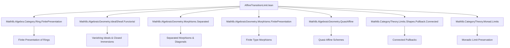
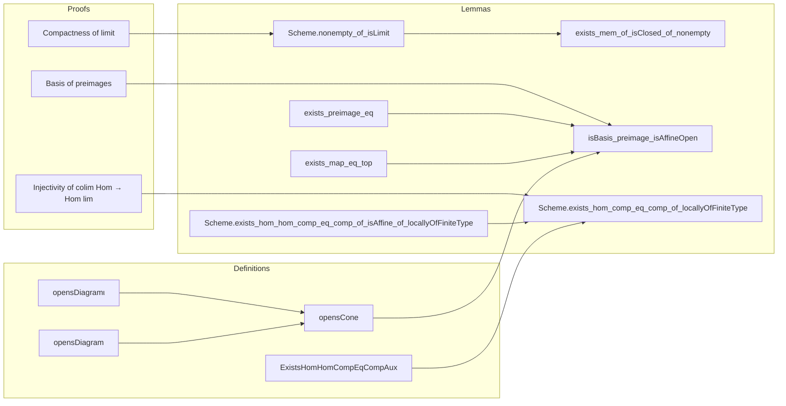

Here is the structured technical metadata extracted from `AffineTransitionLimit.lean`:

---

### **1. KEY DEFINITIONS & THEOREMS**

| Name | Type / Signature | Purpose |
|------|------------------|---------|
| `Scheme.nonempty_of_isLimit` | `lemma` | Shows the limit of a cofiltered diagram of nonempty compact quasi-compact schemes with affine transition maps is nonempty. |
| `exists_mem_of_isClosed_of_nonempty` | `lemma` | For a cofiltered diagram with affine transitions, the limit of compatible nonempty compact closed subsets is nonempty. |
| `exists_mem_of_isClosed_of_nonempty'` | `lemma` | Variant of above for closed sets indexed over morphisms into a fixed object `j`. |
| `exists_map_eq_top` | `lemma` | If an open set `U ⊆ Dⱼ` contains the full image of `lim Dᵢ → Dⱼ`, then it already contains the image of some `Dₖ → Dⱼ`. |
| `opensDiagram` | `def` | Diagram of preimages `Dⱼᵢ⁻¹ U` over `Over i`. |
| `opensDiagramι` | `def` | Natural transformation from `opensDiagram D i U` to `Over.forget ⋙ D`. |
| `opensCone` | `def` | Cone over `opensDiagram D i U` with apex `c.π.app i ⁻¹ᵁ U`. |
| `isLimitOpensCone` | `lemma` | Proves `opensCone D c i U` is a limiting cone. |
| `isBasis_preimage_isAffineOpen` | `lemma` | Preimages of affine opens under the limit map form a basis for the topology. |
| `exists_preimage_eq` | `lemma` | Every compact open in the limit is the preimage of a compact open in some stage. |
| `exists_map_preimage_le_map_preimage` | `lemma` | If preimages satisfy an inclusion, then so do some stage maps. |
| `exists_map_preimage_eq_map_preimage` | `lemma` | If preimages are equal, then some stage maps have equal preimages. |
| `isAffineHom_π_app` | `lemma` | The projection `lim Dᵢ → Dᵢ` is affine. |
| `Scheme.compactSpace_of_isLimit` | `lemma` | The limit space is compact if all stages are compact. |
| `Scheme.exists_hom_hom_comp_eq_comp_of_isAffine_of_locallyOfFiniteType` | `lemma` | Injectivity of colimit → limit Hom-map in affine case. |
| `Scheme.exists_hom_comp_eq_comp_of_locallyOfFiniteType` | `lemma` | Main result: injectivity of `colim Homₛ(Dᵢ, X) → Homₛ(lim Dᵢ, X)` for `X` locally of finite type over `S`. |
| `ExistsHomHomCompEqCompAux` | `structure` | Auxiliary structure for proving the main injectivity lemma. |
| `i'`, `hii'`, `g`, `𝒰D₀`, `𝒰D`, `D'`, `c'`, `hc'` | `def`s/`lemma`s | Components of the auxiliary construction used in the proof. |

---

### **2. NAMING CONVENTIONS**

- **Prefixes**:
  - `is_`: Properties (e.g., `isAffine`, `isClosed`, `isLimit`, `isAffineHom`)
  - `exists_`: Existence lemmas (e.g., `exists_mem_of_isClosed_of_nonempty`)
  - `opens_`: Related to open subsets and their diagrams/cones (e.g., `opensDiagram`, `opensCone`)
  - `preimage_`: Preimage-related constructions (e.g., `exists_map_preimage_eq_map_preimage`)
- **Suffixes**:
  - `_of_`: Conditions or assumptions (e.g., `nonempty_of_isLimit`, `exists_mem_of_isClosed_of_nonempty`)
  - `_app`: Component at an index (e.g., `π.app i`, `hc.app`)
  - `_hom`: Morphism-related (e.g., `isAffineHom`, `IsAffineHom`)
- **Other patterns**:
  - `ι`, `π`: Canonical morphisms (inclusion, projection)
  - `𝒰`, `𝒰S`, `𝒰X`, `𝒰D`: Open covers
  - `D'`, `c'`: Restricted diagrams/cones

---

### **3. TACTIC STACK**

Frequently used tactics:
- `simp` / `simp only` / `simp_rw`
- `rw`, `ext`, `congr`
- `obtain ⟨…⟩`, `choose`, `by_contra!`
- `refine`, `exact`, `assumption`
- `dsimp`, `convert`, `change`
- `have`, `suffices`, `wlog`
- `infer_instance`, `infer_instance'`
- `simpa`, `simp only [← …]`, `simp [-…]`
- `apply +allowSynthFailures` (for typeclass inference)
- `cases`, `induction`, `exact?` (rarely)

---

### **4. PROOF LOGIC**

**General proof strategy**:
- **Induction / cofilteredness**: Use cofilteredness to glue or refine diagrams (e.g., `IsCofiltered.cospan`, `inf_objs_exists`).
- **Reduction to affine case**: Via open covers, affine covers, and localization (e.g., `isBasis_preimage_isAffineOpen`, `exists_preimage_eq`).
- **Closed subset arguments**: Use `exists_mem_of_isClosed_of_nonempty` to extract points in intersections.
- **Limit cone manipulation**: Use `isLimitEquivIsTerminal`, `lift`, `uniq`, `fac`, and `postcompose`.
- **Sheaf / ideal sheaf techniques**: Vanishing ideals, pullbacks of closed immersions, support arguments.
- **Topological compactness**: Use `isCompact_iff_compactSpace`, `QuasiCompact.compactSpace_of_compactSpace`.
- **Category-theoretic limits**: Use `IsLimit`, `limit.isLimit`, `isLimitOfPreserves`, `Functor.whiskerLeft`, `whiskerRight`.

**Typical flow**:
1. Reduce to a simpler diagram (e.g., over `Over j`, or via open cover).
2. Construct auxiliary cones/diagrams (e.g., `opensCone`, `D'`, `𝒰D`).
3. Prove auxiliary cone is limiting (e.g., `isLimitOpensCone`, `hc'`).
4. Apply known lemmas (e.g., `Scheme.nonempty_of_isLimit`, `exists_mem_of_isClosed_of_nonempty'`).
5. Use algebraic geometry facts (e.g., `isAffine_of_isAffineHom`, `Spec.map_surjective`).
6. Conclude via `le_antisymm`, `exists_intro`, or `simpa`.

---

### **5. IMPORTS**

| Module | Purpose |
|--------|---------|
| `Mathlib.Algebra.Category.Ring.FinitePresentation` | Finite presentation of rings, used for finite type assumptions. |
| `Mathlib.AlgebraicGeometry.IdealSheaf.Functorial` | Vanishing ideals, closed subschemes, ideal sheaves. |
| `Mathlib.AlgebraicGeometry.Morphisms.Separated` | Separated morphisms, diagonal morphisms. |
| `Mathlib.AlgebraicGeometry.Morphisms.FinitePresentation` | Finite type, finite presentation of morphisms. |
| `Mathlib.AlgebraicGeometry.QuasiAffine` | Quasi-affine schemes, open immersions. |
| `Mathlib.CategoryTheory.Limits.Shapes.Pullback.Connected` | Connectedness of pullback diagrams. |
| `Mathlib.CategoryTheory.Monad.Limits` | Monadicity and limit preservation (used for `Scheme.Spec`). |

---

### **6. MERMAID DIAGRAMS**

#### **Dependency Graph (High-Level)**

#### **Overview of File Structure**

---

Let me know if you'd like a formalized dependency graph in `lean4` or a more detailed breakdown of the `ExistsHomHomCompEqCompAux` structure.
