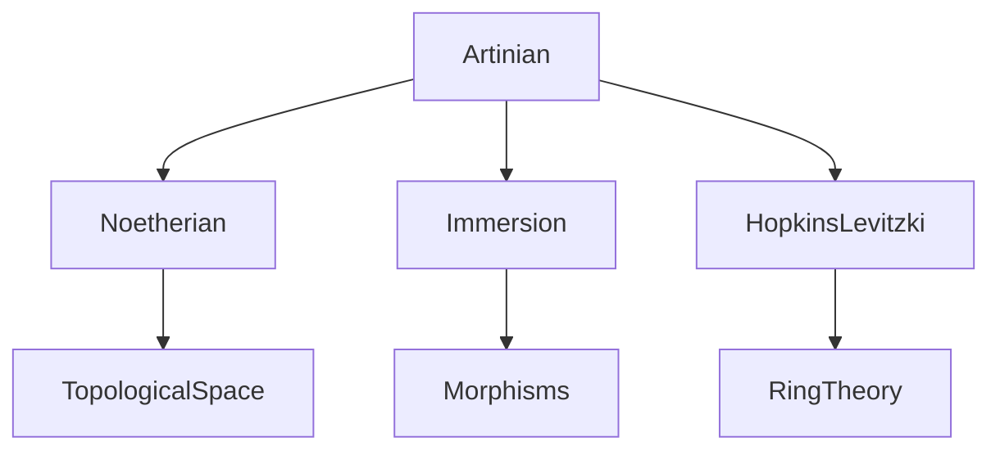
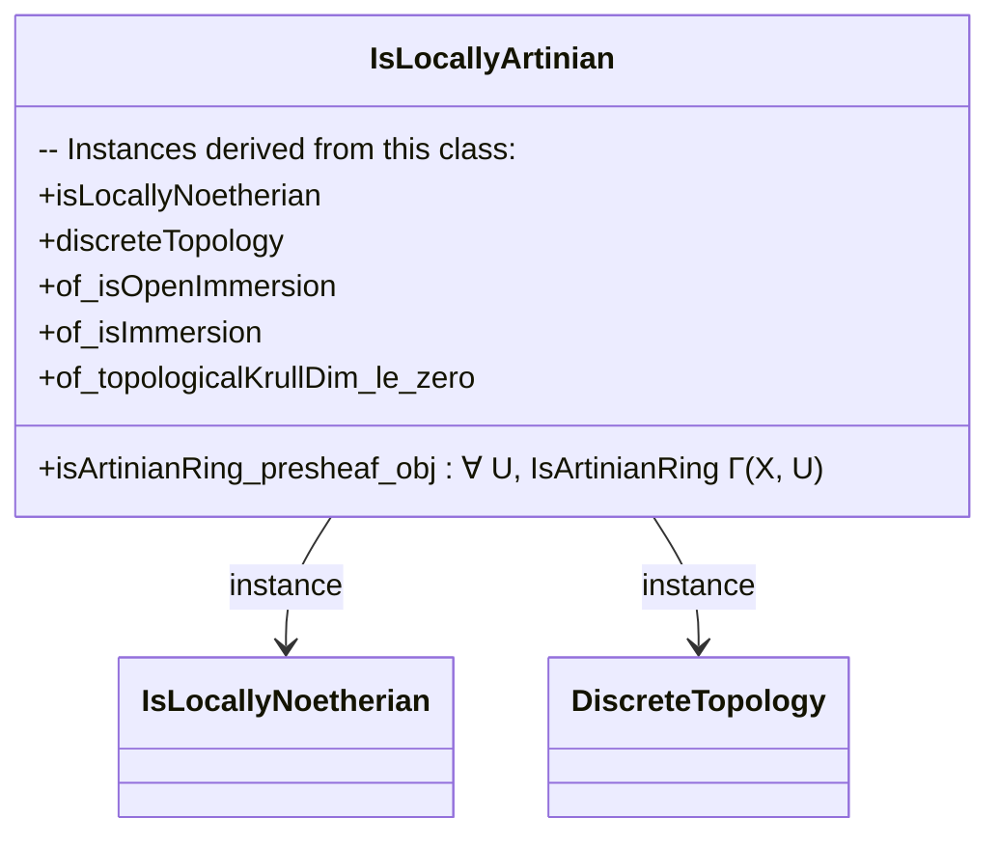

Here is a structured technical brief based on the provided `Artinian.lean` file:

---

### **1. Key Definitions & Theorems**

| Name | Type | Purpose |
|------|------|---------|
| `IsLocallyArtinian X` | `Scheme → Prop` | A scheme `X` is *locally Artinian* if for every open affine `U`, the ring of sections `Γ(X, U)` is Artinian. |
| `IsArtinianScheme X` | `Scheme → Prop` | A scheme `X` is *Artinian* if it is locally Artinian and quasi-compact (i.e., compact in the topological sense). |
| `IsLocallyArtinian.of_topologicalKrullDim_le_zero` | `topologicalKrullDim X ≤ 0 → IsLocallyArtinian X` | Characterizes locally Artinian schemes via Krull dimension ≤ 0 (under local Noetherian hypothesis). |
| `IsLocallyArtinian.iff_isLocallyNoetherian_and_discreteTopology` | `IsLocallyArtinian X ↔ IsLocallyNoetherian X ∧ DiscreteTopology X` | Main structural equivalence: locally Artinian ⇔ locally Noetherian + discrete topology. |
| `IsArtinianScheme.iff_isNoetherian_and_discreteTopology` | `IsArtinianScheme X ↔ IsNoetherian X ∧ DiscreteTopology X` | Characterization of Artinian schemes: Noetherian + discrete topology. |
| `Scheme.isLocallyArtinianScheme_Spec` | `IsLocallyArtinian (Spec R) ↔ IsArtinianRing R` | Relates ring-theoretic Artinian property to scheme-theoretic one for affine schemes. |
| `Scheme.isArtinianScheme_Spec` | `IsArtinianScheme (Spec R) ↔ IsArtinianRing R` | Same as above, but for *Artinian schemes* (uses quasi-compactness of `Spec R`). |
| `IsArtinianScheme.finite` | `Finite X` | Any Artinian scheme has a finite underlying topological space. |

---

### **2. Naming Conventions**

- **Prefixes**:
  - `is_..._Ring`: e.g., `IsArtinianRing`, `IsNoetherianRing`, `IsLocallyNoetherian`.
  - `is_..._Scheme`: e.g., `IsArtinianScheme`, `IsLocallyArtinian`.
  - `..._of_...`: e.g., `of_isOpenImmersion`, `of_isImmersion`, `of_topologicalKrullDim_le_zero`.
- **Suffixes**:
  - `_iff_...`: for biconditional theorems (e.g., `iff_isLocallyNoetherian_and_discreteTopology`).
  - `_presheaf_obj`: for components of the class definition (e.g., `isArtinianRing_presheaf_obj`).
- **Class names**: `Is...` (e.g., `IsLocallyArtinian`, `IsArtinianScheme`).

---

### **3. Tactic Stack**

Frequently used tactics in proofs:
- `aesop`: for automated reasoning with simp sets and intro/apply chains.
- `rw`: rewriting using equivalences and equalities.
- `simp`: simplification using definitional equalities and lemmas.
- `exact`, `apply`, `intro`, `cases`: standard proof construction.
- `change`, `convert`: for adjusting goals to match known lemmas.
- `inferInstance`: to synthesize typeclass instances.
- `discreteTopology_iff_isOpen_singleton.mpr`: specialized tactic for discrete topology proofs.

---

### **4. Proof Logic**

- **Induction/Case Analysis**: Not used directly; instead, proofs rely on:
  - **Topological characterizations** (e.g., Krull dimension, discreteness).
  - **Scheme-theoretic properties** (e.g., existence of affine opens, immersions).
  - **Transfer along isomorphisms** (e.g., `ΓSpecIso`, `isoSpec`).
- **Typical flow**:
  1. Reduce to affine case using open covers or affine opens.
  2. Apply known ring-theoretic equivalences (e.g., `isArtinianRing_iff_krullDimLE_zero`).
  3. Use topological facts (e.g., `topologicalKrullDim_zero_of_discreteTopology`).
  4. Conclude via equivalence theorems (`iff_isLocallyNoetherian_and_discreteTopology`).

---

### **5. Imports**

| Module | Purpose |
|--------|---------|
| `Mathlib.AlgebraicGeometry.Noetherian` | Defines Noetherian schemes and rings; used for `IsNoetherian`, `IsLocallyNoetherian`. |
| `Mathlib.AlgebraicGeometry.Morphisms.Immersion` | Provides `IsImmersion`, `IsOpenImmersion`, and their properties (e.g., `isEmbedding.discreteTopology`). |
| `Mathlib.RingTheory.HopkinsLevitzki` | Contains `isArtinianRing_iff_krullDimLE_zero`, linking Artinian rings and Krull dimension. |

---

### **6. Mermaid Diagrams**

#### **Dependency Graph (Module Level)**



#### **Overview of Theory Flow**

```mermaid
flowchart LR
  A[Ring R] -->|Spec| B[Scheme Spec R]
  B -->|IsLocallyArtinian| C[Γ(Spec R, U) Artinian ∀U]
  C -->|Affine case| D[IsArtinianRing R]
  B -->|IsArtinianScheme| E[Locally Artinian + Quasi-compact]
  E -->|Topological| F[DiscreteTopology + Noetherian]
  F -->|Finite| G[Finite underlying space]
```

#### **Structure of `IsLocallyArtinian` Class**



---

### **7. Notes & Future Work**

- **TODO**: Prove that *all* Artinian schemes are affine (currently only `Spec R` is known to be Artinian iff `R` is Artinian).
- **Generalization hint**: The proof of `of_isImmersion` suggests extension to *locally quasi-finite* morphisms.

--- 

Let me know if you'd like a formalized dependency graph in `lean4` or a proof outline for a specific theorem.
