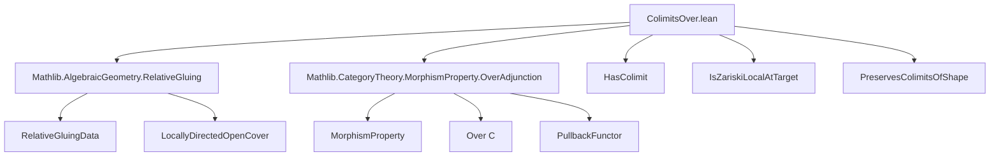

### Technical Brief: `ColimitsOver.lean`

---

#### **1. Key Definitions & Theorems**

| Name | Type / Signature | Purpose |
|------|------------------|---------|
| `ColimitGluingData` | `structure` | Encapsulates a compatible family of colimiting cocones over the pullbacks `Dᵢ : J ⥤ P.Over ⊤ (𝒰.X i)` and ensures compatibility via `P(𝒰.trans hij)`. |
| `ColimitGluingData.trans` | `natural transformation` | Auxiliary map encoding the transition between pullbacks along `𝒰.trans hij`. |
| `ColimitGluingData.transitionCocone` | `Cocone` | Cocone induced on the composite diagram via precomposition. |
| `ColimitGluingData.transitionMap` | `morphism` | Mediates between colimit objects `(d.cocone i).pt` and `(d.cocone j).pt` using universal property and preservation of colimits. |
| `ColimitGluingData.functor` | `𝒰.I₀ ⥤ Scheme` | Underlying diagram for relative gluing: sends `i ↦ (d.cocone i).pt.left`. |
| `ColimitGluingData.isPullback` | `IsPullback` | Shows that transition maps form pullbacks — key for gluing. |
| `ColimitGluingData.relativeGluingData` | `𝒰.RelativeGluingData` | Constructs a relative gluing datum from the family of colimits. |
| `ColimitGluingData.glued` | `P.Over ⊤ S` | The glued object over `S`, constructed via relative gluing. |
| `ColimitGluingData.pullbackGluedIso` | `iso` | Shows that pulling back `d.glued` along `𝒰.f i` recovers the original colimit object `(d.cocone i).pt`. |
| `ColimitGluingData.gluedCocone` | `Cocone D` | The global cocone over `D`, built by gluing local cocones using locally directed open covers. |
| `ColimitGluingData.isColimitGluedCocone` | `IsColimit` | Proves that the glued cocone is colimiting — main theorem. |
| `hasColimit_of_locallyDirected` | `lemma` | Main existence result: under assumptions (locality, stability, preservation), colimits in `P.Over ⊤ S` reduce to affine case. |

---

#### **2. Naming Conventions**

- **Prefixes:**
  - `isColimit_`: asserts colimiting property.
  - `transition_`: transition maps/cocones between local data.
  - `pullback_`: constructions involving pullbacks.
  - `glued_`: global glued object or cocone.
  - `prop_trans`: property `P` holds for transition maps.

- **Suffixes:**
  - `_data`: structure holding intermediate data.
  - `_iso`: isomorphism.
  - `_cocone`: cocone construction.
  - `_map`: morphism (often transition or desc).
  - `_natTrans`: natural transformation.

- **Other patterns:**
  - `functor`, `natTrans`, `equifibered`: components of `RelativeGluingData`.
  - `ι.app`, `pt`, `left`, `hom`: standard `Over`/`Comma` notation.

---

#### **3. Tactic Stack**

Frequent tactics used in proofs:

| Tactic | Usage |
|--------|-------|
| `simp` / `simp only` | Simplification of diagrams, naturality, universal properties. |
| `ext` | Extensionality for morphisms (especially in `Scheme`, `Pullback`, `Over`). |
| `apply ...hom_ext` | Proving equality of morphisms via universal properties (e.g., colimits, pullbacks). |
| `congr` | Congruence for equality of composite morphisms. |
| `rw [assoc]`, `reassoc_of%`, `← assoc` | Reassociating compositions. |
| `apply (isColimit ...).hom_ext` | Uniqueness in colimit universal property. |
| `simp [*, assoc]` | Aggressive simplification with associativity. |
| `apply pullback.hom_ext` | Proving equality in pullback objects. |
| `convert`, `congr 1` | Matching up diagrams with extra structure. |
| `have : ... := by ...; rw [this]` | Intermediate lemmas for rewriting. |

---

#### **4. Proof Logic**

The logical flow follows a **gluing strategy**:

1. **Local Setup**: Assume for each `i : 𝒰.I₀`, the diagram `Dᵢ = D ⋙ pullback P ⊤ (𝒰.f i)` has a colimit.
2. **Compatibility Data**: Use `P`-stability under base change (`prop_trans`) to define transition maps between colimits.
3. **Pullback Condition**: Show these transitions form pullbacks (`isPullback`) — crucial for descent.
4. **Relative Gluing**: Assemble into a `RelativeGluingData`, then glue to get `glued : P.Over ⊤ S`.
5. **Global Cocone**: Construct `gluedCocone` over `D` using locally directedness of `𝒰`.
6. **Colimit Verification**:
   - **Existence (`desc`)**: Define candidate cocone morphism via local universal properties and glue.
   - **Factorization (`fac`)**: Show factorization via local uniqueness.
   - **Uniqueness (`uniq`)**: Reduce to local uniqueness using cover.

The core idea: **descent of colimits along Zariski covers**, using:
- `IsZariskiLocalAtTarget P` (locality of `P`)
- Preservation of colimits by pullback along transitions
- Thinness & smallness of indexing category `𝒰.I₀`

---

#### **5. Imports**

| Import | Role |
|--------|------|
| `Mathlib.AlgebraicGeometry.RelativeGluing` | Provides `RelativeGluingData`, `glueMorphismsOverOfLocallyDirected`, descent machinery. |
| `Mathlib.CategoryTheory.MorphismProperty.OverAdjunction` | Defines `P.Over`, pullback functors, and adjunctions for morphism properties. |

---

#### **6. Dependency & Theory Overview**

##### **Mermaid Diagram: Theory Dependencies**



##### **Mermaid Diagram: File Overview**

```mermaid
flowchart LR
  subgraph Setup
    D[D : J ⥤ P.Over ⊤ S]
    U[𝒰 : S.OpenCover]
    H1[H : ∀ hij, P(𝒰.trans hij)]
    H2[PreservesColimits]
    H3[HasColimit locally]
  end

  subgraph Construction
    G[ColimitGluingData]
    F[functor : 𝒰.I₀ ⥤ Scheme]
    R[relativeGluingData]
    Glued[glued : P.Over ⊤ S]
  end

  subgraph Verification
    GC[gluedCocone : Cocone D]
    ICI[isColimitGluedCocone]
    HC[hasColimit_of_locallyDirected]
  end

  Setup --> Construction
  Construction --> Verification
  Verification --> HC
```

##### **Theoretical Role**

This file implements a **descent principle for colimits** in the category `P.Over ⊤ S`, where `P` is a morphism property (e.g., étale, smooth, open immersion). It allows reducing existence of colimits over a general base `S` to the affine case — a standard technique in algebraic geometry.

It is foundational for constructing moduli objects, relative colimits, and descent of structured morphisms.

--- 

Let me know if you'd like a formalized summary in Lean or a diagram of the key universal property squares.
