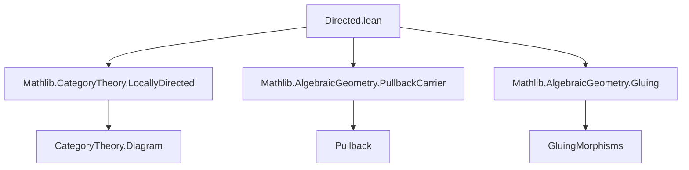
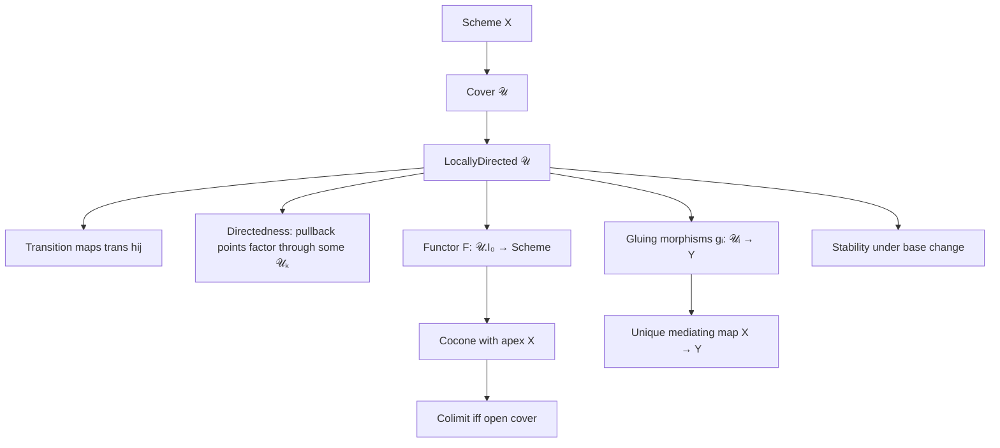

### Technical Brief: `Directed.lean` — Locally Directed Covers in Algebraic Geometry

---

#### **1. Key Definitions & Theorems**

| Name | Type / Signature | Purpose |
|------|------------------|---------|
| `LocallyDirected` | `class` | Defines a *directed cover* with transition maps and a “directedness” condition on pullbacks: every point in a fiber product $\mathcal{U}_i \times_X \mathcal{U}_j$ factors through some $\mathcal{U}_k$ with $k \le i, j$. |
| `trans` | `𝒰.trans {i j} hij : 𝒰.X i ⟶ 𝒰.X j` | Transition morphism for $i \le j$; part of the directed structure. |
| `intersectionOfLocallyDirected` | `𝒰.intersectionOfLocallyDirected i j : (𝒰.f i ×[X] 𝒰.f j).Cover` | Constructs a cover of the pullback $\mathcal{U}_i \times_X \mathcal{U}_j$ by subobjects $\mathcal{U}_k$ with $k \le i,j$. |
| `functorOfLocallyDirected` | `𝒰.functorOfLocallyDirected : 𝒰.I₀ ⥤ Scheme` | The diagram (functor) induced by the cover: objects map to $\mathcal{U}_i$, morphisms to transition maps. |
| `coconeOfLocallyDirected` | `𝒰.coconeOfLocallyDirected : Cocone 𝒰.functorOfLocallyDirected` | Canonical cocone with apex $X$ and legs $\mathcal{U}_i \to X$. |
| `glueMorphismsOfLocallyDirected` | `(∀ i, 𝒰.X i ⟶ Y) → (∀ hij, trans hij ≫ g j = g i) → X ⟶ Y` | Glues compatible morphisms from the cover to $Y$, using directedness. |
| `isColimitCoconeOfLocallyDirected` | `IsColimit 𝒰.coconeOfLocallyDirected` | If $\mathcal{U}$ is a *directed open cover*, then $X$ is the colimit of the diagram $\mathcal{U}_i$. |
| `directedAffineCover` | `X.directedAffineCover : X.OpenCover` | The cover of all affine opens of $X$, naturally directed by inclusion of images. |
| `locallyDirectedPullbackCover` | `Cover.LocallyDirected (𝒰.pullback₁ f)` | Stability of locally directed covers under base change. |

---

#### **2. Naming Conventions**

- **Prefixes**:
  - `trans_`: transition maps (e.g., `trans_id`, `trans_comp`, `trans_map`)
  - `directed_`: properties related to the directedness condition (e.g., `directed`)
  - `glueMorphismsOfLocallyDirected`: gluing along directed covers
  - `ofIsBasisOpensRange`: construction from a basis condition
- **Suffixes**:
  - `_homBase`: natural transformation to base scheme
  - `_cocone`: cocone constructions
  - `_ofLocallyDirected`: constructions derived from the locally directed assumption
- **Category-theoretic**:
  - `functorOfLocallyDirected`, `intersectionOfLocallyDirected`: noun phrases naming constructions
  - `isColimitCoconeOfLocallyDirected`: predicate + object

---

#### **3. Tactic Stack**

| Tactic | Usage |
|--------|-------|
| `by cat_disch` | Used in class axioms to discharge categorical diagram commutativity (e.g., `trans_id`, `trans_comp`). |
| `simp` / `simp only` | Dominant tactic for simplifying pullback diagrams, naturality, and hom-sets. |
| `rw`, `apply`, `exact` | Standard rewriting and proof steps, especially for equality chaining. |
| `obtain ⟨…⟩ := …` | Extracting witnesses from existential quantifiers (e.g., from `directed`). |
| `apply pullback.hom_ext` | Proving equality of pullback morphisms by checking projections. |
| `convert`, `apply_fun`, `congr` | Used in isomorphism manipulations and base-change arguments. |
| `aesop` (not present) | Not used — proofs are mostly manual or `simp`-driven. |
| `ring` (not present) | Not needed — no arithmetic simplifications. |

---

#### **4. Proof Logic**

- **Induction**: Not used — proofs are mostly *constructive* and *existential*.
- **Core pattern**:
  1. **Existential witness extraction** from `directed` or `isBasis` assumptions.
  2. **Pullback factorization**: Use `pullback.lift`, `pullback.snd`, `pullback.fst`, and isomorphisms (`pullbackAssoc`, `pullbackRightPullbackFstIso`, etc.) to reorganize diagrams.
  3. **Naturality & compatibility**: Show that transition maps commute with structure maps (`𝒰.trans hij ≫ 𝒰.f j = 𝒰.f i`) using `trans_map`.
  4. **Gluing**: Use `hom_ext` (extensionality for morphisms of schemes) to reduce to checking on a cover.
  5. **Colimit verification**: Show universal property via `desc` (gluing) and `uniq` (uniqueness via `hom_ext`).

- **Base change stability**:
  - Uses isomorphisms between different pullback configurations (`pullbackAssoc`, `pullback.congrHom`, `pullbackLeftPullbackSndIso`) to reduce to the original cover’s `directed` property.

---

#### **5. Imports & Dependencies**

| Module | Role |
|--------|------|
| `Mathlib.CategoryTheory.LocallyDirected` | General theory of locally directed diagrams in categories. |
| `Mathlib.AlgebraicGeometry.PullbackCarrier` | Pullback constructions in `Scheme`, especially carrier-level existence lemmas (`Scheme.Pullback.exists_preimage_pullback`). |
| `Mathlib.AlgebraicGeometry.Gluing` | General gluing lemmas for morphisms along covers (`glueMorphisms`, `hom_ext`). |

---

#### **6. Mermaid Diagrams**

##### **Dependency Graph (Module Level)**



##### **Conceptual Overview of `Directed.lean`**



##### **Diagram of `directedAffineCover`**

```mermaid
graph LR
  A[X] -->|𝒰 = affine opens| B[𝒰.I₀ = X.affineOpens]
  B -->|U ≤ V iff im(U) ⊆ im(V)| C[Preorder]
  C --> D[trans = lift of opens]
  D --> E[LocallyDirected]
  E --> F[colimit = X]
```

---

#### **7. Summary**

This file formalizes the theory of *locally directed covers* in algebraic geometry, enabling effective gluing and colimit arguments. Key contributions:
- A categorical abstraction of “directedness” for covers, ensuring pullbacks are covered by subdiagrams.
- Construction of canonical diagrams and cocones.
- Practical tools for gluing morphisms and proving colimit properties.
- Verification that natural covers (e.g., all affine opens) are locally directed.

The formalization is heavily diagrammatic, relying on pullback calculus and categorical extensionality, with minimal automation beyond `simp`. It sets the stage for powerful descent and sheaf-theoretic arguments in `Scheme`.
