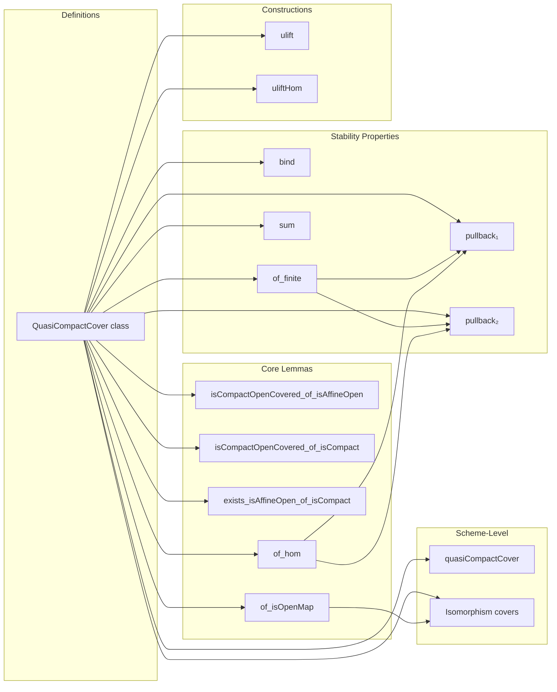

Here is the structured technical brief extracted from `QuasiCompact.lean`:

---

### **1. Key Definitions & Theorems**

| Name | Type / Signature | Purpose |
|------|------------------|---------|
| `QuasiCompactCover` | `class QuasiCompactCover (𝒰 : PreZeroHypercover.{v} S) : Prop` | Defines when a pre-zero-hypercover `𝒰` of a scheme `S` is *quasi-compact*: every affine open $U \subseteq S$ is covered by finitely many images of quasi-compact opens from the cover components. |
| `isCompactOpenCovered_of_isAffineOpen` | `lemma` | Instantiates the definition: for affine $U$, $𝒰$ finitely covers $U$. |
| `isCompactOpenCovered_of_isCompact` | `lemma` | Extends coverage to *any* compact open $U$, not just affine. |
| `exists_isAffineOpen_of_isCompact` | `lemma` | Gives an explicit finite affine refinement of a compact open $U$ under a quasi-compact cover. |
| `of_isOpenMap` | `lemma` | If all component maps of `𝒰` are open (e.g., étale, Zariski, fppf), then `𝒰` is quasi-compact. |
| `of_hom` | `lemma` | Quasi-compactness descends along cover morphisms (refinements). |
| `pullback₁`, `pullback₂` instances | `instance` | Pullbacks of quasi-compact covers remain quasi-compact. |
| `bind` instance | `instance` | Bind (i.e., iterated pullback/composition) of quasi-compact covers is quasi-compact. |
| `of_finite` | `instance` | Finite covers with quasi-compact component maps are quasi-compact. |
| `homCover`, `singleton` | `instance` | Covers induced by a single quasi-compact surjection (e.g., affine cover) are quasi-compact. |
| `Scheme.coverOfIsIso` instance | `instance` | Isomorphism-induced covers are quasi-compact (via `of_isOpenMap`). |
| `ulift` | `noncomputable def` | Lifts a quasi-compact cover from a higher universe to the base universe, preserving quasi-compactness. |
| `uliftHom` | `noncomputable def` | The refinement morphism from the lifted cover to the original. |
| `quasiCompactCover` | `def` | Object property on `PreZeroHypercover S` given by `QuasiCompactCover`. |

---

### **2. Naming Conventions**

- **Prefixes**:
  - `isCompactOpenCovered_of_…`: Lemmas constructing `IsCompactOpenCovered` from structural properties.
  - `of_…`: Lemmas showing quasi-compactness follows from a condition (e.g., `of_isOpenMap`, `of_hom`, `of_finite`).
  - `ulift`: Universe-lifting constructions.
- **Suffixes**:
  - `_of_isAffineOpen`, `_of_isCompact`: Specializations to affine or compact opens.
  - `_iff`: Equivalence lemmas (e.g., `quasiCompactCover_iff`).
- **Variable naming**:
  - `𝒰`, `𝒱`: Covers/hypercovers.
  - `U`, `U'`: Opens (often affine or compact).
  - `f`, `g`, `h`: Morphisms.
  - `i`, `j`, `k`, `s`, `t`: Indexing elements (often `Fin n` or `Σ`-types).
  - `V`, `W`: Opens in total spaces of components.

---

### **3. Tactic Stack**

Frequently used tactics in proofs:

| Tactic | Role |
|--------|------|
| `aesop` | Automated reasoning for set-theoretic and categorical identities. |
| `simp_rw` | Simplification with rewrite rules (especially for set operations and pullbacks). |
| `obtain` / `cases` / `choose` | Existential elimination and construction. |
| `refine` / `exact` | Proof construction with holes filled later. |
| `simpa` | Simplify and discharge goals using assumptions. |
| `subset_antisymm` | Prove equality of sets via double inclusion. |
| `rw [← …]` | Rewriting using categorical/functional inverses (e.g., pullback diagrams). |
| `infer_instance` | Solve typeclass goals automatically. |
| `wlog` | Without loss of generality (used in pullback proof). |
| `ring` / `linarith` | Not present — algebraic simplifications handled via `simp`/`aesop`. |

---

### **4. Proof Logic**

- **Inductive structure**: Most proofs follow a pattern:
  1. Reduce to affine opens (via basis of affine opens).
  2. Use compactness to extract finite subcovers.
  3. Construct finite families of opens in the cover components.
  4. Verify covering condition via set-theoretic equalities (often using `Set.mem_iUnion`, `Set.image_iUnion`, etc.).
- **Common proof patterns**:
  - **Pullback stability**: Use universal property of pullbacks (`Scheme.Pullback.exists_preimage_pullback`) and continuity.
  - **Refinement descent**: Use `of_hom` with a morphism of hypercovers.
  - **Bind/fibration**: Use sigma-type indexing and finiteness lemmas (`of_finite`, `of_finite_of_isSpectralMap`).
  - **Universe lifting**: Use `restrictIndex` + finite choice via `exists_isAffineOpen_of_isCompact`.

---

### **5. Imports**

| Module | Purpose |
|--------|---------|
| `Mathlib.AlgebraicGeometry.Morphisms.Affine` | Affine morphisms, `IsAffineOpen`, `fromSpec`, etc. |
| `Mathlib.AlgebraicGeometry.Properties` | General scheme properties (e.g., `isBasis_affineOpens`, `isCompact`). |
| `Mathlib.AlgebraicGeometry.PullbackCarrier` | Pullbacks of schemes, morphisms, and their universal properties. |
| `Mathlib.Topology.Sets.CompactOpenCovered` | `IsCompactOpenCovered` — the core notion of finite covering by compact opens. |

---

### **6. Mermaid Diagrams**

#### **Dependency Graph (Core Concepts)**

```mermaid
graph TD
  A[Scheme S] --> B[PreZeroHypercover 𝒰]
  B --> C[QuasiCompactCover 𝒰]
  C --> D[IsCompactOpenCovered (𝒰.f ·) U]
  D --> E[IsAffineOpen U]
  D --> F[IsCompact U]
  C --> G[Pullback stability]
  C --> H[Refinement descent]
  C --> I[Bind/fibration stability]
  C --> J[Finite cover stability]
  J --> K[QuasiCompact component maps]
  K --> L[IsOpenMap ⇒ QuasiCompactCover]
```

#### **Overview of File Structure**



---

### **7. Theory Context**

- **Purpose**: Formalizes *quasi-compactness* of covers in the context of the **fpqc topology** (faithfully flat, quasi-compact, locally of finite presentation).
- **Role in larger theory**:
  - `QuasiCompactCover` is the object property underlying the **fpqc site**.
  - Used to define **fpqc descent** (not in this file, but implied by stability properties).
  - Interacts with:
    - `IsOpenMap` (e.g., étale, Zariski covers are quasi-compact).
    - `QuasiCompact` morphism property (via `of_finite`).
    - `IsAffineOpen` basis (via `exists_isAffineOpen_of_isCompact`).
- **Universe handling**: Explicit universe polymorphism (`w' w u v`) and `ulift` construction ensure compatibility across universes.

--- 

Let me know if you'd like a formalized dependency graph in `lean4` syntax or a visualization of the `ulift` construction.
