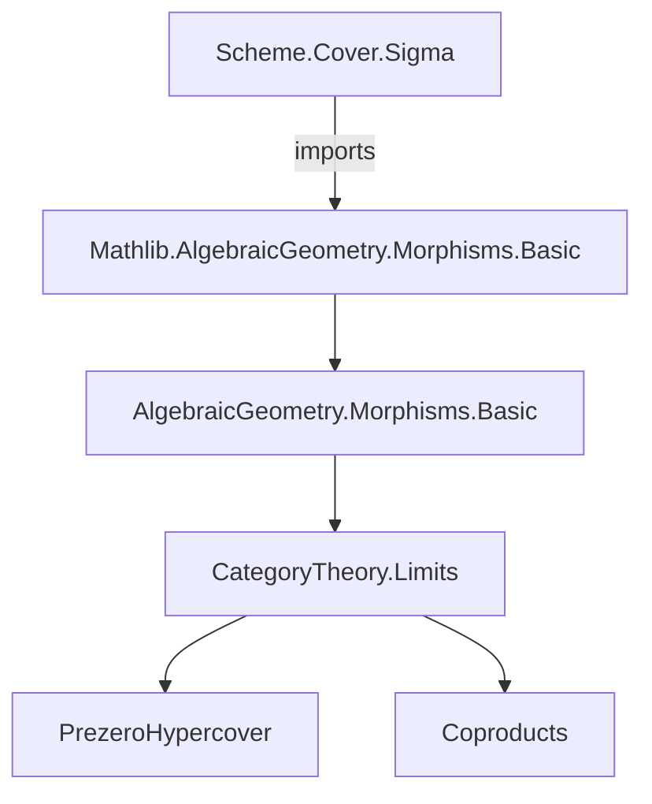
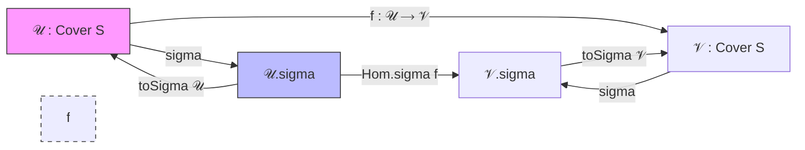
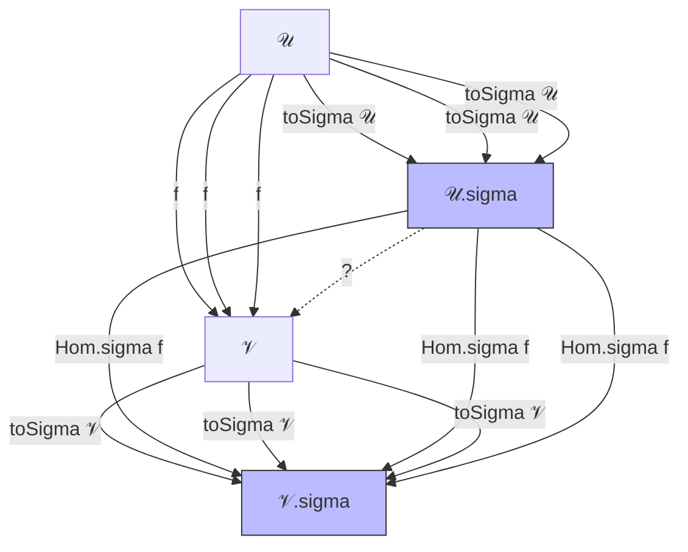

**Technical Brief: `Sigma.lean` — Collapsing Covers in `Scheme.Cover`**

---

### 1. **Key Definitions & Theorems**

| Name | Type / Signature | Purpose |
|------|------------------|---------|
| `sigma` | `𝒰 : Cover (precoverage P) S → Cover (precoverage P) S` | Constructs a *single-object cover* from a cover `𝒰`, using the disjoint union $\coprod \mathcal{U}.X$ as the covering object. |
| `toSigma` | `𝒰 ⟶ 𝒰.sigma` | The *refinement map* from a cover to its collapsed (sigma) version; encodes the universal property of the coproduct. |
| `Hom.sigma` | `(f : 𝒰 ⟶ 𝒱) → 𝒰.sigma ⟶ 𝒱.sigma` | Functorial action on morphisms of covers: lifts a refinement `f` to the collapsed covers via universal property of coproducts. |
| `sigmaFunctor` | `S.Cover (precoverage P) ⥤ S.Cover (precoverage P)` | The *endofunctor* on the category of covers that maps each cover to its sigma version and morphisms via `Hom.sigma`. Proven functorial (`map_id`, `map_comp`). |

All definitions are marked `@[simps]`, indicating they are designed for easy projection/simplification.

---

### 2. **Naming Conventions**

- **Prefixes**:
  - `sigma_`: for constructions related to the collapsing functor.
  - `toSigma`: for canonical maps *into* the sigma cover.
  - `Hom.sigma`: for induced maps on morphism spaces.
- **Suffixes**:
  - `_I₀`, `_X`, `_f`: standard for cover components (index type, object, structure map).
  - `_desc`: used for universal property applications (`Sigma.desc`, `IsZariskiLocalAtSource.sigmaDesc`).
- **Notable patterns**:
  - `𝒰.sigma` (not `sigma 𝒰`) in some places (e.g., `𝒰.sigma.I₀`) — suggests `sigma` is also used as a *structure extension* (though defined as a function).
  - `default` used universally for the unique index in `PUnit`.

---

### 3. **Tactic Stack**

Frequent tactics used in proofs/definitions:

| Tactic | Role |
|--------|------|
| `simp` / `simp only` | Simplify using `@[simps]`, `sigma` definitions, and `PUnit` uniqueness. |
| `ext` | Extensionality for morphisms in `Scheme`/`Cover` (e.g., `Sigma.hom_ext`). |
| `obtain ⟨i, y, rfl⟩ := ...` | Case analysis on existential quantifiers (e.g., `𝒰.exists_eq`). |
| `refine ⟨..., ...⟩` | Construct terms via universal properties (coproducts, presieves). |
| `rw [presieve₀_mem_precoverage_iff]` | Rewriting using characterization of presieve membership. |
| `aesop` (not present here) — *absent*, but `simp` + `ext` suffice. |

No heavy automation (`aesop`, `tauto`, `interval_cases`) — proofs are mostly structural and rely on categorical universal properties.

---

### 4. **Proof Logic**

- **Structure of proofs**:
  1. **Define object**: `sigma` uses `refine ⟨..., fun _ ↦ ...⟩` to construct a cover via `presieve₀_mem_precoverage_iff`.
  2. **Verify membership**: Use `IsZariskiLocalAtSource.sigmaDesc` to ensure the structure map lands in the precoverage.
  3. **Morphism definitions**: Use `Sigma.ι` (coproduct injections) and `Sigma.desc` (universal property) to define maps.
  4. **Functor laws**: Proven by `ext` + `simp`, leveraging uniqueness of maps into/from coproducts and `PUnit`’s uniqueness.

- **Induction**: Not used — all arguments are *categorical* and *universal property*-based.

- **Key logical flow**:
  > *Given a cover `𝒰`, construct its coproduct cover `𝒰.sigma`. Show that the canonical map `toSigma` exists. Show that any refinement `𝒰 → 𝒱` induces `𝒰.sigma → 𝒱.sigma`. Conclude that `sigma` extends to a functor.*

---

### 5. **Imports & Dependencies**

| Import | Role |
|--------|------|
| `Mathlib.AlgebraicGeometry.Morphisms.Basic` | Provides `MorphismProperty`, `IsZariskiLocalAtSource`, `precoverage`, `Cover`, etc. |
| `CategoryTheory.Limits` (via `open`) | Provides `∐` (coproduct), `Sigma.desc`, `Sigma.ι`, `hom_ext`, etc. |
| `Scheme` (universe-polymorphic) | Base category for objects. |
| `PUnit` (implicit) | Used for singleton index type in `I₀`. |

**Assumptions on `P`** (critical for correctness):
- `[IsZariskiLocalAtSource P]`: ensures stability under base change and allows `sigmaDesc`.
- `[UnivLE.{v, u}]`: universe level control.
- `[P.IsStableUnderBaseChange]`: needed for `presieve₀_mem_precoverage_iff`.
- `[IsJointlySurjectivePreserving P]`: ensures the coproduct cover remains jointly surjective.
- `[P.IsMultiplicative]`: used in later lemmas (not in this file, but declared for future use).

---

### 6. **Mermaid Diagrams**

#### **Dependency Graph (Module Level)**

#### **Overview of `sigmaFunctor` Construction**

#### **Categorical Commutative Diagram (Refinement Triangle)**

*(Naturality of `toSigma` follows from `Hom.sigma` definition and `Sigma.hom_ext`.)*

---

### 7. **Summary**

This module defines the *collapsing functor* `sigma : Cover S → Cover S`, which sends any cover to the singleton-indexed cover given by the coproduct of its components. It is foundational for simplifying cover-based arguments (e.g., hypercover constructions), and its functoriality is rigorously established using universal properties of coproducts and the structure of `Scheme.Cover`. The assumptions on `P` ensure that the construction stays within the desired class of morphisms (e.g., Zariski-local, stable under base change).
