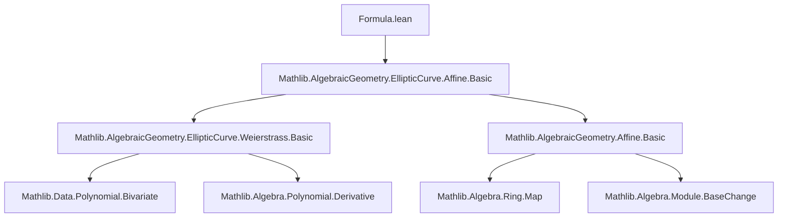
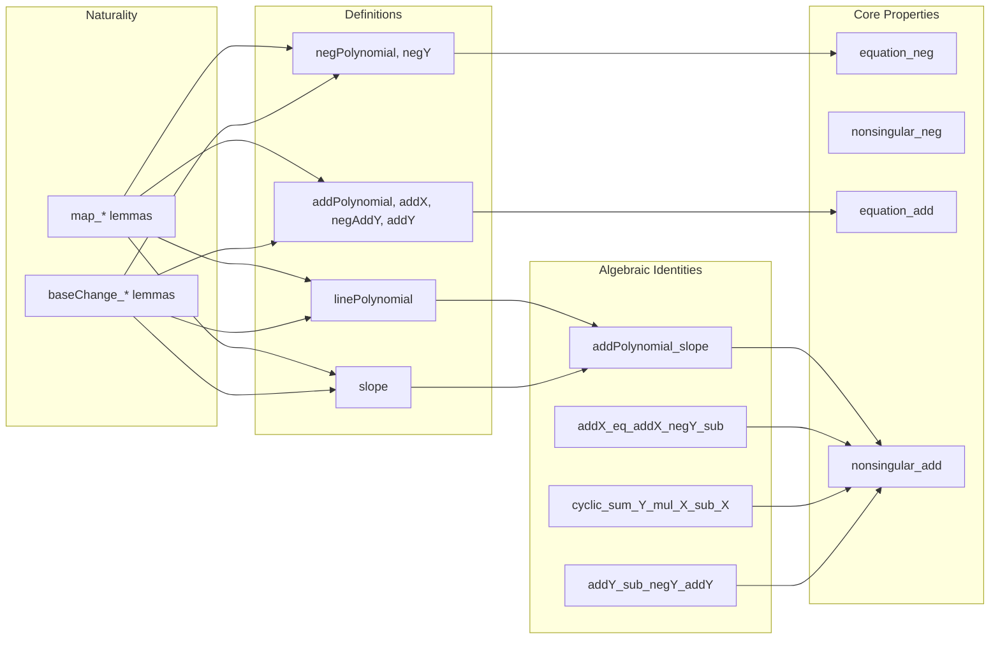

### Technical Brief: `Formula.lean` — Affine Weierstrass Curve Addition/Negation Formulae

---

#### **1. Key Definitions & Theorems**

| Name | Type / Signature | Purpose |
|------|------------------|---------|
| `negPolynomial` | `R[X][Y]` | Polynomial representing $-Y - a_1 X - a_3$, i.e., the $Y$-coordinate of $-P$ for $P = (x, y)$. |
| `negY` | `R → R → R` | Evaluates `negPolynomial` at $(x, y)$: $-y - a_1 x - a_3$. |
| `linePolynomial` | `R → R → R → R[X]` | Polynomial for line $Y = \ell(X - x) + y$ through point $(x, y)$ with slope $\ell$. |
| `slope` | `F → F → F → F → F` | Computes slope $\ell$ of line through two points: secant ($x_1 \ne x_2$), tangent ($x_1 = x_2, y_1 \ne -y_2 - a_1 x_2 - a_3$), or $0$ (vertical). |
| `addPolynomial` | `R → R → R → R[X]` | Polynomial obtained by substituting `linePolynomial` into Weierstrass equation; roots are $x_1, x_2, x_3 = x(P_1 + P_2)$. |
| `addX` | `R → R → R → R` | $x$-coordinate of $P_1 + P_2$: $\ell^2 + a_1 \ell - a_2 - x_1 - x_2$. |
| `negAddY` | `R → R → R → R → R` | $y$-coordinate of $-(P_1 + P_2)$: $\ell(x_3 - x_1) + y_1$. |
| `addY` | `R → R → R → R → R` | $y$-coordinate of $P_1 + P_2$: $\text{negY}(x_3, \text{negAddY}(x_1, x_2, y_1, \ell))$. |
| `equation_neg` | `W'.Equation x (negY x y) ↔ W'.Equation x y` | Negation preserves the Weierstrass equation. |
| `nonsingular_neg` | `W'.Nonsingular x (negY x y) ↔ W'.Nonsingular x y` | Negation preserves nonsingularity. |
| `equation_add` | Under secant/tangent condition, `W.Equation (addX ...) (addY ...)` | Addition preserves the Weierstrass equation. |
| `nonsingular_add` | Under secant/tangent condition, `W.Nonsingular (addX ...) (addY ...)` | Addition preserves nonsingularity. |
| `addPolynomial_slope` | Factorization of `addPolynomial` as $-(X - x_1)(X - x_2)(X - x_3)$ | Core algebraic identity for addition law. |
| `addX_eq_addX_negY_sub` | $x(P_1 + P_2) = x(P_1 - P_2) - \psi(P_1)\psi(P_2)/(x_2 - x_1)^2$ | duplication-like identity using $\psi(x,y) = 2y + a_1x + a_3$. |
| `cyclic_sum_Y_mul_X_sub_X` | $y_1(x_2 - x_3) + y_2(x_3 - x_1) + y_3'(x_1 - x_2) = 0$, where $y_3' = \text{negAddY}(x_1,x_2,y_1,\ell)$ | Collinearity condition for $P_1 + P_2 + P_3 = \mathcal{O}$. |
| `addY_sub_negY_addY` | $\psi(P_1 + P_2) = \frac{\psi(P_2)(x_1 - x_3) - \psi(P_1)(x_2 - x_3)}{x_2 - x_1}$ | $\psi$-function addition formula. |

---

#### **2. Naming Conventions**

- **Prefixes**:
  - `neg*`: negation-related (e.g., `negPolynomial`, `negY`, `negAddY`).
  - `add*`: addition-related (e.g., `addX`, `addY`, `addPolynomial`).
  - `line*`: line-related polynomials (`linePolynomial`).
  - `slope*`: slope-related definitions (`slope`, `slope_of_*` lemmas).
- **Suffixes**:
  - `Y`, `X`: coordinate projections.
  - `negAddY`: $y$-coordinate of *negated* sum (pre-final negation).
  - `addY`: final $y$-coordinate of sum.
- **Predicate forms**:
  - `equation_*`, `nonsingular_*`: preservation lemmas.
- **Map/base-change lemmas**:
  - `map_*`, `baseChange_*`: naturality under ring homomorphisms/algebra maps.

---

#### **3. Tactic Stack**

| Tactic | Usage |
|--------|-------|
| `simp only [...]` | Extensive use of custom macros: `C_simp`, `derivative_simp`, `eval_simp`, `map_simp`. |
| `ring1`, `ring` | Simplifying polynomial identities, especially in coordinate formulas. |
| `linear_combination` | Proving linear dependencies (e.g., from `h₁ - h₂`). |
| `grind` | Automated solving of polynomial equalities. |
| `congr!`, `ext`, `congr 1` | Equality proofs for polynomials/functions. |
| `contrapose!`, `not_congr`, `and_congr_left` | Logical manipulations in nonsingularity proofs. |
| `field_simp`, `div_mul_cancel₀`, `sub_ne_zero.mpr` | Field arithmetic simplifications. |
| `derivative_simp` | Derivative simplifications (custom macro). |
| `eval_simp` | Evaluation simplifications (custom macro). |
| `map_simp` | Map/base-change simplifications (custom macro). |

---

#### **4. Proof Logic**

- **Induction**: Not used directly; proofs rely on algebraic manipulation of polynomials and evaluation.
- **Case analysis**:
  - On equality of $x$-coordinates (`x₁ = x₂` vs `x₁ ≠ x₂`).
  - On equality of $y$-coordinates relative to `negY` (`y₁ = negY x₂ y₂` vs `≠`).
- **Polynomial factorization**:
  - `addPolynomial_slope` factorizes `addPolynomial` using root structure.
  - Derivative analysis (`derivative_addPolynomial_slope`) used to verify nonsingularity via Jacobian criterion.
- **Nonsingularity proofs**:
  - Use equivalence `Nonsingular x y ↔ Equation x y ∧ derivative.eval x ≠ 0`.
  - Show derivative nonzero via contradiction or explicit nonzero product.
- **Naturality**:
  - `map_*` and `baseChange_*` lemmas follow from `map_simp` and naturality of evaluation/map.

---

#### **5. Imports & Dependencies**

- **Primary import**:
  ```lean
  import Mathlib.AlgebraicGeometry.EllipticCurve.Affine.Basic
  ```
- **Implicit dependencies**:
  - `Mathlib.Data.Polynomial.Bivariate` (via `Polynomial` and `Bivariate` scopes).
  - `Mathlib.Algebra.Polynomial.Eval`, `Derivative`, `RingHom`, `Field`.
  - `Mathlib.AlgebraicGeometry.EllipticCurve.Weierstrass` (via `WeierstrassCurve`).
  - `Mathlib.AlgebraicGeometry.AffineScheme` (via `Affine`, `map`, `baseChange`).

---

#### **6. Mermaid Diagrams**

##### **Dependency Graph (Module Level)**



##### **Overview of File Structure**



---

#### **7. Theory Context**

- **Goal**: Formalize the *explicit* group law on nonsingular affine points of a Weierstrass curve.
- **Role of this file**: Provides *polynomial* and *coordinate* formulae for negation and addition, and proves they preserve the curve equation and nonsingularity.
- **Next step** (per docstring): `Point.lean` will define the *actual* group operation on points, using these formulae and verifying group axioms.

---

#### **8. Tags & References**

- **Tags**: `elliptic curve`, `affine`, `negation`, `doubling`, `addition`, `group law`
- **Reference**: J. Silverman, *The Arithmetic of Elliptic Curves* (2009)

--- 

Let me know if you'd like a formalized summary in Lean syntax or a dependency graph for `Point.lean`.
