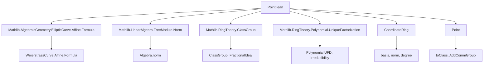
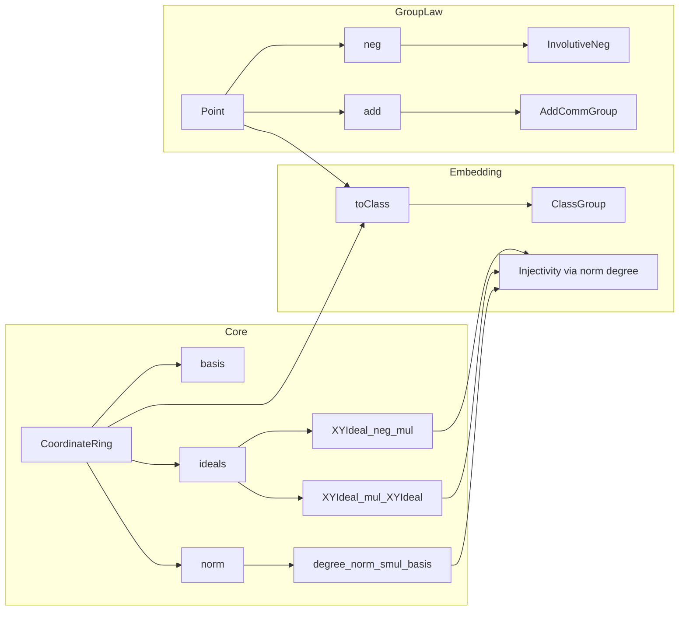

Here is the **technical metadata extraction** for the `Point.lean` file, structured as requested:

---

### 1. KEY DEFINITIONS & THEOREMS

| Name | Type / Signature | Purpose |
|------|------------------|---------|
| `CoordinateRing` | `Type u` | Affine coordinate ring $F[W] = F[X,Y]/\langle W(X,Y)\rangle$, implemented as `AdjoinRoot W'.polynomial`. |
| `basis` | `Basis (Fin 2) F[X] W'.CoordinateRing` | Power basis $\{1, Y\}$ of $F[W]$ over $F[X]$. |
| `mk` | `F[X][Y] →+* W'.CoordinateRing` | Natural quotient map from bivariate polynomials to the coordinate ring. |
| `XClass x` | `W'.CoordinateRing` | Class of $X - x$ in $F[W]$. |
| `YClass y` | `W'.CoordinateRing` | Class of $Y - y(X)$ in $F[W]$. |
| `XIdeal x` | `Ideal W'.CoordinateRing` | Principal ideal $\langle X - x\rangle$. |
| `YIdeal y` | `Ideal W'.CoordinateRing` | Principal ideal $\langle Y - y(X)\rangle$. |
| `XYIdeal x y` | `Ideal W'.CoordinateRing` | Ideal $\langle X - x, Y - y(X)\rangle$. |
| `quotientXYIdealEquiv` | `(W'.CoordinateRing ⧸ XYIdeal x y) ≃ₐ[F] F` | Evaluation isomorphism at a point satisfying $W(x, y(x)) = 0$. |
| `XYIdeal_neg_mul` | `XYIdeal x (C (W.negY x y)) * XYIdeal x (C y) = XIdeal x` | Key ideal identity used to define inverse in class group. |
| `XYIdeal_mul_XYIdeal` | Product of point ideals equals line-ideal times sum-point ideal | Encodes group law algebraically via ideal multiplication. |
| `XYIdeal' h` | `FractionalIdeal⁰ W.CoordinateRingˣ` | Nonzero fractional ideal class associated to a nonsingular point. |
| `norm_smul_basis` | `Algebra.norm ... = p^2 - ...` | Explicit formula for algebra norm in power basis. |
| `degree_norm_smul_basis` | `degree (norm (p + qY)) = max (2·deg p, 2·deg q + 3)` | Degree formula for norm, crucial for injectivity. |
| `Point` | `Inductive` | Type of nonsingular affine points: `zero` (∞) or `some (x,y,h)`. |
| `neg` | `Point → Point` | Group inverse: $(x,y) \mapsto (x, -y - a_1 x - a_3)$. |
| `add` | `Point → Point → Point` | Group law: chord-tangent construction in affine coordinates. |
| `toClass` | `Point →+ Additive (ClassGroup W.CoordinateRing)` | Group homomorphism embedding $W(F)$ into ideal class group via $P \mapsto [\mathfrak{m}_P]$. |
| `instAddCommGroup` | `AddCommGroup W.Point` | Main theorem: $W(F)$ is an abelian group under `add`. |

---

### 2. NAMING CONVENTIONS

- **Prefixes**:
  - `XYIdeal`, `XIdeal`, `YIdeal`: for ideals generated by coordinate differences.
  - `XClass`, `YClass`: for element classes modulo the Weierstrass equation.
  - `mk`: for canonical quotient map.
  - `neg`, `add`: for group operations.
  - `toClass`: for canonical map to class group.
- **Suffixes**:
  - `'` (e.g., `XYIdeal'`): fractional ideal version (unit in class group).
  - `Equiv`, `Iso`: for isomorphisms (e.g., `quotientXYIdealEquiv`).
  - `map`, `coe`: for coercion or base change maps.
- **Pattern**:
  - `XYIdeal_mul_XYIdeal`, `XYIdeal_neg_mul`: ideal-theoretic formulations of group axioms.
  - `degree_norm_smul_basis`, `norm_smul_basis`: norm computations in basis.

---

### 3. TACTIC STACK

Frequent tactics used:
- `simp only [...]` — especially with `map_*`, `basis_*`, `XYIdeal_*`.
- `ring1`, `ring` — for polynomial algebra simplifications.
- `linear_combination` — for verifying polynomial identities (e.g., in `XYIdeal_neg_mul`).
- `congr_arg`, `convert`, `apply congr_arg (_ ∘ _ ∘ _)` — for ideal equality via generator manipulation.
- `rcases`, `cases`, `by_cases` — for case analysis on equalities (`x₁ = x₂`, `y₁ = W.negY x₂ y₂`).
- `rw [← map_mul, ← map_add]`, `simp_rw` — for transporting equalities along algebra maps.
- `infer_instance`, `exact`, `refine` — for typeclass resolution and construction.
- `C_simp`: custom macro expanding `map_ofNat`, `C_*`, etc.

---

### 4. PROOF LOGIC

- **Structure**:
  1. **Coordinate ring**: Constructed as `AdjoinRoot`, prove it's a domain, define basis, norm.
  2. **Ideals**: Define point ideals, prove key multiplicative identities (`XYIdeal_neg_mul`, `XYIdeal_mul_XYIdeal`) using explicit polynomial algebra.
  3. **Class group embedding**: Define `XYIdeal'`, show it respects inverses and addition via ideal identities.
  4. **Group law**: Define `add`, `neg` inductively; prove group axioms via `toClass` injectivity.
  5. **Injectivity**: Use `degree_norm_smul_basis` to show `toClass` is injective (norm degree distinguishes points).
- **Key logical flow**:
  - *Induction* on point structure (`zero`, `some`).
  - *Case split* on equality of $x$-coordinates and $y$-coordinates (to handle $\mathcal{O}$, inverses, and generic addition).
  - *Ideal computations* reduce group identities to polynomial identities.
  - *Norm degree argument* gives injectivity of `toClass`, hence group axioms.

---

### 5. IMPORTS

| Module | Purpose |
|--------|---------|
| `Mathlib.AlgebraicGeometry.EllipticCurve.Affine.Formula` | Weierstrass equation, point formulas (`slope`, `addX`, `addY`, `negY`, etc.). |
| `Mathlib.LinearAlgebra.FreeModule.Norm` | Algebra norm over free modules (used for `norm_smul_basis`). |
| `Mathlib.RingTheory.ClassGroup` | Ideal class group, fractional ideals, `ClassGroup.mk`. |
| `Mathlib.RingTheory.Polynomial.UniqueFactorization` | Polynomial UFD properties (e.g., irreducibility of $W$). |

---

### 6. MERMAID DIAGRAMS

#### Dependency Graph (Top-Level)

#### Overview of `Point.lean`

---

Let me know if you'd like a **formalized dependency graph** (e.g., for `lean4checker`), or a **summary of the group law verification pipeline**.
