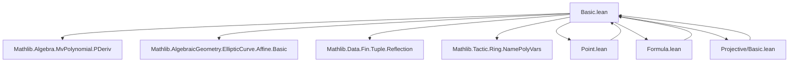
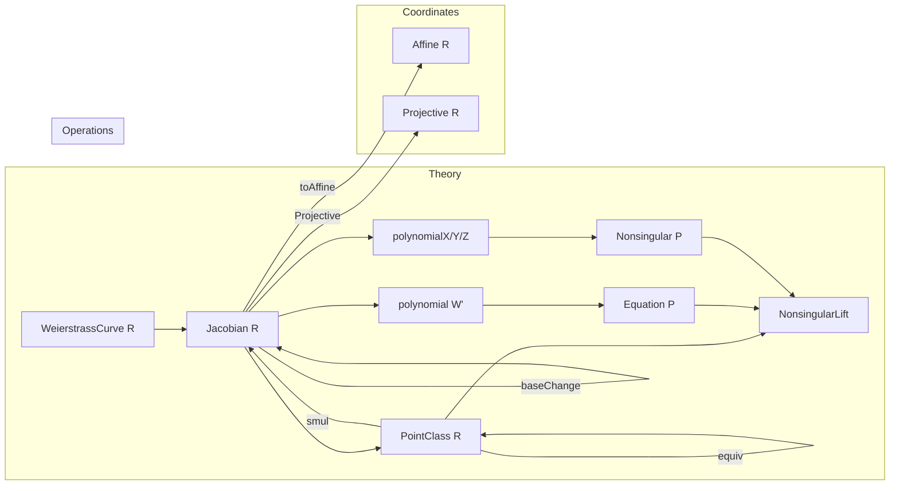

### Technical Brief: `Basic.lean` — Weierstrass Equations in Jacobian Coordinates

---

#### **1. Key Definitions & Theorems**

| Name | Type / Signature | Purpose |
|------|------------------|---------|
| `Jacobian R` | `Type r` | Abbreviation for `WeierstrassCurve R`, representing a Weierstrass curve in Jacobian coordinates. |
| `PointClass R` | `Type r` | Quotient of `(Fin 3 → R) \ {0}` under the `Rˣ`-action `(u, P) ↦ u • P`, where `u • P = ![u² * P x, u³ * P y, u * P z]`. Represents projective points in weighted projective space ℙ(2,3,1). |
| `polynomial W'` | `MvPolynomial (Fin 3) R` | Homogeneous Weierstrass polynomial: $Y^2 + a_1XYZ + a_3YZ^3 - (X^3 + a_2X^2Z^2 + a_4XZ^4 + a_6Z^6)$. |
| `polynomialX`, `polynomialY`, `polynomialZ` | `MvPolynomial (Fin 3) R` | Partial derivatives $W_X, W_Y, W_Z$ w.r.t. $X, Y, Z$, computed via `pderiv`. |
| `Equation W' P` | `Prop` | $P$ lies on $W'$: $\text{eval } P\ W'.\text{polynomial} = 0$. |
| `Nonsingular W' P` | `Prop` | $P$ is on $W'$ and at least one partial derivative is nonzero: $\text{Equation } P \land (W_X(P) \ne 0 \lor W_Y(P) \ne 0 \lor W_Z(P) \ne 0)$. |
| `NonsingularLift W' ⟦P⟧` | `Prop` | Lift of `Nonsingular` to equivalence classes: $\text{Nonsingular } P$, well-defined via `nonsingular_of_equiv`. |
| `polynomial_relation` | `theorem` | Euler’s homogeneous function theorem: $6W(P) = 2xW_X(P) + 3yW_Y(P) + zW_Z(P)$. |
| `equiv_some_of_Z_ne_zero` | `lemma` | For $z \ne 0$, any point is equivalent to $[x/z^2,\ y/z^3,\ 1]$. |
| `equiv_of_Z_eq_zero` | `lemma` | All nonsingular points with $z = 0$ are equivalent (to $[1,1,0]$). |

---

#### **2. Naming Conventions**

- **Prefixes**:
  - `polynomial*`: homogeneous Weierstrass polynomial and its partials.
  - `equation*`, `nonsingular*`: predicates on point representatives.
  - `map_*`, `baseChange_*`: behavior under ring homomorphisms / base change.
  - `eval_*`: evaluation of polynomials at points.
- **Suffixes**:
  - `*_of_Z_eq_zero`, `*_of_Z_ne_zero`: case analysis on $z = 0$ or $z \ne 0$.
  - `*_iff`: characterizations (e.g., `equation_iff`, `nonsingular_iff`).
  - `*_ext`: extensionality lemmas for vector notation (e.g., `fin3_def_ext`, `smul_fin3_ext`).
- **Notation**:
  - `x`, `y`, `z` as `0`, `1`, `2 : Fin 3`.
  - `![a, b, c]` for `Fin 3 → R` vectors.
  - `•` for weighted scalar multiplication.

---

#### **3. Tactic Stack**

| Tactic | Usage |
|--------|-------|
| `simp only [...]` | Simplify using vector/evaluation definitions (`fin3_def`, `smul_fin3`, `eval_polynomial`, etc.). |
| `ring1` / `ring` | Prove polynomial identities after simplification. |
| `linear_combination` | Combine equations with coefficients (often with `norm := ...`). |
| `erw` | Rewrite up to definitional equality (used to bypass syntactic mismatches between `u • P` and `![...]`). |
| `fin_cases` | Case analysis on `Fin 3` indices. |
| `congr!`, `congr` | Congruence reasoning for vector equality. |
| `map_simp`, `pderiv_simp`, `matrix_simp`, `eval_simp` | Custom macros for simplifying maps, pderivs, matrices, and evaluations. |

---

#### **4. Proof Logic**

- **Induction / Case Splitting**: Most proofs split on `z = 0` vs `z ≠ 0`, leveraging:
  - `equiv_some_of_Z_ne_zero` to reduce to affine case.
  - `equiv_of_Z_eq_zero` to classify all $z = 0$ nonsingular points.
- **Unit Manipulation**: When $z \ne 0$, invertibility of $z$ (or $Pz$) is used to construct scaling units.
- **Homogeneity**: Euler’s theorem (`polynomial_relation`) is used to relate nonsingularity across coordinates.
- **Base Change & Functoriality**: Lemmas like `map_nonsingular`, `baseChange_nonsingular` rely on injectivity of ring maps to preserve nonzero conditions.
- **Quotient Reasoning**: `nonsingular_of_equiv` ensures `NonsingularLift` is well-defined on `PointClass`.

---

#### **5. Imports & Dependencies**

| Module | Purpose |
|--------|---------|
| `Mathlib.Algebra.MvPolynomial.PDeriv` | Partial derivatives of multivariate polynomials (`pderiv`). |
| `Mathlib.AlgebraicGeometry.EllipticCurve.Affine.Basic` | Affine Weierstrass equations and nonsingularity. |
| `Mathlib.Data.Fin.Tuple.Reflection` | Vector notation (`![...]`) and `Fin 3` reasoning. |
| `Mathlib.Tactic.Ring.NamePolyVars` | Polynomial variable naming (`name_poly_vars X Y Z`). |

---

#### **6. Mermaid Diagrams**

##### **Dependency Graph (Top-Level)**

##### **File Overview (Structure)**

---

#### **7. Notes on Formalization Strategy**

- **Syntactic Mismatches**: The use of `Fin 3 → R` for points causes mismatches between `u • P` and `![u² * P x, ...]`. This is mitigated via:
  - `smul_fin3`, `fin3_def` lemmas.
  - `erw` for definitional rewriting (explicitly justified as safe).
- **Field vs Ring**: `Nonsingular` is only fully meaningful over fields (e.g., `F`), but definitions work over arbitrary `CommRing`. The `TODO` notes this limitation.
- **Weighted Projective Space**: The action `(u², u³, u)` encodes ℙ(2,3,1), distinguishing Jacobian from standard projective coordinates.
- **Modularity**: All definitions live in `WeierstrassCurve.Jacobian`, with conversions to `Affine` and `Projective` via `toAffine`, `toJacobian`.

---

#### **8. References**

- J. Silverman, *The Arithmetic of Elliptic Curves*, especially Ch. III (group law, projective coordinates).
- Lean Mathlib: `WeierstrassCurve`, `MvPolynomial`, `AlgebraicGeometry.EllipticCurve`.

--- 

This file provides the foundational algebraic and geometric setup for elliptic curves in Jacobian coordinates, enabling efficient reasoning about projective points and their nonsingularity — a prerequisite for defining the group law in `Point.lean`.
