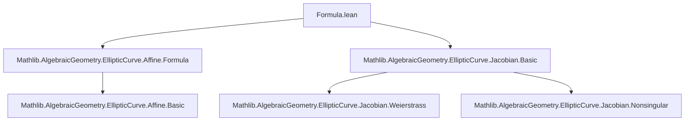
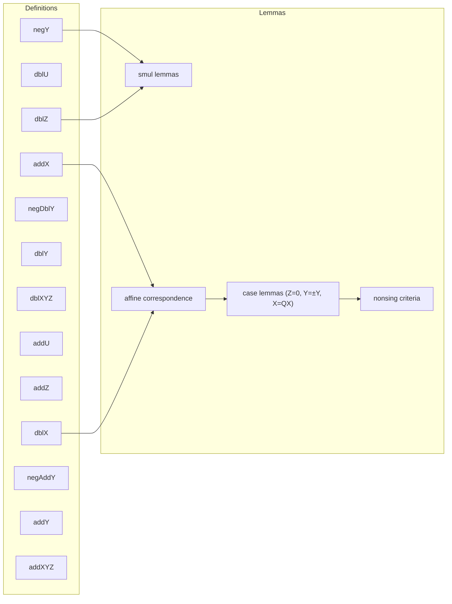

Here is the **technical metadata extraction** for the Lean 4 file `Formula.lean`, structured as requested:

---

### **1. Key Definitions & Theorems**

| Name | Type / Purpose |
|------|----------------|
| `negY` | `def negY (P : Fin 3 → R) : R` — Y-coordinate of $-P$ in Jacobian coordinates; computes $-Y - a_1 X Z - a_3 Z^3$. |
| `dblU` | `def dblU (P : Fin 3 → R) : R` — Unit factor in doubling when $P = -P$ (i.e., 2-torsion); equals $\partial F/\partial X$ at $P$. |
| `dblZ` | `def dblZ (P : Fin 3 → R) : R` — Z-coordinate of $2P$; computes $Z (Y - \text{negY}\, P)$. |
| `dblX` | `def dblX (P : Fin 3 → R) : R` — X-coordinate of $2P$; derived from secant/tangent formula, homogeneous of degree 4. |
| `negDblY` | `def negDblY (P : Fin 3 → R) : R` — Y-coordinate of $-(2P)$; used to avoid division in group law. |
| `dblY` | `def dblY (P : Fin 3 → R) : R` — Y-coordinate of $2P$; defined via `negY` on $(\text{dblX}, \text{negDblY}, \text{dblZ})$. |
| `dblXYZ` | `def dblXYZ (P : Fin 3 → R) : Fin 3 → R` — Full Jacobian representative of $2P$. |
| `addU` | `def addU (P Q : Fin 3 → F) : F` — Unit factor for $P + Q$ when $P \ne \pm Q$; $-(P_y Q_z^3 - Q_y P_z^3)/(P_z Q_z)$. |
| `addZ` | `def addZ (P Q : Fin 3 → R) : R$ — Z-coordinate of $P + Q$; computes $P_x Q_z^2 - Q_x P_z^2$. |
| `addX` | `def addX (P Q : Fin 3 → R) : R$ — X-coordinate of $P + Q$; large homogeneous polynomial of degree 8 (scaled to be $(2,3,1)$-homogeneous of degree 4). |
| `negAddY` | `def negAddY (P Q : Fin 3 → R) : R$ — Y-coordinate of $-(P + Q)$; large homogeneous polynomial of degree 12 (scaled to be $(2,3,1)$-homogeneous of degree 4). |
| `addY` | `def addY (P Q : Fin 3 → R) : R$ — Y-coordinate of $P + Q$; defined via `negY` on $(\text{addX}, \text{negAddY}, \text{addZ})$. |
| `addXYZ` | `def addXYZ (P Q : Fin 3 → R) : Fin 3 → R$ — Full Jacobian representative of $P + Q$. |

**Key Lemmas** (selected):
- `negY_smul`, `dblZ_smul`, `dblX_smul`, `addZ_smul`, `addX_smul`, `negAddY_smul`: All are $(2,3,1)$-homogeneous of degree $4$ (for $X,Y,Z$) or $2$ (for $U$).
- `dblZ_ne_zero_of_Y_ne`, `addZ_ne_zero_of_X_ne`: Ensure denominators nonzero under geometric conditions.
- `dblX_of_Z_ne_zero`, `dblY_of_Z_ne_zero`, `addX_of_Z_ne_zero`, `negAddY_of_Z_ne_zero`: Relate Jacobian formulas to affine ones via scaling.
- `Y_eq_of_Y_ne`, `Y_ne_negY_of_Y_ne`, `Y_eq_negY_of_Y_eq`: Key algebraic lemmas for resolving cases in group law proofs.
- `nonsingular_iff_of_Y_eq_negY`: Characterizes nonsingularity in terms of affine coordinates when $Y = -Y$.

---

### **2. Naming Conventions**

- **Prefixes**:
  - `neg*`: for negation (e.g., `negY`, `negDblY`, `negAddY`)
  - `dbl*`: for doubling (e.g., `dblU`, `dblZ`, `dblX`, `dblY`, `dblXYZ`)
  - `add*`: for addition (e.g., `addU`, `addZ`, `addX`, `addY`, `addXYZ`)
- **Suffixes**:
  - `_eq`: equality lemmas (e.g., `negY_eq`, `dblX_eq`)
  - `_smul`: scaling behavior (e.g., `dblZ_smul`, `addX_smul`)
  - `_of_Z_eq_zero`, `_of_Z_ne_zero`, `_of_Y_eq`, `_of_Y_ne`: case analysis on coordinates
  - `_of_X_eq`, `_of_X_ne`: case analysis on $X/Z^2$ equality
- **`map_simp` tactic macro**: simplifies under ring homomorphisms (e.g., `WeierstrassCurve.map`).

---

### **3. Tactic Stack**

- `simp only [...]`: heavily used with explicit lemmas (e.g., `map_ofNat`, `map_X`, `negY`, `dblZ`, etc.)
- `ring1`: for polynomial simplification and verification of homogeneity
- `linear_combination`: for verifying identities by hand (e.g., proving $0 = 0$ modulo Weierstrass equation)
- `rw [...]`: rewriting with definitions and lemmas
- `field_simp`, `field`: for field arithmetic (especially in `Z ≠ 0` cases)
- `contrapose!`: for negated implications (e.g., proving $a \ne b$ by contradiction)
- `have`, `set_option linter.flexible false`: for local assumptions and suppressing linter warnings

---

### **4. Proof Logic**

- **Induction**: Not used (no inductive types involved).
- **Case analysis**: On $Z = 0$ vs $Z \ne 0$, and on $P_x / P_z^2 = Q_x / Q_z^2$ vs $\ne$.
- **Homogeneity checks**: Prove scaling behavior via `smul_fin3_ext`, then `ring1`.
- **Affine lifting**: Use `negY_of_Z_ne_zero`, `dblX_of_Z_ne_zero`, etc., to relate Jacobian formulas to affine ones.
- **Algebraic resolution**: Use `Y_sub_Y_mul_Y_sub_negY` to deduce equality or inequality of $Y$-coordinates under the Weierstrass equation.
- **Nonsingularity criteria**: Reduce to evaluating partial derivatives (via `nonsingular_iff_of_Z_ne_zero`, `nonsingular_iff_of_Y_eq_negY`).

---

### **5. Imports**

- `Mathlib.AlgebraicGeometry.EllipticCurve.Affine.Formula`: defines affine addition/doubling/negation.
- `Mathlib.AlgebraicGeometry.EllipticCurve.Jacobian.Basic`: defines Jacobian points, Weierstrass curves, nonsingularity, and basic properties.

---

### **6. Mermaid Diagrams**

#### **Dependency Graph (Module-Level)**

#### **Overview of File Structure**

---

Let me know if you'd like the **dependency graph of definitions** (e.g., `dblXYZ` depends on `dblX`, `dblY`, `dblZ`) or a **proof dependency tree** for a specific theorem (e.g., `dblXYZ_of_Z_ne_zero`).
