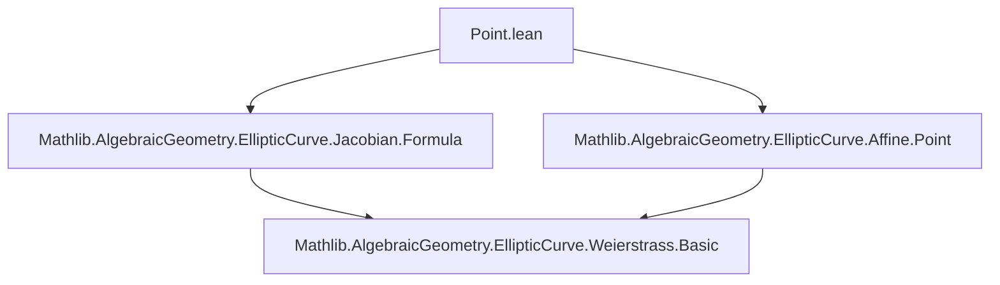

### Technical Brief: `Point.lean` — Nonsingular Jacobian Points and Group Law

---

#### **1. Key Definitions & Theorems**

| Name | Type / Signature | Purpose |
|------|------------------|---------|
| `neg (P : Fin 3 → R)` | `Fin 3 → R` | Negation of a Jacobian point *representative*; flips the $Y$-coordinate using `negY`. |
| `negMap (P : PointClass R)` | `PointClass R` | Induced negation on *point classes* (i.e., equivalence classes under scalar multiplication). |
| `add (P Q : Fin 3 → R)` | `Fin 3 → R` | Addition of representatives: uses `dblXYZ` if $P ≈ Q$, else `addXYZ`. |
| `addMap (P Q : PointClass R)` | `PointClass R` | Induced addition on point classes via `Quotient.map₂`. |
| `Point (W : Jacobian F)` | `Type u` | Type of *nonsingular* Jacobian points: pairs `⟨point, nonsingular⟩`. |
| `Point.neg (P : W.Point)` | `W.Point` | Negation on nonsingular points (via `negMap` and `nonsingularLift_negMap`). |
| `Point.add (P Q : W.Point)` | `W.Point` | Addition on nonsingular points (via `addMap` and `nonsingularLift_addMap`). |
| `Point.toAffineAddEquiv` | `W.Point ≃+ W.toAffine.Point` | **Main theorem**: equivalence of groups between nonsingular Jacobian points and affine nonsingular points. |
| `nonsingular_neg` | `W.Nonsingular P → W.Nonsingular (W.neg P)` | Negation preserves nonsingularity. |
| `nonsingular_add` | `W.Nonsingular P → W.Nonsingular Q → W.Nonsingular (W.add P Q)` | Addition preserves nonsingularity. |
| `Point.instAddCommGroup` | `AddCommGroup W.Point` | Nonsingular Jacobian points form an abelian group. |

---

#### **2. Naming Conventions**

- **Prefixes**:
  - `neg`, `add`, `dbl` — basic operations (`negY`, `addXYZ`, `dblXYZ`, `addU`, `dblU`, `addZ`, etc.)
  - `nonsingular` — predicates on representatives or classes (`Nonsingular`, `NonsingularLift`)
  - `map` — lifts operations to quotient (`negMap`, `addMap`)
  - `toAffine`, `fromAffine` — coordinate change maps
  - `equiv` / `of_equiv` — properties under equivalence `≈`

- **Suffixes**:
  - `_of_Z_eq_zero`, `_of_Z_ne_zero`, `_of_Y_eq`, `_of_Y_ne`, `_of_X_ne` — case analysis on coordinates
  - `_equiv`, `_smul_equiv` — behavior under scalar multiplication
  - `_lift`, `_some`, `_zero` — for lifted maps or point constructors

- **Notation**:
  - `x`, `y`, `z` → `0`, `1`, `2 : Fin 3`
  - `map_simp` tactic macro expands `map_*` lemmas for `MvPolynomial` maps.

---

#### **3. Tactic Stack**

Frequent tactics used:

| Tactic | Usage |
|--------|-------|
| `simp only [...]` | Simplify using explicit lemmas (e.g., `map_ofNat`, `neg_X`, `addZ_neg`) |
| `rw [...]` | Rewrite using definitions or equivalences (`add_of_equiv`, `neg_of_Z_eq_zero`, etc.) |
| `linear_combination` | Prove polynomial identities (e.g., `addX_neg`, `negAddY_neg`) |
| `ring1` / `ring` | Simplify polynomial expressions in commutative rings |
| `by_cases` | Split on decidable equalities (`P z = 0`, `P ≈ Q`, etc.) |
| `rcases` / `inductionOn` | Unpack quotients or existential hypotheses |
| `exact` / `apply` | Use injectivity/surjectivity (e.g., of `toAffineAddEquiv`) |
| `map_simp` (macro) | Expand `map_*` lemmas for ring homomorphisms |

---

#### **4. Proof Logic**

- **Structure**:
  1. **Representative-level lemmas** (`neg`, `add`, `nonsingular_*`) are proven first.
  2. **Quotient lifting**: Show operations respect equivalence `≈` (`neg_equiv`, `add_equiv`), then define `negMap`, `addMap`.
  3. **Nonsingularity preservation**: Prove `nonsingular_neg`, `nonsingular_add` via case analysis on $z = 0$ or $z ≠ 0$, and whether $P ≈ Q$ or $P.y = -Q.y$.
  4. **Point-level definitions**: Use `nonsingularLift_*` to lift operations to `W.Point`.
  5. **Group structure**: Use `toAffineAddEquiv` to transport the abelian group structure from affine points.

- **Common proof pattern**:
  - Induction on `PointClass` or `Point`.
  - Case split on `P z = 0` or `P z ≠ 0`.
  - Use `toAffine_of_Z_ne_zero`, `toAffine_of_Z_eq_zero` to reduce to affine case.
  - Apply `toAffine_add`, `toAffine_neg`, then use injectivity of `toAffineAddEquiv`.

---

#### **5. Imports & Dependencies**

| Import | Role |
|--------|------|
| `Mathlib.AlgebraicGeometry.EllipticCurve.Affine.Point` | Defines affine nonsingular points, group law, and `toAffine` maps. |
| `Mathlib.AlgebraicGeometry.EllipticCurve.Jacobian.Formula` | Provides Jacobian coordinate formulas (`dblXYZ`, `addXYZ`, `negY`, etc.) and basic algebraic properties. |

Other dependencies (implicit):
- `Mathlib.Algebra.Group.Defs`, `Mathlib.Algebra.Ring.MvPolynomial`, `Mathlib.Data.Quot`, `Mathlib.Algebra.Group.Action`, `Mathlib.Algebra.Field.Basic`

---

#### **6. Mermaid Diagrams**

##### **Dependency Graph (Module-Level)**



##### **Overview of Theory Flow**

```mermaid
graph LR
  A[Jacobian Coordinates] --> B[PointClass R = (Fin 3 → R)/≈]
  B --> C[Point R = {class, nonsingular}]
  C --> D[Group Law: neg, add]
  D --> E[toAffineAddEquiv : Point ≃+ Affine.Point]
  E --> F[AddCommGroup instance]
  A --> G[Jacobian.Formula: dblXYZ, addXYZ, negY]
  G --> D
  H[Affine.Point] --> E
  H --> I[AddCommGroup on Affine.Point]
  I --> E
```

##### **Proof Strategy Flow (Addition Preservation of Nonsingularity)**

```mermaid
graph TD
  A[W.Nonsingular P, Q] --> B{Case: P.z = 0?}
  B -->|Yes| C{Q.z = 0?}
  C -->|Yes| D[add = smul ![1,1,0]; use isUnit_X]
  C -->|No| E[add = smul Q; use isUnit_X, Ne.isUnit]
  B -->|No| F{Q.z = 0?}
  F -->|Yes| G[add = smul (-P); use isUnit_X]
  F -->|No| H{P ≈ Q?}
  H -->|Yes| I[add = dblXYZ; use isUnit_dblU/dblZ]
  H -->|No| J{P.y = -Q.y?}
  J -->|Yes| K[add = smul ![1,1,0]; use isUnit_dblU]
  J -->|No| L[add = smul addXYZ; use nonsingular_add_of_Z_ne_zero]
  D & E & G & I & K & L --> M[W.Nonsingular (W.add P Q)]
```

---

#### **7. Summary**

This file formalizes the group law on *nonsingular Jacobian points* of a Weierstrass curve over a field, building on formulas from `Jacobian.Formula`. It establishes:

- Well-definedness of `neg` and `add` on point classes and nonsingular points.
- Equivalence with the affine group law via `toAffineAddEquiv`.
- Full `AddCommGroup` structure on `W.Point`.

The formalization is highly structured, with careful case analysis on coordinate vanishing and equivalence, and leverages the existing affine theory for the core group properties.

--- 

*End of Technical Brief.*
