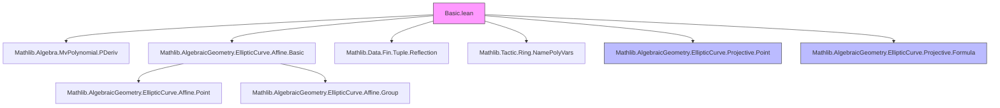

**Technical Brief: `Basic.lean` — Projective Weierstrass Equations and Nonsingularity**

---

### 1. KEY DEFINITIONS & THEOREMS

| Name | Type / Signature | Purpose |
|------|------------------|---------|
| `Projective R` | `abbrev WeierstrassCurve R` | Abbreviation for a Weierstrass curve in *projective* coordinates over `R`. |
| `polynomial W'` | `MvPolynomial (Fin 3) R` | Homogeneous Weierstrass polynomial $W(X,Y,Z)$ in projective coordinates. |
| `polynomialX W'`, `polynomialY W'`, `polynomialZ W'` | `MvPolynomial (Fin 3) R` | Partial derivatives $\partial W/\partial X$, $\partial W/\partial Y$, $\partial W/\partial Z$. |
| `Equation W' P` | `Prop` | $P$ satisfies $W(P) = 0$. |
| `Nonsingular W' P` | `Prop` | $P$ lies on $W$ and at least one partial derivative is nonzero. |
| `PointClass R` | `Type r` | Quotient $(\Fin 3 \to R)/\!\sim$ under unit-scaling action (`MulAction.orbitRel`). |
| `NonsingularLift W' [P]` | `Prop` | Lift of `Nonsingular` to equivalence classes: well-defined iff `Nonsingular` is invariant under $\sim$. |
| `polynomial_relation W' P` | `3 * W(P) = x·W_X(P) + y·W_Y(P) + z·W_Z(P)` | Euler’s homogeneous function theorem for degree-3 homogeneous $W$. |
| `equiv_some_of_Z_ne_zero` | $P \sim [x/z, y/z, 1]$ | Every point with $z \ne 0$ is equivalent to an affine point. |
| `equiv_of_Z_eq_zero` | $P \sim Q$ if $P_z = Q_z = 0$ and both nonsingular | All nonsingular points with $z = 0$ are equivalent (to $[0:1:0]$). |

---

### 2. NAMING CONVENTIONS

- **Prefixes**:
  - `polynomial*`: homogeneous Weierstrass polynomial and its partials.
  - `eval_*`: evaluation of polynomials at point representatives.
  - `equation_*`: membership in the curve.
  - `nonsingular_*`: nonsingularity conditions (on representatives, classes, or under base change).
  - `equiv_*`, `X_eq_*`, `Y_eq_*`, `Z_eq_*`: properties of equivalence relation.

- **Suffixes**:
  - `_of_Z_eq_zero`, `_of_Z_ne_zero`: case analysis on $z$-coordinate.
  - `_some`: specialization to affine chart $z = 1$.
  - `_smul`, `_equiv`: behavior under scaling or equivalence.
  - `_lift`: lifted to quotient (`PointClass`).
  - `map_*`, `baseChange_*`: behavior under ring homomorphisms / base change.

- **Notation**:
  - `x`, `y`, `z` → `0`, `1`, `2 : Fin 3`
  - `![a, b, c]` → vector representation of `Fin 3 → R`
  - `P x`, `P y`, `P z` → components of `P : Fin 3 → R`

---

### 3. TACTIC STACK

| Tactic | Usage Frequency | Purpose |
|--------|-----------------|---------|
| `simp only [...]` | Very High | Simplify using explicit lemmas (`fin3_def`, `smul_fin3`, `eval_*`, `polynomialX_eq`, etc.). |
| `ring1` / `ring` | High | Prove polynomial identities after simplification. |
| `linear_combination` | High | Combine multiple scaled equations (often with `norm := ...`). |
| `erw` | Medium | Rewrite up to definitional equality (used to bypass non-defeq `•` and `![...]`). |
| `cases` / `rcases` | Medium | Extract witnesses from `∃` or `Quotient.exact`. |
| `ext` + `fin_cases` | Medium | Prove extensionality of `Fin 3 → R`. |
| `contrapose!` | Low | Negate goals for contradiction. |
| `conv_rhs => rw [...]` | Low | Targeted rewriting on right-hand side. |

**Custom macros**:
- `eval_simp`, `map_simp`, `matrix_simp`, `pderiv_simp`: domain-specific simplifier setups.

---

### 4. PROOF LOGIC

- **Structure**:
  1. **Representative-based reasoning**: Most definitions and lemmas are stated for `P : Fin 3 → R`.
  2. **Equivalence invariance**: Lemmas like `equation_smul`, `nonsingular_smul`, `nonsingular_of_equiv` show that properties descend to `PointClass`.
  3. **Case analysis on $z$**:
     - $z \ne 0$: reduce to affine case via `equiv_some_of_Z_ne_zero`.
     - $z = 0$: reduce to special point $[0:1:0]$, often using `equiv_of_Z_eq_zero`.
  4. **Field assumptions**: Many key results (e.g., `equiv_of_X_eq_of_Y_eq`, `equiv_of_Z_eq_zero`) require `Field F` to use division and invertibility.
  5. **Base change & maps**: Use `map_*` and `baseChange_*` lemmas to lift properties along injective ring homomorphisms.

- **Typical proof pattern**:
  ```lean
  rw [nonsingular_iff, equation_iff]
  constructor
  · rintro ⟨hP, hP'⟩; exact ...
  · rintro ⟨hP, hP'⟩; exact ...
  ```

---

### 5. IMPORTS & SCOPE

| Import | Role |
|--------|------|
| `Mathlib.Algebra.MvPolynomial.PDeriv` | Partial derivatives of multivariate polynomials. |
| `Mathlib.AlgebraicGeometry.EllipticCurve.Affine.Basic` | Affine Weierstrass equations and nonsingularity. |
| `Mathlib.Data.Fin.Tuple.Reflection` | Tactics for `Fin n → R` vectors (`fin3_def`, etc.). |
| `Mathlib.Tactic.Ring.NamePolyVars` | Naming of polynomial variables (`X`, `Y`, `Z`). |

**Scope**: Formalization of *projective* Weierstrass curves over arbitrary commutative rings, with emphasis on:
- Equivalence classes of projective points (up to unit scaling),
- Homogeneous equations and partial derivatives,
- Nonsingularity as a well-defined condition on projective points,
- Compatibility with base change and ring homomorphisms.

---

### 6. MERMAID DIAGRAMS

#### Dependency Graph (Top-Level)



#### Overview of `Basic.lean`

```mermaid
flowchart LR
  subgraph Definitions
    P[Projective R]
    POLY[polynomial W']
    POLYX[polynomialX W']
    POLYY[polynomialY W']
    POLYZ[polynomialZ W']
    EQ[Equation W' P]
    NS[Nonsingular W' P]
    PC[PointClass R]
    NSL[NonsingularLift W' [P]]
  end

  subgraph Relations
    EULER[polynomial_relation]
    EQUIV[Equivalence under Rˣ]
    RED[Reduction to affine chart]
  end

  P --> POLY
  POLY --> POLYX
  POLY --> POLYY
  POLY --> POLYZ
  POLY --> EULER
  POLY --> EQ
  EQ --> NS
  PC <-- EQUIV
  NS --> NSL
  RED --> EQ
  RED --> NS
```

---

### 7. KEY OBSERVATIONS

- **`erw` usage**: Explicitly justified in the docstring — used to bypass definitional mismatches between `u • P` and `![u * P x, u * P y, u * P z]`. This is a *controlled* use of `erw`, not a sign of poor design.
- **Nonsingularity only for fields**: The docstring notes that `Nonsingular` and `NonsingularLift` are only mathematically accurate over fields; generalization is future work.
- **`[0:1:0]` as base point**: All nonsingular points with $z = 0$ are equivalent to this point — crucial for group law definition in `Point.lean`.
- **Compatibility with affine theory**: `toAffine`, `equation_some`, `nonsingular_some`, etc., ensure seamless transition between coordinates.

---

### 8. RECOMMENDATIONS FOR FORMALIZATION

- **Automation**: Consider adding `simp` lemmas for `smul_fin3`, `fin3_def`, and `eval_*` to reduce `erw` usage.
- **Generalization**: Extend `Nonsingular` to arbitrary commutative rings (e.g., via Jacobian criterion or regularity).
- **Mirroring**: As noted, changes to naming/structure should be mirrored in `Jacobian/Basic.lean`.

--- 

*End of Technical Brief.*
