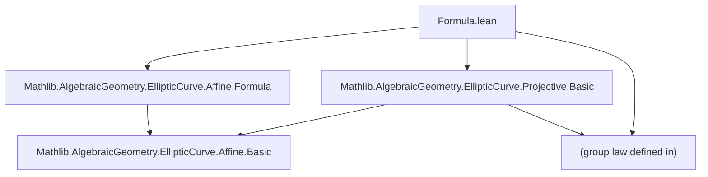
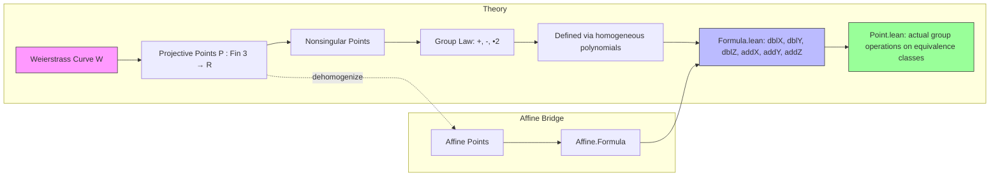

### Technical Brief: `Formula.lean` — Projective Elliptic Curve Group Law Formulae

---

#### **1. Key Definitions & Theorems**

| Name | Type / Purpose |
|------|----------------|
| `negY (P : Fin 3 → R)` | `R` — `Y`-coordinate of representative of `-P` in projective coords. |
| `dblZ (P : Fin 3 → R)` | `R` — `Z`-coordinate of representative of `2 • P`. |
| `dblX (P : Fin 3 → R)` | `R` — `X`-coordinate of representative of `2 • P`. |
| `negDblY (P : Fin 3 → R)` | `R` — `Y`-coordinate of representative of `-(2 • P)`. |
| `dblY (P : Fin 3 → R)` | `R` — `Y`-coordinate of representative of `2 • P`, defined via `negY` on `(dblX, negDblY, dblZ)`. |
| `addZ (P Q : Fin 3 → R)` | `R` — `Z`-coordinate of representative of `P + Q`. |
| `addX (P Q : Fin 3 → R)` | `R` — `X`-coordinate of representative of `P + Q`. *(truncated in source)* |
| `negAddY (P Q : Fin 3 → R)` | `R` — `Y`-coordinate of representative of `-(P + Q)`. *(truncated in source)* |
| `addY (P Q : Fin 3 → R)` | `R` — `Y`-coordinate of representative of `P + Q`. *(truncated in source)* |
| `dblXYZ (P : Fin 3 → R)` | `Fin 3 → R` — triple `(dblX P, dblY P, dblZ P)` representing `2 • P`. |
| `dblU (P : Fin 3 → F)` | `F` — unit scaling factor when `2 • P` is torsion (`P = -P`). |
| `addU (P Q : Fin 3 → F)` | `F` — unit scaling factor when `P + Q` lies on the line at infinity (`X=0`). |

**Key Lemmas (selected):**

| Lemma | Purpose |
|-------|---------|
| `negY_smul`, `dblX_smul`, `dblY_smul`, `dblZ_smul`, `addZ_smul`, `dblXYZ_smul` | Homogeneity of degree `4` under scalar multiplication. |
| `dblX_eq'`, `dblX_eq`, `dblZ`, `negDblY_eq'`, `negDblY_eq` | Relate projective polynomials to affine rational functions via clearing denominators. |
| `dblX_of_Z_ne_zero`, `dblY_of_Z_ne_zero`, `dblZ_of_Y_ne`, `dblXYZ_of_Z_ne_zero` | Show projective formulas reduce to affine ones upon dehomogenization (`Z ≠ 0`). |
| `dblU_ne_zero_of_Y_eq`, `dblZ_ne_zero_of_Y_ne`, `addU_ne_zero_of_Y_ne`, `addZ_ne_zero_of_X_ne` | Non-vanishing conditions for units/scalings in group law. |
| `Y_eq_of_Y_ne`, `Y_eq_of_Y_ne'`, `Y_eq_negY_of_Y_eq`, `nonsingular_iff_of_Y_eq_negY` | Characterize when two projective points represent same affine point or are negatives. |
| `dblXYZ_of_Y_eq`, `dblXYZ_of_Z_eq_zero`, `dblXYZ_of_Z_ne_zero` | Explicit description of `2 • P` in special cases (e.g., 2-torsion, affine chart). |

---

#### **2. Naming Conventions**

- **Prefixes**:
  - `neg_`: negation (`negY`, `negDblY`, `negAddY`)
  - `dbl_`: doubling (`dblX`, `dblY`, `dblZ`, `dblU`)
  - `add_`: addition (`addX`, `addY`, `addZ`, `addU`)
- **Suffixes**:
  - `_eq`: equality lemmas (e.g., `dblX_eq`, `addZ_eq'`)
  - `_smul`: behavior under scalar multiplication
  - `_of_Z_eq_zero`, `_of_Y_eq`, `_of_X_eq`: case analysis on coordinate equalities
  - `_ne_zero`: non-vanishing / invertibility lemmas
  - `_iff`: biconditional characterizations (e.g., `Y_eq_iff'`)
- **Notation**:
  - `P x`, `P y`, `P z`: projections using `Fin 3` indices (`x = 0`, `y = 1`, `z = 2`)
  - `![X, Y, Z]`: vector notation for `Fin 3 → R`
  - `•`: scalar multiplication on vectors

---

#### **3. Tactic Stack**

- **Core simplification & rewriting**:
  - `simp only [...]` — extensive use of `map_*`, `eval_*`, `negY`, `dblX`, etc.
  - `rw [...]` — often with custom normalization via `norm := (...)`
- **Ring & field reasoning**:
  - `ring1`, `ring`, `field_simp`, `field` — for polynomial identities and rational simplifications
- **Linear combination**:
  - `linear_combination` — heavily used to verify polynomial identities modulo Weierstrass equation
- **Logical reasoning**:
  - `contrapose!`, `sub_eq_zero.mp`, `mul_eq_zero.mp`, `resolve_left/right`, `ne_self_iff_false`
- **Custom macros**:
  - `map_simp`: expands `MvPolynomial.map` and related lemmas

---

#### **4. Proof Logic**

- **Inductive structure**: Most proofs follow a pattern:
  1. **Expand definitions** (`rw [dblX, negY, ...]`)
  2. **Apply `linear_combination`** to reduce to Weierstrass equation (`equation_iff`)
  3. **Case analysis** on `Z = 0`, `X = 0`, `Y = ±Y'`, etc.
  4. **Use homogeneity** (`smul_*`) to reduce to normalized cases
  5. **Lift to affine** via `Z ≠ 0` → dehomogenize (`div_self`, `div_eq_div_iff`)
  6. **Compare with affine formulas** in `Affine.Formula` to conclude equality

- **Key logical motifs**:
  - *Homogeneity*: All definitions are homogeneous of degree `4`, verified via `smul_*` lemmas.
  - *Denominator clearing*: Projective formulas are scaled versions of affine rational functions; verified via `dblX_eq'`, `dblX_eq`, etc.
  - *Non-vanishing ⇒ invertibility*: In fields, `≠ 0` ⇒ `IsUnit`, used repeatedly for scaling factors.

---

#### **5. Imports & Dependencies**

- **Primary imports**:
  ```lean
  Mathlib.AlgebraicGeometry.EllipticCurve.Affine.Formula
  Mathlib.AlgebraicGeometry.EllipticCurve.Projective.Basic
  ```
- **Core dependencies**:
  - `MvPolynomial` (multivariate polynomials, used for homogeneous coordinate rings)
  - `CommRing`, `Field` (base rings/fields for Weierstrass coefficients)
  - `WeierstrassCurve` (from `Projective.Basic`, defines `W : Projective R` and `W.Equation`, `W.Nonsingular`, etc.)

---

#### **6. Mermaid Diagrams**

##### **Dependency Graph (Module-Level)**



##### **Overview of Theory Flow**



---

#### **7. Implementation Notes Summary**

- **Homogeneity of degree 4**: All `dblXYZ` and `addXYZ` are homogeneous of degree `4`, achieved by *canceling* denominators from affine formulas (which would be degree `5`, `6`, `8`) using factors like `P z`, `P y - W.negY P`, etc.
- **Explicit large polynomials**: `dblX`, `negDblY`, `addX`, `addY` are given as huge explicit sums (verified by CAS), but satisfy clean factorized forms (e.g., `dblX_eq'`).
- **Mirroring affine theory**: As noted, naming and structure should mirror `Mathlib.AlgebraicGeometry/EllipticCurve/Jacobian/Formula.lean`.
- **Field vs. Ring**: Most nontrivial lemmas assume `F` is a field (for invertibility), but definitions work over arbitrary `CommRing`.

--- 

Let me know if you'd like the `addX`, `addY`, `negAddY` definitions completed or a formalization of the group law in `Point.lean`.
