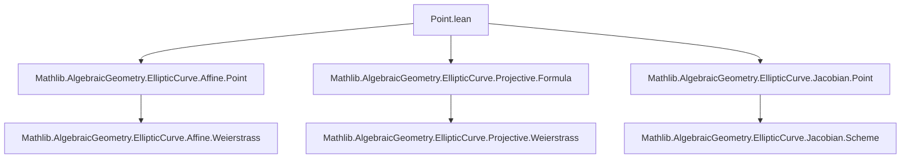
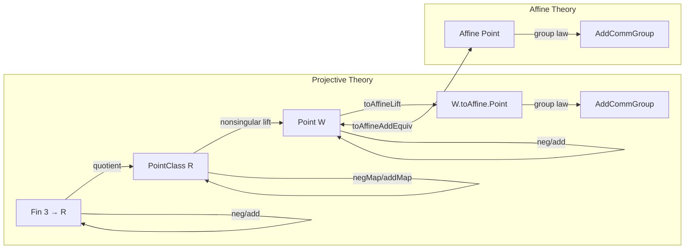
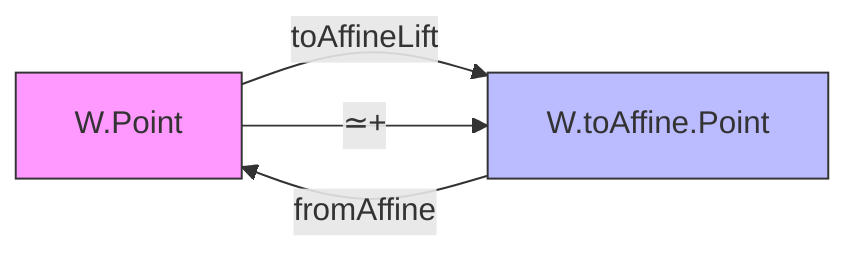

### Technical Brief: `Point.lean` — Nonsingular Projective Points on Weierstrass Curves

---

#### **1. Key Definitions & Theorems**

| Name | Type / Signature | Purpose |
|------|------------------|---------|
| `neg (P : Fin 3 → R)` | `Fin 3 → R` | Negation of a projective point *representative*; flips the $Y$-coordinate via `W'.negY`. |
| `negMap (P : PointClass R)` | `PointClass R` | Induced negation on *projective point classes* (i.e., equivalence classes under scalar multiplication). |
| `add (P Q : Fin 3 → R)` | `Fin 3 → R` | Projective addition: uses `dblXYZ` if $P ≈ Q$, else `addXYZ`. Noncomputable due to case analysis. |
| `addMap (P Q : PointClass R)` | `PointClass R` | Induced addition on point classes via `Quotient.map₂`, well-defined by `add_equiv`. |
| `Point` | `Structure` | A nonsingular projective point: a pair `⟨point : PointClass R, nonsingular : W'.NonsingularLift point⟩`. |
| `Point.neg (P : W.Point)` | `W.Point` | Negation on nonsingular projective points, using `nonsingularLift_negMap`. |
| `Point.add (P Q : W.Point)` | `W.Point` | Addition on nonsingular projective points, using `nonsingularLift_addMap`. |
| `toAffineLift (P : W.Point)` | `W.toAffine.Point` | Natural map from projective to affine nonsingular points; lifts `toAffine` on representatives. |
| `fromAffine (P : W.toAffine.Point)` | `W.Point` | Inclusion of affine nonsingular points into projective ones. |
| `toAffineAddEquiv [DecidableEq F]` | `W.Point ≃+ W.toAffine.Point` | **Main theorem**: equivalence of abelian groups between projective and affine nonsingular points. |
| `nonsingular_neg` | `W.Nonsingular P → W.Nonsingular (W.neg P)` | Negation preserves nonsingularity. |
| `nonsingular_add` | `W.Nonsingular P → W.Nonsingular Q → W.Nonsingular (W.add P Q)` | Addition preserves nonsingularity. |
| `Point.instAddCommGroup` | `AddCommGroup W.Point` | Nonsingular projective points form an abelian group. |

---

#### **2. Naming Conventions**

- **Prefixes**:
  - `neg`, `add`, `dbl`, `addXYZ`, `dblXYZ`, `negY`, `addU`, `dblU`, `addZ`, `dblZ`: operations on coordinates.
  - `of_Z_eq_zero`, `of_Z_ne_zero`, `of_Y_eq`, `of_Y_ne`, `of_X_ne`: case analysis on coordinate conditions.
  - `equiv`, `smul`, `map`, `lift`: structural properties (equivalence, scaling, functoriality, lifting).
  - `nonsingular_`, `nonsingularLift_`: nonsingularity preservation/conditions.

- **Suffixes**:
  - `_map`: induced map on quotient/point classes.
  - `_equiv`: equivalence of representatives under scaling.
  - `_some`, `_zero`: cases for affine point type (`some` vs `0`).
  - `_def`: definitional equalities (e.g., `neg_def`, `add_def`).

- **Notation**:
  - `x`, `y`, `z`: projections `Fin 3 → R` at indices `0`, `1`, `2`.
  - `map_simp`: custom tactic macro for simplifying ring homomorphism maps.

---

#### **3. Tactic Stack**

Frequently used tactics in proofs:

| Tactic | Usage |
|--------|-------|
| `simp only [...]` | Simplify using explicit lemmas (e.g., `neg_X`, `neg_Y`, `addZ_neg`, `dblZ`, etc.). |
| `ring1`, `ring` | Prove polynomial identities (e.g., in `addZ_neg`, `negAddY_neg`). |
| `linear_combination` | Combine equations with coefficients (e.g., `negAddY_neg`). |
| `by_cases` | Split on decidable propositions (`P z = 0`, `P ≈ Q`, etc.). |
| `rcases`, `inductionOn` | Eliminate quotients or existential hypotheses. |
| `rw [...]` | Rewrite using definitional equalities or lemmas. |
| `convert`, `congr'` | Prove equality up to definitional equality or equivalence. |
| `apply (toAffineAddEquiv ...).injective` | Transfer properties via equivalence. |
| `aesop` (not present) | Not used — proofs are highly structured and case-based. |

---

#### **4. Proof Logic**

The logical flow follows a **case analysis + lifting** strategy:

1. **Representative-level lemmas**:
   - Define `neg`, `add` on `Fin 3 → R`.
   - Prove `nonsingular_neg`, `nonsingular_add` by exhaustive case analysis on:
     - $z = 0$ or $z ≠ 0$,
     - $P ≈ Q$ or not,
     - $P_y = -Q_y$ or not (i.e., vertical line case).
   - Use coordinate formulas (e.g., `negY_of_Z_ne_zero`, `dblXYZ_of_Z_ne_zero`) to reduce to affine case.

2. **Quotient-level lifting**:
   - Show `neg_equiv`, `add_equiv` to ensure `negMap`, `addMap` are well-defined on `PointClass`.
   - Use `Quotient.map₂` and `nonsingularLift_*` lemmas to lift to `Point`.

3. **Group structure**:
   - Define `neg`, `add` on `Point`.
   - Prove group axioms via `toAffineAddEquiv`: since the equivalence is additive and bijective, group properties transfer from affine side (where they are already known).

4. **Equivalence**:
   - Construct `toAffineLift`, `fromAffine`.
   - Prove `toAffineLift_neg`, `toAffineLift_add`.
   - Show `toAffineAddEquiv` is an `≃+` (additive equivalence) using `Point.ext_iff` and properties of `toAffine`.

---

#### **5. Imports & Dependencies**

| Import | Role |
|--------|------|
| `Mathlib.AlgebraicGeometry.EllipticCurve.Affine.Point` | Defines affine nonsingular points and their group law. |
| `Mathlib.AlgebraicGeometry.EllipticCurve.Projective.Formula` | Provides coordinate formulas (`addXYZ`, `dblXYZ`, `negY`, etc.) and basic projective geometry. |
| `Mathlib.AlgebraicGeometry.EllipticCurve.Jacobian.Point` (implied via reference) | Parallel theory for Jacobian; naming consistency required. |

**Core dependencies**:
- `MvPolynomial`, `Function`, `Quotient`, `Field`, `CommRing`, `AddCommGroup`.
- `WeierstrassCurve`, `Projective`, `Affine`, `Nonsingular`, `PointClass`.

---

#### **6. Mermaid Diagrams**

##### **Dependency Graph (Module-Level)**

##### **Theory Overview (Point.lean)**

##### **Key Equivalence**

---

#### **7. Summary**

This file constructs the **group law on nonsingular projective points** of a Weierstrass curve over a field, using projective coordinates. It leverages:
- Explicit coordinate formulas from `Projective.Formula`,
- Equivalence with the affine group law via `toAffineAddEquiv`,
- Careful case analysis to handle singularities and degenerate cases (e.g., $Z = 0$).

The structure mirrors the affine theory, ensuring compatibility and enabling base change, functoriality, and scheme-theoretic generalizations (as noted in references to `Jacobian.Point`).

The core insight: **projective nonsingularity is preserved under the group operations**, and the resulting group is canonically isomorphic to the affine one — a foundational step toward the full Jacobian construction.
