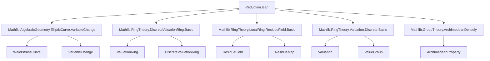

### Technical Brief: Reduction of Weierstrass Curves over Local Fields (Lean 4)

---

#### **1. Key Definitions & Theorems**

| Name | Type / Signature | Purpose |
|------|------------------|---------|
| `IsIntegral R W` | `Prop` | Predicate: $W$ has integral coefficients over $R$ (i.e., $W \cong W_{\text{int}} \otimes_R K$). |
| `integralModel R W` | `WeierstrassCurve R` | A concrete integral model of an integral $W$. |
| `Δ_integral_of_isIntegral` | `∃ r : R, algebraMap R K r = W.Δ` | Discriminant of an integral model lifts to $R$. |
| `exists_isIntegral` | `∃ C, IsIntegral R (C • W)` | Every Weierstrass curve over $K$ is isomorphic to an integral one via a variable change $C$. |
| `valuation_Δ_aux R W` | `{ v : ℤᵐ⁰ // v ≤ 1 }` | Valuation of discriminant (in additive notation), truncated to $\le 1$ if integral. |
| `IsMinimal R W` | `Prop` | $W$ has *minimal* discriminant valuation among all isomorphic integral models. Formally: $\forall C,\, \text{IsIntegral}(C•W) \Rightarrow v_\mathfrak{m}(\Delta_{C•W}) \le v_\mathfrak{m}(\Delta_W)$. |
| `exists_isMinimal` | `∃ C, IsMinimal R (C • W)` | Every curve admits a minimal model. |
| `minimal R W` | `WeierstrassCurve K` | A choice of minimal model for $W$. |
| `reduction R W` | `WeierstrassCurve (ResidueField R)` | Reduction modulo the maximal ideal of $R$, defined for minimal $W$. |
| `IsGoodReduction R W` | `Prop` | $W$ has *good reduction* iff $v_\mathfrak{m}(\Delta_W) = 1$. |
| `isGoodReduction_iff_isElliptic_reduction` | `IsGoodReduction R W ↔ (W.reduction R).IsElliptic` | Good reduction ⇔ reduced curve is elliptic (i.e., nonsingular). |

---

#### **2. Naming Conventions**

- **Predicates**: `is_` prefix (`IsIntegral`, `IsMinimal`, `IsGoodReduction`)
- **Auxiliary constructions**: `_aux` suffix (`valuation_Δ_aux`)
- **Model extraction**: `integralModel`, `minimal`
- **Operations**: `reduction`, `baseChange_integralModel_eq`
- **Valuation-related**: `Δ_integral_of_isIntegral`, `valuation_Δ_aux_eq_of_isIntegral`
- **Variable change action**: `C • W` (smul notation)
- **Equivalence via `mk_iff`**: Enables `↔`-introduction for class definitions.

---

#### **3. Tactic Stack**

| Tactic | Usage Frequency | Purpose |
|--------|-----------------|---------|
| `simp` / `simp only` | Very High | Simplify using definitions (`map_a₁`, `variableChange_def`, `Valuation.mem_integer_iff`, etc.) |
| `rw` | High | Rewrite using equalities (e.g., `← baseChange_integralModel_eq`, `← smul_assoc`) |
| `apply` | High | Apply lemmas or constructors (e.g., `isIntegral_of_exists_lift`) |
| `obtain ⟨...⟩` | Medium | Extract witnesses from existential hypotheses |
| `choose` / `choose a ha using h` | Medium | Use choice to pick elements from existential statements |
| `by_cases` / `by_contra` | Medium | Split on decidable propositions or eliminate contradictions |
| `all_goals`, `any_goals` | Medium | Apply tactic to all/any goals |
| `conv_rhs => rw ...` | Low | Right-hand side rewriting in congruence contexts |
| `linarith`, `refine`, `apply le_self_pow` | Low | Arithmetic and inequality reasoning |
| `ext` + `simp` | Medium | Extensionality for structures (Weierstrass curves) |

---

#### **4. Proof Logic**

- **Structure**: Modular, with three main sections: `Integral`, `Minimal`, `Reduction`.
- **Typical proof pattern**:
  1. **Lift coefficients** to $R$ using valuation bounds (`exists_isIntegral`):
     - Compute valuations of coefficients.
     - Scale by a uniformizer power to make all coefficients integral.
     - Use `isIntegral_of_exists_lift` to verify integrality.
  2. **Minimize discriminant valuation** (`exists_isMinimal`):
     - Apply `exists_maximalFor_of_wellFoundedGT` to the well-founded relation $v < w$ on valuations.
     - Use `exists_isIntegral` to ensure nonempty domain of integral models.
     - Extract maximal valuation (i.e., minimal discriminant valuation).
  3. **Reduce modulo maximal ideal** (`reduction`, `isGoodReduction_iff_isElliptic_reduction`):
     - Map integral model via `residue R`.
     - Use properties of discrete valuation rings:  
       $v_\mathfrak{m}(\Delta) = 1 \iff \Delta \notin \mathfrak{m} \iff \overline{\Delta} \ne 0 \iff \text{reduction is elliptic}$.

- **Induction**: Not used (no structural recursion on natural numbers).
- **Classical choice**: Used via `Classical` import and `choose`.

---

#### **5. Imports & Dependencies**

| Module | Role |
|--------|------|
| `Mathlib.AlgebraicGeometry.EllipticCurve.VariableChange` | Variable changes (isomorphisms) of Weierstrass curves. |
| `Mathlib.RingTheory.DiscreteValuationRing.Basic` | DVR structure: maximal ideal, uniformizer, valuation. |
| `Mathlib.RingTheory.LocalRing.ResidueField.Basic` | Residue field construction and map. |
| `Mathlib.RingTheory.Valuation.Discrete.Basic` | Discrete valuation theory (additive/multiplicative forms). |
| `Mathlib.GroupTheory.ArchimedeanDensely` | Used implicitly for valuation group properties (e.g., Archimedean property for bounding coefficients). |

---

#### **6. Mermaid Diagrams**

##### **Dependency Graph (Module-Level)**



##### **Overview of Theory Flow**

```mermaid
flowchart LR
  Start[WeierstrassCurve K] -->|exists_isIntegral| IntegralModel[WeierstrassCurve R]
  IntegralModel -->|exists_isMinimal| MinimalModel[Minimal WeierstrassCurve K]
  MinimalModel -->|reduction| ResidueCurve[WeierstrassCurve (ResidueField R)]
  MinimalModel -->|valuation_Δ_aux| Valuation[ℤᵐ⁰]
  Valuation -->|IsGoodReduction| GoodReduction[Δ ∉ 𝔪]
  GoodReduction -->|isGoodReduction_iff_isElliptic_reduction| Elliptic[ResidueCurve.IsElliptic]
```

---

#### **7. Summary**

This file formalizes the foundational reduction theory of Weierstrass curves over fraction fields of discrete valuation rings. It establishes:
- Existence of integral models (`exists_isIntegral`),
- Existence of minimal models (`exists_isMinimal`),
- Construction of reduction modulo the maximal ideal (`reduction`),
- Equivalence between good reduction and nonsingularity of the reduced curve (`isGoodReduction_iff_isElliptic_reduction`).

The development closely follows Silverman’s *The Arithmetic of Elliptic Curves*, using Lean’s algebraic geometry and commutative algebra libraries to formalize valuation-theoretic arguments about discriminants and variable changes.

--- 

Let me know if you'd like a formalization roadmap for extending this to Néron models or Tate’s algorithm.
