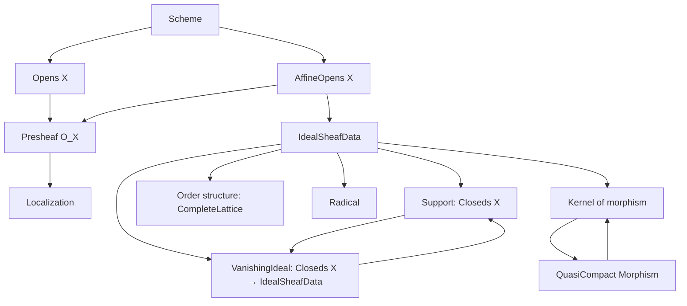
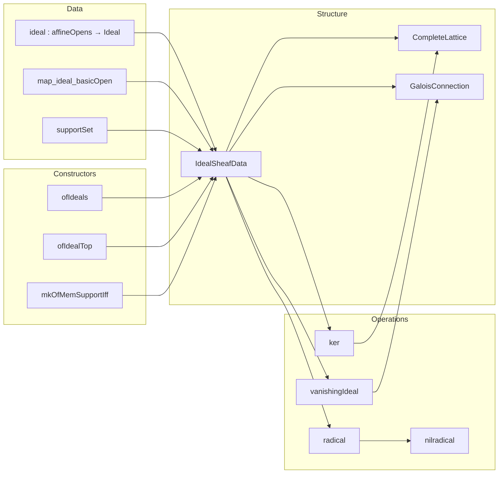

**Technical Brief: `Basic.lean` — Ideal Sheaves on Schemes in Lean 4**

---

### 1. KEY DEFINITIONS & THEOREMS

| Name | Type / Signature | Purpose |
|------|------------------|---------|
| `IdealSheafData X` | `Type u` | A structure encoding the data of an ideal sheaf: a family of ideals on affine opens, compatibility under localization, and a support set. |
| `ideal I U` | `Ideal Γ(X, U)` | Component of ideal sheaf `I` at affine open `U`. |
| `map_ideal_basicOpen` | `∀ U f, (I.ideal U).map (presheaf.map ...) = I.ideal (D(f))` | Ensures compatibility with basic open localization. |
| `supportSet I` | `Set X` | Defined as `⋂ U, zeroLocus (I.ideal U)`; the set-theoretic support. |
| `support I` | `Closeds X` | The closed subset underlying the support. |
| `vanishingIdeal Z` | `IdealSheafData X` | Largest ideal sheaf whose support is exactly `Z`. |
| `ofIdealTop I` | `Ideal Γ(X, ⊤) → IdealSheafData X` | Induces an ideal sheaf from a global ideal (in affine case). |
| `ofIdeals I` | `(∀ U, Ideal Γ(X, U)) → IdealSheafData X` | Largest ideal sheaf ≤ given family of ideals. |
| `equivOfIsAffine` | `[IsAffine X] → IdealSheafData X ≃o Ideal Γ(X, ⊤)` | Equivalence of ideal sheaves and global ideals on affine schemes. |
| `radical I` | `IdealSheafData X` | Ideal sheaf of radicals componentwise; support unchanged. |
| `nilradical X` | `IdealSheafData X` | `radical ⊥`; the nilradical sheaf. |
| `Hom.ker f` | `IdealSheafData Y` | Kernel ideal sheaf of `f : X → Y`, defined as `ofIdeals (U ↦ ker (f.app U))`. |
| `gc` | `GaloisConnection support vanishingIdeal` | `support` and `vanishingIdeal` form a Galois connection. |
| `le_support_iff_le_vanishingIdeal` | `Z ≤ I.support ↔ I ≤ vanishingIdeal Z` | Explicit form of the Galois connection. |
| `support_ker` (implicit) | `Set.range f ⊆ f.ker.support` | Support of kernel contains the image (for any morphism). |
| `Hom.ker_apply` | `[QuasiCompact f] → f.ker.ideal U = ker (f.app U)` | Equality of components under quasi-compactness. |
| `vanishingIdeal_support I` | `vanishingIdeal I.support = I.radical` | Vanishing ideal of support recovers radical. |
| `ext_of_iSup_eq_top` | `I = J` if they agree on a cover by affine opens whose union is `X`. | Extensionality principle for ideal sheaves. |

---

### 2. NAMING CONVENTIONS

- **Prefixes**:
  - `ideal_`: projections or operations on the `ideal` component (e.g., `ideal_top`, `ideal_inf`, `ideal_ofIdeals_le`).
  - `support_`: operations on support (e.g., `support_eq_bot_iff`, `support_antitone`, `support_ker`).
  - `vanishingIdeal_`: properties of vanishing ideal (e.g., `vanishingIdeal_antimono`, `vanishingIdeal_support`).
  - `ofIdeals`, `ofIdealTop`: constructors from families or global ideals.
  - `map_ideal`: compatibility of ideals under restriction maps.
  - `gc`: Galois connection-related lemmas.
  - `isClosed_`: proofs that certain sets are closed (e.g., `isClosed_supportSet`).
  - `mem_..._iff`: characterizations of membership (e.g., `mem_supportSet_iff`, `mem_support_iff_of_mem`).

- **Suffixes**:
  - `_le`, `_ge`: inequalities.
  - `_iff`: equivalence with membership or inclusion.
  - `_mono`, `_antitone`: monotonicity/antitonicity.
  - `_top`, `_bot`: behavior on top/bottom elements.
  - `_sup`, `_inf`, `_iSup`, `_iInf`: behavior on suprema/infima.

- **`mkOfMemSupportIff`**: constructor using a membership condition on support (easier to apply).

---

### 3. TACTIC STACK

Frequently used tactics in proofs:

| Tactic | Purpose |
|--------|---------|
| `simp` / `simp only` | Simplify using definitional equalities and lemmas (e.g., `ideal_top`, `support_bot`). |
| `rw` / `erw` | Rewrite using equalities, often with `←` or `congr` arguments. |
| `ext` / `ext x` | Extensionality for sets, functions, or ideal sheaves. |
| `apply_fun` | Apply a function to both sides of an inclusion/equality. |
| `convert` / `congr` | Congruence reasoning, especially for structure equality. |
| `aesop` | Automated reasoning for first-order logic + simplifier. |
| `dsimp`, `delta` | Delta-reduction for definitional unfolding. |
| `exact`, `refine`, `obtain`, `cases` | Standard proof construction. |
| `have`, `suffices` | Intermediate claims. |
| `interval_cases`, `induction` | For natural number arguments (e.g., powers `n`). |
| `localization_away_isOpenEmbedding`, `isLocalization_*` | Specialized lemmas for localization. |
| `Ideal.map_le_iff_le_comap`, `Ideal.mem_map_of_mem` | Ideal-theoretic rewrites. |
| `RingHom.mem_ker`, `RingHom.comap_ker` | Kernel-related rewrites. |
| `Set.*` lemmas (`preimage_comp`, `image_preimage_eq_inter_range`, etc.) | Set-theoretic manipulations. |

---

### 4. PROOF LOGIC

**Typical proof structure**:

1. **Extensionality**: Prove equality of ideal sheaves by showing equality of their `ideal` components (`ext` + `Ideal.ext`).
2. **Componentwise reasoning**: Reduce statements to each affine open `U`, often using:
   - `map_ideal` to relate ideals on `U` and `D(f) ⊆ U`.
   - `mem_support_iff_of_mem` to reduce support membership to a single affine neighborhood.
3. **Localization compatibility**: Use `IsLocalization.mk'_mem_map_algebraMap_iff`, `exists_mk'_eq`, and `pow_add` to handle localization.
4. **Galois connections**: Use `gc` to translate between support and vanishing ideal conditions.
5. **Covering arguments**: Use `ext_of_iSup_eq_top` or basis arguments (`X.isBasis_affineOpens.exists_subset_of_mem_open`) to glue local data.
6. **Quasi-compactness**: Used to upgrade `ideal_ker_le` to equality (`Hom.ker_apply`), via compactness of preimages and localization.

**Induction patterns**:
- Rarely used directly; most proofs are structural or rely on localization/cover arguments.
- When powers of elements appear (e.g., `n : ℕ`), `interval_cases` or `induction n` is used.

---

### 5. IMPORTS & DEPENDENCIES

| Module | Purpose |
|--------|---------|
| `Mathlib.AlgebraicGeometry.Morphisms.QuasiCompact` | Quasi-compact morphisms, used in `Hom.ker_apply`. |
| `Mathlib.AlgebraicGeometry.Properties` | General scheme properties (e.g., `zeroLocus`, `vanishingIdeal`, `isAffineOpen`). |
| `Mathlib.Tactic.DepRewrite` | Dependent rewriting for structure fields. |
| `CategoryTheory`, `TopologicalSpace` | For presheaves, morphisms, opens, continuity, etc. |

**Key underlying theories**:
- Sheaf theory on schemes (presheaves, opens, affine opens).
- Localization of rings and modules.
- Prime spectrum, zero loci, vanishing ideals.
- Galois connections between closed subsets and ideals.

---

### 6. MERMAID DIAGRAMS

#### Dependency Graph (High-Level)

#### Overview of `Basic.lean`

---

### 7. SUMMARY

This file introduces a *data-centric* approach to ideal sheaves on schemes: rather than defining them as subsheaves of the structure sheaf (which would require sheaf theory machinery), it encodes the *equivalent data* of an ideal sheaf via:
- Local ideals on affine opens,
- Compatibility under localization,
- A support set.

This design enables:
- Straightforward construction (`ofIdeals`, `mkOfMemSupportIff`),
- A clean lattice structure (`CompleteLattice`),
- A Galois connection between closed subsets and ideal sheaves (`gc`),
- A robust theory of kernels (`Hom.ker`) under quasi-compactness.

The file is foundational for subsequent development (e.g., reduced subschemes, divisors, blow-ups), and is written with future refactoring in mind (see comment: *“This should be refactored as a constructor for ideal sheaves once they are introduced into mathlib.”*).
