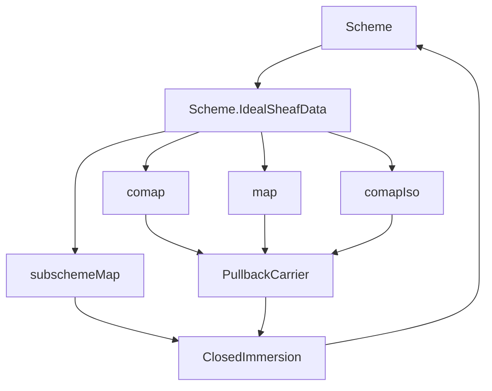
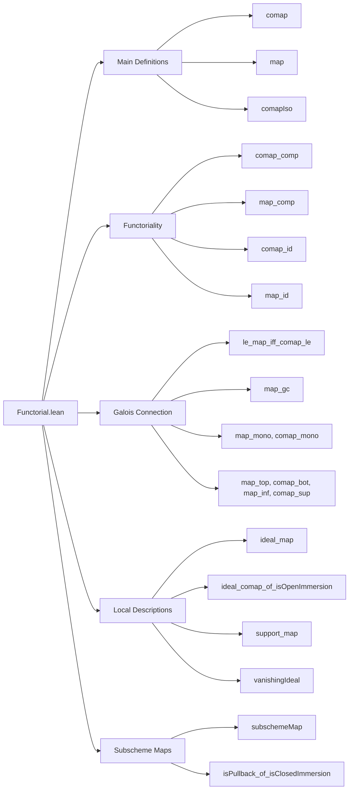

### Technical Brief: `Functorial.lean` — Functorial Constructions of Ideal Sheaves

---

#### **1. Key Definitions & Theorems**

| Name | Type / Signature | Purpose |
|------|------------------|---------|
| `comap` | `IdealSheafData Y → (X ⟶ Y) → IdealSheafData X` | Pullback of an ideal sheaf along a morphism; defined as the kernel of the pullback projection. |
| `map` | `IdealSheafData X → (X ⟶ Y) → IdealSheafData Y` | Pushforward of an ideal sheaf; defined as the kernel of the composite morphism `subschemeι ≫ f`. |
| `comapIso` | `(I : Y.IdealSheafData) (f : X ⟶ Y) → (I.comap f).subscheme ≅ pullback f I.subschemeι` | Shows the subscheme of the pullback ideal sheaf is isomorphic to the fibered product. |
| `comap_comp` | `I.comap (f ≫ g) = (I.comap g).comap f` | Functoriality of pullback (contravariant). |
| `comap_id` | `I.comap (𝟙 _) = I` | Identity preservation for pullback. |
| `map_comp` | `I.map (f ≫ g) = (I.map f).map g` | Functoriality of pushforward (covariant). |
| `map_id` | `I.map (𝟙 _) = I` | Identity preservation for pushforward. |
| `le_map_iff_comap_le` | `J ≤ I.map f ↔ J.comap f ≤ I` | Core equivalence underlying the Galois connection. |
| `map_gc` | `GaloisConnection (comap · f) (map · f)` | Pushforward and pullback form a Galois connection. |
| `map_ker` | `f.ker.map g = (f ≫ g).ker` | Compatibility of pushforward with kernel ideal sheaves. |
| `ideal_map` | `(I.map f).ideal U = (I.ideal ⟨_, H⟩).comap (f.app U).hom` | Local description of pushforward ideal sheaf on affine opens. |
| `ideal_comap_of_isOpenImmersion` | `(I.comap f).ideal U = (I.ideal ⟨f ''ᵁ U, _⟩).comap (f.appIso U).inv.hom` | Local description of pullback ideal sheaf under open immersion. |
| `subschemeMap` | `J ≤ I.map f → I.subscheme ⟶ J.subscheme` | Induced map on closed subschemes when `J ≤ I.map f`. |
| `isPullback_of_isClosedImmersion` | Criterion for a square to be a pullback using ideal sheaves. | Used to verify pullbacks in the category of schemes via ideal sheaf conditions. |

---

#### **2. Naming Conventions**

- **Prefixes**:
  - `comap_`: pullback-related (contravariant action).
  - `map_`: pushforward-related (covariant action).
  - `subschemeMap_`: induced map on subschemes.
  - `ideal_`: local sections / stalk-level description.
  - `support_`: support of ideal sheaf.

- **Suffixes**:
  - `_comp`: composition/functoriality lemmas.
  - `_id`: identity laws.
  - `_Iso`: isomorphism statements.
  - `_le`: inequalities in the lattice of ideal sheaves.
  - `_of_`: conditions or assumptions (e.g., `of_isClosedImmersion`, `of_isOpenImmersion`).

- **Other patterns**:
  - `ker_`, `range_`, `preimage_`: topological/set-theoretic operations.
  - `vanishingIdeal`, `support`, `subscheme`: core geometric objects.

---

#### **3. Tactic Stack**

| Tactic | Usage Frequency | Purpose |
|--------|-----------------|---------|
| `simp` | Very High | Simplify using `@[simp]` lemmas, especially `comapIso`, `map`, `subschemeMap_subschemeι`, etc. |
| `rw` | High | Rewrite using equalities like `comap_comp`, `le_map_iff_comap_le`, `map_ker`. |
| `exact` / `refine` | Medium | Construct proofs using existing lemmas (e.g., `IsClosedImmersion.isIso_of_ker_eq`). |
| `apply le_antisymm` | Medium | Prove equality of ideal sheaves via mutual inequality. |
| `ext1` / `ext` | Medium | Extensionality for supports/closures. |
| `delta` | Low | Unfold definitions (e.g., `delta IdealSheafData.comap`). |
| `simpa` | Medium | Simplify and discharge goals using assumptions. |
| `calc` / `trans` | Low | Chain inequalities (e.g., in `map_comp`). |
| `asIso`, `Iso.hom_inv_id_assoc`, `Iso.inv_id` | Low | Manipulate isomorphisms in pullback diagrams. |

---

#### **4. Proof Logic**

- **Structure of proofs**:
  - **Functoriality** (`comap_comp`, `map_comp`): Use isomorphisms between pullbacks to relate kernels; often involve `pullback.map`, `pullbackRightPullbackFstIso`, and `ker_comp_of_isIso`.
  - **Galois connection** (`map_gc`): Prove `le_map_iff_comap_le`, then apply `GaloisConnection.mk`.
  - **Local descriptions** (`ideal_map`, `ideal_comap_of_isOpenImmersion`): Reduce to affine opens, use `subschemeObjIso`, `RingHom.comap_ker`, and properties of open/closed immersions.
  - **Subscheme maps**: Use universal property of closed immersions (`IsClosedImmersion.lift`).
  - **Pullback criterion** (`isPullback_of_isClosedImmersion`): Reduce to showing a morphism is an isomorphism via `IsClosedImmersion.isIso_of_ker_eq`.

- **Common patterns**:
  - Use `subschemeι` to relate ideal sheaves and closed subschemes.
  - Leverage `support` and `closure` for topological reasoning.
  - Use `QuasiCompact f` to ensure image of support behaves well under `map`.

---

#### **5. Imports & Dependencies**

| Module | Role |
|--------|------|
| `Mathlib.AlgebraicGeometry.Morphisms.ClosedImmersion` | Provides `IsClosedImmersion`, `ker`, `lift`, `isIso_of_ker_eq`, etc. |
| `Mathlib.AlgebraicGeometry.PullbackCarrier` | Provides `pullback`, `pullback.fst`, `pullback.snd`, `pullback.lift`, `pullback.condition`, etc. |

**Broader context**: This file sits in the `Scheme.IdealSheafData` namespace, building on foundational machinery for schemes, morphisms, and ideal sheaves (as subschemes). It is part of a larger effort to formalize functorial constructions in algebraic geometry.

---

#### **8. Mermaid Diagrams**

##### **Dependency Graph (High-Level)**

##### **Overview of File Structure**

---

This file formalizes the *adjointness* of pullback and pushforward for ideal sheaves, and provides the technical tools needed to reason about their behavior under composition, identity, and localizations. It is foundational for further development of direct and inverse image functors in algebraic geometry.
