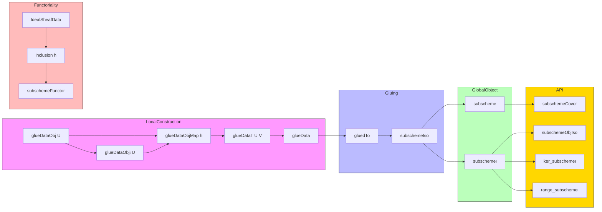

Here's a structured technical brief extracted from the provided `Subscheme.lean` file:

---

### **1. Key Definitions & Theorems**

| Name | Type | Purpose |
|------|------|---------|
| `glueDataObj (U : X.affineOpens)` | `Scheme` | Represents `Spec(𝒪ₓ(U)/I(U))`, the local piece to be glued. |
| `glueDataObjι (U)` | `I.glueDataObj U ⟶ U.1` | Closed immersion into the affine open `U`. |
| `glueDataObjMap (h : U ≤ V)` | `I.glueDataObj U ⟶ I.glueDataObj V` | Transition maps for the glue data (open immersions). |
| `glueDataT (U V)` | `I.glueDataObjPullback U V ⟶ I.glueDataObjPullback V U` | Symmetry/transition isomorphisms in the glue data. |
| `glueData` | `Scheme.GlueData` | Full glue data for constructing the scheme `Spec(𝒪ₓ/I)`. |
| `gluedTo` | `I.glueData.glued ⟶ X` | Global map from the glued scheme to `X`. |
| `subscheme` | `Scheme` | The **scheme-theoretic subscheme** associated to `I`. |
| `subschemeι` | `I.subscheme ⟶ X` | The canonical inclusion (closed immersion). |
| `subschemeCover` | `I.subscheme.AffineOpenCover` | Affine open cover by `Spec(𝒪ₓ(U)/I(U))`. |
| `subschemeObjIso (U)` | `Γ(I.subscheme, I.subschemeι ⁻¹ᵁ U) ≅ Γ(X, U)/I(U)` | Global sections of the subscheme over `U` match the quotient. |
| `inclusion (h : I ≤ J)` | `J.subscheme ⟶ I.subscheme` | Functoriality: inclusion of ideal sheaves induces morphism of subschemes. |
| `subschemeFunctor` | `(IdealSheafData Y)ᵒᵖ ⥤ Over Y` | Contravariant functor from ideal sheaves to subschemes over `Y`. |
| `ker_subschemeι` | `I.subschemeι.ker = I` | Kernel of inclusion equals original ideal sheaf. |
| `range_subschemeι` | `Set.range I.subschemeι = I.support` | Image of inclusion is exactly the support of `I`. |

**Theorems (selected):**
- `ker_glueDataObjι_appTop`: Kernel of stalk map matches comap of ideal.
- `range_glueDataObjι_ι_eq_support_inter`: Local image = support ∩ affine open.
- `range_gluedTo`: Global image = full support.
- `subschemeι_app_surjective`: Maps on sections are surjective.
- `ker_subschemeι_app`: Kernel of section map = original ideal.
- `inclusion_id`, `inclusion_comp`: `inclusion` defines a functor.

---

### **2. Naming Conventions**

- **Prefixes:**
  - `glueDataObj*`: Local pieces and maps for gluing.
  - `glueDataT*`: Transition maps and cocycle conditions.
  - `subscheme*`: Final global constructions.
  - `inclusion*`: Morphisms induced by inclusion of ideal sheaves.
- **Suffixes:**
  - `_ι`: Inclusion/morphism into ambient scheme.
  - `_hom`, `_map`: Morphisms between local pieces.
  - `_iso`: Isomorphisms (e.g., `subschemeObjIso`, `glueDataObjIso`).
  - `_app`: Component at an open set (e.g., `ker_subschemeι_app`).
- **`I.` prefix**: All definitions/lemmas are scoped under `IdealSheafData`.

---

### **3. Tactic Stack**

Frequently used tactics:
- `rw`, `simp`, `congr`, `ext1`, `apply`, `exact`
- `change`, `erw`, `convert`, `subst`
- `have`, `obtain`, `refine`, `intro`, `cases`
- `rw [← cancel_mono …]`, `rw [← IsIso.inv_comp_eq]`, `rw [pullback.condition]`
- `simp only [...] at this`, `convert_to ... using 3`
- `apply pullback.hom_ext`, `apply AffineOpenCover.openCover.hom_ext`
- `rw [Category.assoc]`, `rw [Iso.hom_inv_id]`, `rw [Iso.inv_hom_id]`
- `rw [RingHom.ker_equiv_comp]`, `rw [Ideal.mk_ker]`, `rw [Ideal.comap_comap]`
- `rw [Set.range_comp]`, `rw [Set.image_preimage_eq_inter_range]`
- `apply subset_antisymm`, `apply funext`, `ext x`

---

### **4. Proof Logic**

**General proof strategy:**
1. **Local-to-global construction**:
   - Define local pieces `Spec(𝒪ₓ(U)/I(U))`.
   - Prove compatibility (transition maps, cocycle conditions) using:
     - Ideal quotient maps (`Ideal.Quotient.mk`, `Ideal.quotientMap`)
     - Localization properties (`IsLocalization.Away`)
     - Pullback diagrams and universal properties.
2. **Gluing**:
   - Use `Scheme.GlueData` and `Multicoequalizer.desc` to construct global map `gluedTo`.
   - Prove injectivity, surjectivity onto support, and openness/closedness properties.
3. **Restriction & isomorphism**:
   - Identify glued scheme with subscheme via homeomorphism to `support(I)`.
   - Use `restrict` + `subschemeIso` to define final object.
4. **Functoriality**:
   - For `I ≤ J`, construct `inclusion h` via affine open cover gluing.
   - Verify functor laws using `AffineOpenCover.openCover.hom_ext`.

**Common subproof patterns:**
- **Ideal-theoretic lemmas**: `Ideal.mk_ker`, `Ideal.comap_comap`, `Ideal.quotientMap_comp_mk`.
- **Sheaf-theoretic lemmas**: `section_ext`, `exists_basicOpen_le_affine_inter`.
- **Topological lemmas**: `range_glueDataObjι_ι`, `Set.image_preimage_eq_inter_range`.
- **Categorical lemmas**: `IsOpenImmersion.isoOfRangeEq`, `pullback.hom_ext`, `Multicoequalizer.π_desc`.

---

### **5. Imports & Dependencies**

**Primary dependencies:**
- `Mathlib.AlgebraicGeometry.Morphisms.Preimmersion`
- `Mathlib.AlgebraicGeometry.Morphisms.QuasiSeparated`
- `Mathlib.AlgebraicGeometry.IdealSheaf.Basic`
- `Mathlib.CategoryTheory.Adjunction.Opposites`

**Key underlying theories:**
- Sheaves of rings (`𝒪ₓ`)
- Ideal sheaves and their support
- Affine opens, basic opens, `Γ(X, U)`
- Pullbacks, limits, colimits in `Scheme`
- Glueing schemes (`Scheme.GlueData`, `Multicoequalizer`)
- Closed immersions, open immersions, preimmersions

---

### **6. Mermaid Diagrams**

#### **Dependency Graph (High-Level)**

```mermaid
graph TD
  A[IdealSheafData X] --> B[glueDataObj U]
  A --> C[glueDataObjι U]
  B --> D[glueDataObjMap h]
  C --> D
  D --> E[glueData]
  E --> F[gluedTo : glueData.glued ⟶ X]
  F --> G[subscheme : Scheme]
  F --> H[subschemeι : subscheme ⟶ X]
  A --> I[inclusion h : J.subscheme ⟶ I.subscheme]
  I --> J[subschemeFunctor : (IdealSheafData Y)^op ⥤ Over Y]
  K[Support of I] <--> F
  L[Quotient rings Γ(X,U)/I(U)] --> B
  M[Localization] --> D
```

#### **Overview of File Structure**



---

Let me know if you'd like a formalized dependency graph in Lean or a more detailed tactic-level proof sketch for a specific lemma.
