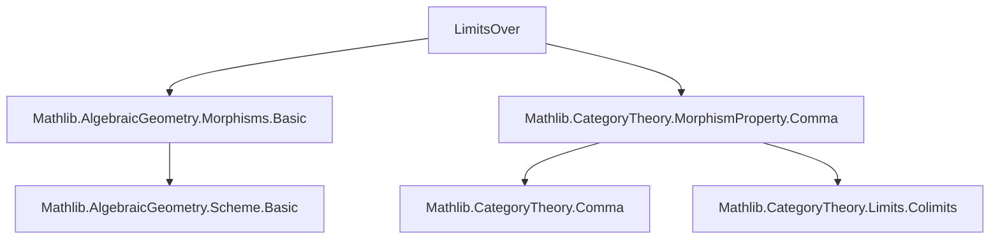
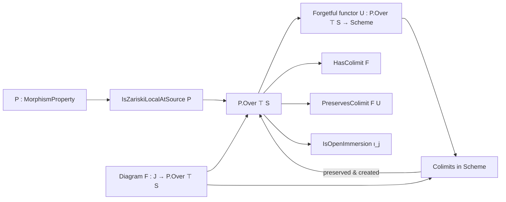
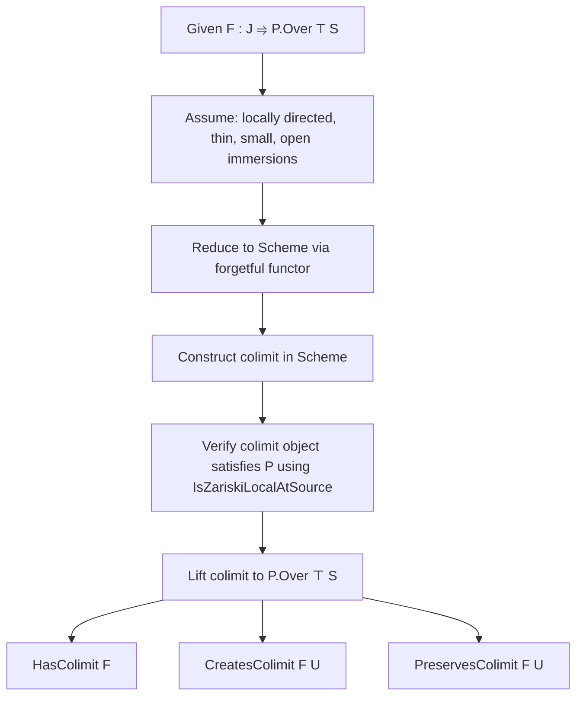

Here is a structured technical brief extracted from `LimitsOver.lean`, focusing on formal metadata relevant for building a domain-specific AI agent in Lean 4.

---

### **1. Key Definitions & Theorems**

| Name | Type / Signature | Purpose |
|------|------------------|---------|
| `hasColimit_of_created` | `(F : J ⥤ C) → (U : C) → CreatesColimit F U → HasColimit F` | General criterion for existence of colimits via creation by a forgetful functor. |
| `createsColimitOfFullyFaithfulOfIso` | (Standard lemma in `CategoryTheory`) | Constructs colimit creation under fully faithful functors with isomorphism of cocones. |
| `preservesColimitIso` | `(F : C ⥤ D) [PreservesColimitsOfShape J F] → (c : Cocone F) → F.mapCocone c ≅ colimit (F ∘ F)` | Isomorphism between image of colimit cocone and colimit in target category. |
| `IsZariskiLocalAtSource.iff_of_openCover` | `(P : MorphismProperty _) → (f : X ⟶ Y) → (𝒰 : X.OpenCover) → …` | Characterizes Zariski-local-at-source properties via open covers. |
| `mono_iff_injective` | `Mono f ↔ Function.Injective f` (for `Scheme`-morphisms) | Connects categorical monomorphism with set-theoretic injectivity. |
| `IsOpenImmersion.map` | `IsOpenImmersion f → IsOpenImmersion (F.map h).left` | Stability of open immersions under functorial image (used in `span` instances). |

**Key Theorems (Instances):**

| Instance | Context | Purpose |
|----------|---------|---------|
| `instance : HasColimit F` (in `Over`) | `F : J ⥤ Over S`, locally directed diagram of open immersions | Shows colimits exist in over-category `Over S` for such diagrams. |
| `instance : CreatesColimit F (MorphismProperty.Over.forget P ⊤ S)` | Under `IsZariskiLocalAtSource P`, `F : J ⥤ P.Over ⊤ S`, locally directed diagram of open immersions | Shows colimits in `P.Over ⊤ S` are created by the forgetful functor to `Scheme`. |
| `instance : PreservesColimit F (MorphismProperty.Over.forget P ⊤ S)` | Same as above | Colimit in `P.Over ⊤ S` maps to colimit in `Scheme` via forgetful functor. |
| `instance (j : J) : IsOpenImmersion (colimit.ι F j).left` | Same setup | Inclusion maps into colimit are open immersions. |
| `instance : HasCoproductsOfShape ι (P.Over ⊤ S)` | `ι : Type*`, small | Coproducts exist in `P.Over ⊤ S`. |
| `instance : HasFiniteCoproducts (P.Over ⊤ S)` | — | Finite coproducts exist. |
| `instance : CreatesColimitsOfShape (Discrete J) (MorphismProperty.Over.forget P ⊤ S)` | — | Creates all discrete (i.e., coproduct-type) colimits. |

---

### **2. Naming Conventions**

- **Property predicates**: `is_*` (e.g., `IsOpenImmersion`, `IsZariskiLocalAtSource`)
- **Functor composition**: `F ⋙ G` (standard category-theoretic notation)
- **Forgetful functors**: `Over.forget S`, `Scheme.forget`, `MorphismProperty.Over.forget P ⊤ S`
- **Colimit construction**: `colimit F`, `colimit.ι F j`, `colimit.desc F h`
- **Morphism property overcategories**: `P.Over ⊤ S`, `Over S`
- **Span / cocone maps**: `span f g`, `WidePushoutShape.Hom.init`, `WalkingPair`, `WalkingSpan`

Prefixes/suffixes:
- `is_`: property on morphisms (e.g., `IsOpenImmersion`)
- `has_`: existence of categorical structure (e.g., `HasColimit`, `HasCoproductsOfShape`)
- `creates_`: colimit creation by a functor (e.g., `CreatesColimit`, `CreatesColimitsOfShape`)
- `preserves_`: colimit preservation (e.g., `PreservesColimit`)

---

### **3. Tactic Stack**

Frequently used tactics in proofs:

| Tactic | Usage |
|--------|-------|
| `rw` | Rewriting definitions (e.g., `rw [← MorphismProperty.Over.forget_comp_forget_map]`) |
| `simp only` | Simplification with specific lemmas (e.g., `simp only [e, CategoryTheory.ι_preservesColimitIso_hom]`) |
| `infer_instance` | Automatically infers class instances (e.g., `inferInstanceAs <| IsOpenImmersion …`) |
| `cases` | Case analysis on inductive types (e.g., `cases i` on `WalkingPair`) |
| `obtain` / `match` | Destructuring existential or sum types (e.g., `obtain (a | (a | a)) := t`) |
| `simpa` | Simplify using assumptions (`simpa using h`) |
| `refine` | Partial proof construction with holes (`?_`) |
| `let` + `have` | Local definitions and intermediate facts |

---

### **4. Proof Logic**

The logical flow across the file follows a **structured categorical pattern**:

1. **Reduction to base category**:
   - Use forgetful functors (`Over.forget S`, `MorphismProperty.Over.forget P ⊤ S`) to reduce colimit existence/preservation to `Scheme`.
   - Leverage `hasColimit_of_created` and `createsColimitOfFullyFaithfulOfIso`.

2. **Local-directedness & thinness**:
   - Assume `IsLocallyDirected` and `Quiver.IsThin` on indexing category `J`.
   - These ensure colimits in `Scheme` behave well (e.g., glueing along open immersions).

3. **Zariski-local-at-source hypothesis**:
   - Use `IsZariskiLocalAtSource P` to verify that the colimit object in `Scheme` satisfies the property `P`.
   - Construct an open cover `𝒰` on the colimit object and check each restriction lies in `P.Over`.

4. **Stability of open immersions**:
   - Prove inclusion morphisms `colimit.ι F j` are open immersions via `preservesColimitIso` and stability under isomorphism.

5. **Span/parallel pair monomorphism & openness**:
   - For `P.Over ⊤ S`, verify that spans of open immersions yield monomorphisms and open immersions on components.

---

### **5. Imports & Dependencies**

| Module | Role |
|--------|------|
| `Mathlib.AlgebraicGeometry.Morphisms.Basic` | Defines `MorphismProperty`, `IsOpenImmersion`, `IsZariskiLocalAtSource`, `Over`, etc. |
| `Mathlib.CategoryTheory.MorphismProperty.Comma` | Provides `P.Over`, comma-category constructions, forgetful functors, and basic properties. |
| `CategoryTheory.Limits` (via `open CategoryTheory Limits`) | Provides `HasColimit`, `CreatesColimit`, `PreservesColimit`, `colimit`, `ι`, etc. |
| `CategoryTheory.Functor.Comma` (implicit via `Over`) | Comma category machinery. |

---

### **6. Mermaid Diagrams**

#### **Dependency Graph (Module Level)**

#### **Overview of Theoretical Flow**

#### **Proof Strategy Skeleton**

---

Let me know if you'd like a formalized summary in `lean` comment style or a dependency graph for specific lemmas.
