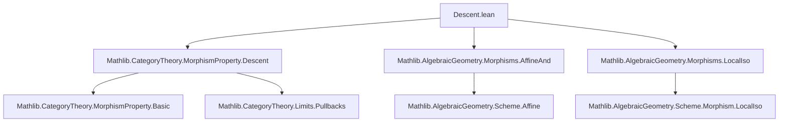

### Technical Brief: `Descent.lean`

---

#### **1. Key Definitions & Theorems**

| Name | Type / Signature | Purpose |
|------|------------------|---------|
| `Scheme.exists_hom_isAffine_of_isZariskiLocalAtSource` | `∀ X [CompactSpace] [IsZariskiLocalAtSource P] [P.ContainsIdentities], ∃ Y p, Surjective p ∧ P p ∧ IsAffine Y` | For quasi-compact $X$, constructs an affine cover $p: Y \to X$ with $P(p)$. |
| `IsZariskiLocalAtTarget.descendsAlong` | `∀ [IsZariskiLocalAtTarget P] [P'.IsStableUnderBaseChange], (∀ f g, P' f → P(pullback.fst f g) → P g) → P.DescendsAlong P'` | Reduces descent along $P'$ to the affine base case when $P$ is local at target. |
| `of_pullback_fst_Spec_of_codescendsAlong` | `∀ [P.RespectsIso], RingHom.CodescendsAlong Q Q', ... → P (pullback.fst f g) → P g` | Transfers descent from ring homomorphism property $Q$ to scheme morphism property $P$ via algebraization. |
| `IsStableUnderBaseChange.of_pullback_fst_of_isAffine` | `∀ [P'.RespectsIso] [P'.IsStableUnderComposition] [P.IsStableUnderBaseChange], ... → P g` | Allows assuming source affine when $X$ admits a $P'$-morphism from an affine scheme. |
| `IsZariskiLocalAtTarget.descendsAlong_inf_quasiCompact` | `∀ [IsZariskiLocalAtTarget P], ... → P.DescendsAlong (P' ⊓ QuasiCompact)` | Descent for $P$ along *quasi-compact* $P'$-morphisms, using local isomorphisms + surjectivity. |
| `HasRingHomProperty.descendsAlong` | `∀ [HasRingHomProperty P Q], RingHom.CodescendsAlong Q Q' → P.DescendsAlong (P' ⊓ QuasiCompact)` | Main result: if $P$ corresponds to $Q$, and $Q$ codescends along $Q'$, then $P$ descends along quasi-compact $P'$-maps. |
| `HasAffineProperty.descendsAlong_of_affineAnd` | `∀ [HasAffineProperty P (affineAnd Q)], DescendsAlong @IsAffineHom P', ... → P.DescendsAlong (P' ⊓ QuasiCompact)` | Descent for properties defined via `affineAnd Q`, assuming affine morphisms descend along $P'$. |

---

#### **2. Naming Conventions**

- **Prefixes:**
  - `is_`: e.g., `IsZariskiLocalAtSource`, `IsZariskiLocalAtTarget`, `IsAffine` — properties of schemes/morphisms.
  - `has_`: e.g., `HasRingHomProperty`, `HasAffineProperty` — existence of an underlying ring homomorphism property.
  - `descendsAlong`, `codescendsAlong`: descent/codescent of properties along morphisms.
- **Suffixes:**
  - `_of_`: e.g., `descendsAlong_of_affineAnd`, `of_pullback_fst_Spec_of_codescendsAlong` — conditions under which a result holds.
  - `_inf_`: e.g., `descendsAlong_inf_quasiCompact` — descent along intersection (infimum) of properties.
- **Other:**
  - `SpecMap_iff_`, `Spec_iff_`: characterizations of $P$ on affine morphisms.
  - `affineAnd`: construction of a morphism property from a ring hom property.

---

#### **3. Tactic Stack**

Frequently used tactics in proofs:

| Tactic | Role |
|--------|------|
| `rw` / `simp` / `simp_rw` | Rewriting definitions, simplifying pullback diagrams, using `IsZariskiLocalAt...` equivalences. |
| `obtain ⟨...⟩` / `cases` | Extracting witnesses from existential hypotheses. |
| `wlog ... generalizing` | WLOG reduction to affine case (common pattern). |
| `algebraize` | Translate scheme-level statements to ring-level via `algebraMap`. |
| `apply ...` / `exact` | Applying lemmas or hypotheses. |
| `convert` / `refine` | Constructing proofs with holes to be filled later. |
| `simp [HasRingHomProperty.Spec_iff]` | Simplifying using equivalence between scheme and ring properties on affines. |
| `pullback.hom_ext`, `pullback.lift_fst`, `pullbackAssoc`, etc. | Pullback diagram manipulations. |
| `Category.assoc`, `Category.iso.inv_comp`, `isoSpec.inv` | Category-theoretic rewrites. |

---

#### **4. Proof Logic**

The logical flow across most descent lemmas follows this pattern:

1. **Reduction to affine base**:
   - Use `IsZariskiLocalAtTarget.descendsAlong` or `IsZariskiLocalAtTarget.descendsAlong_inf_quasiCompact`.
   - Apply `wlog` to assume $Z = \Spec R$ (or $Y = \Spec S$).
2. **Algebraization**:
   - Use `Spec.map_surjective` to lift morphisms to ring maps.
   - Apply `algebraize` to move to ring homomorphism level.
3. **Apply codescending hypothesis**:
   - Use `hQQ' : RingHom.CodescendsAlong Q Q'` to deduce $Q(\text{algebra map})$.
   - Translate back to scheme level using `H₂ : P(Spec.map f) ↔ Q(f.hom)`.
4. **Affine source case**:
   - If needed, assume $X = \Spec R$ or use `of_pullback_fst_of_isAffine` to reduce to affine source.
5. **Gluing / descent**:
   - Use `IsZariskiLocalAt...` properties to glue local data (e.g., via open covers or finite subcovers).
   - Use `pullback` isomorphisms to rearrange diagrams.

---

#### **5. Imports**

| Import | Purpose |
|--------|---------|
| `Mathlib.AlgebraicGeometry.Morphisms.AffineAnd` | Defines `affineAnd Q`, and `HasAffineProperty`. |
| `Mathlib.AlgebraicGeometry.Morphisms.LocalIso` | Defines local isomorphisms and related properties. |
| `Mathlib.CategoryTheory.MorphismProperty.Descent` | General theory of descent/codescending for morphism properties (`DescendsAlong`, `CodescendsAlong`, `IsZariskiLocalAt...`). |

---

#### **6. Mermaid Diagrams**

##### **Dependency Graph (Module-Level)**



##### **Overview of Theory Flow**

```mermaid
flowchart LR
  A[Ring Hom Property Q] -->|codescends| B[Q' on rings]
  C[Morphism Property P] -->|associated to| A
  D[P' on schemes] -->|implies Q'| B
  E[IsZariskiLocalAtTarget P] -->|reduction| F[Affine Base Case]
  G[IsAffine Y] -->|pullback| H[P(pullback.fst)]
  H -->|codescend| I[P(g)]
  F -->|descent lemma| I
  style A fill:#f9f,stroke:#333
  style C fill:#bbf,stroke:#333
  style D fill:#bfb,stroke:#333
  style I fill:#f96,stroke:#333
```

##### **Descent Strategy (High-Level)**

```mermaid
flowchart LR
  Start[Given f: X→Z, g: Y→Z, P'(f), P(pullback.fst f g)] --> Reduce[Reduce to affine base]
  Reduce --> AffineBase[Z = Spec R]
  AffineBase --> Algebraize[Algebraize to ring maps φ, ψ]
  Algebraize --> Codescend[Apply RingHom.CodescendsAlong Q Q']
  Codescend --> Translate[Translate back via P ↔ Q on affines]
  Translate --> Conclusion[P(g)]
  Conclusion --> End[Descent holds]
```

---

#### **7. Notes & Context**

- **Motivation**: This file formalizes a *descent machine* for morphism properties in algebraic geometry, leveraging ring-level codescending.
- **Key Insight**: Many geometric properties (e.g., affine, proper, separated) can be reduced to ring-theoretic properties on affines; descent then follows from faithfully flat descent in commutative algebra.
- **TODOs**:
  - Prove that *affine morphisms descend along faithfully flat morphisms* to make `HasAffineProperty.descendsAlong_of_affineAnd` fully applicable.
  - Generalize beyond quasi-compact morphisms (currently restricted via `P' ⊓ QuasiCompact`).

--- 

Let me know if you'd like a formalized dependency graph in `leanpkg` format or a summary of the `MorphismProperty` interface used.
